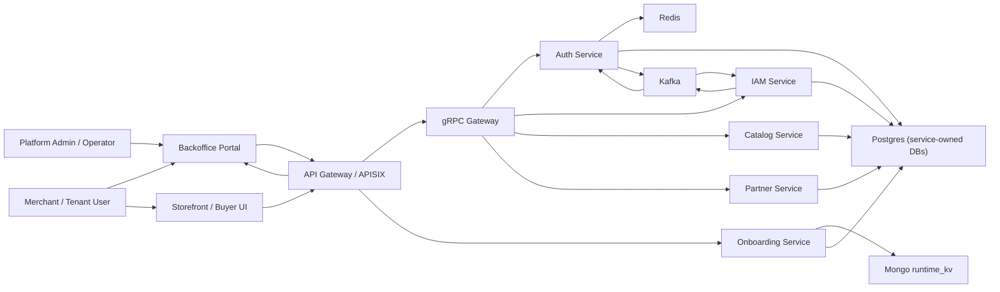

# C1: System Context

## Notes

- `Auth Service` handles identity, sessions, refresh tokens, and scoped access tokens.
- `IAM Service` owns tenants, memberships, roles, policies, boundaries, organizations, and simulations.
- `Catalog Service` and `Partner Service` are gRPC-facing business services behind the gateway.
- `Backoffice Portal` is the main operator-facing entry point.
- `Storefront` is the buyer-facing web surface.
- `gRPC Gateway` is the HTTP facade for gRPC admin-style services.
- `Kafka` is the event backbone for service-to-service asynchronous propagation.
