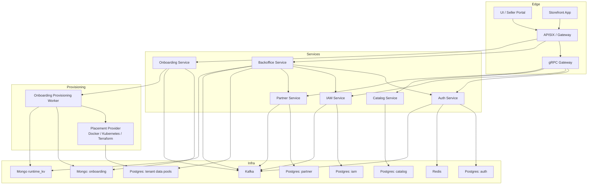

# C2: Container View

## Boundaries

- `auth` and `iam` are separated by API and database ownership.
- `auth` uses `IAMService` over `gRPC` for synchronous authorization-sensitive operations.
- `iam` publishes commit-coupled domain events through Kafka outbox/CDC.
- `auth` consumes a subset of IAM events into a local projection.
- `grpcgateway` remains the HTTP translation layer for gRPC services.
- `backoffice` is GraphQL-first and talks to service APIs plus its own database.
- `onboarding` owns store provisioning requests and the placement allocation source of truth.
- `runtime_kv` is a Mongo-backed router projection consumed by `pdtenantdb`, not the source of truth for placement.
- placement providers create or bind the tenant storage target for Docker, Kubernetes, or future Terraform/cloud runtimes.
