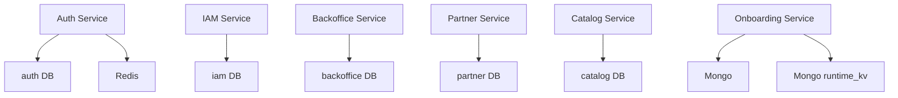
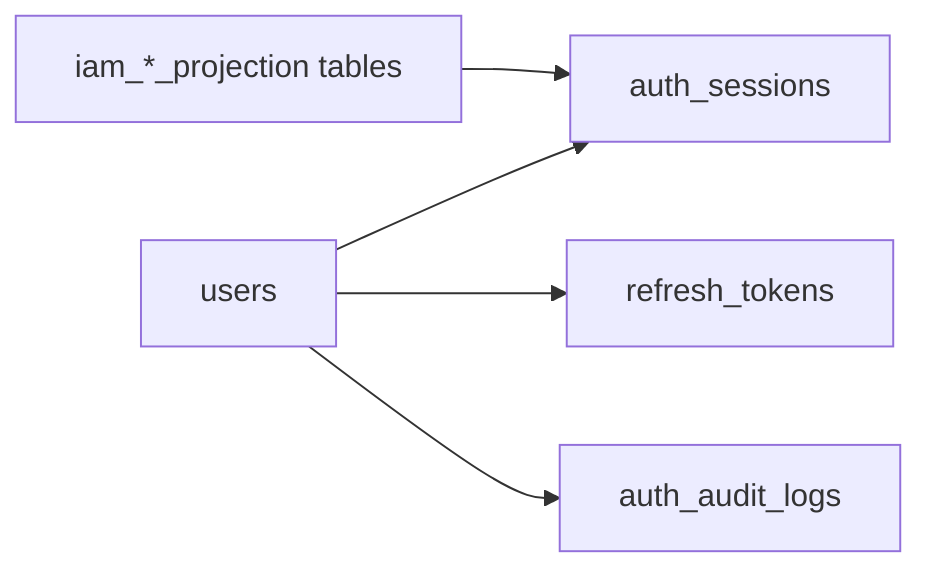
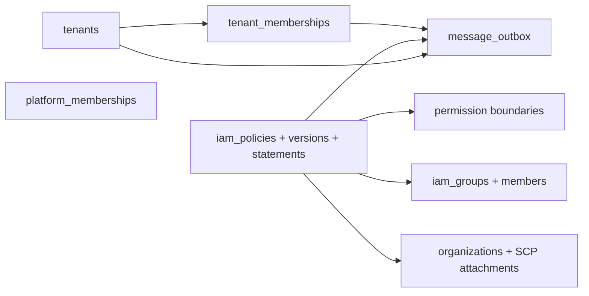
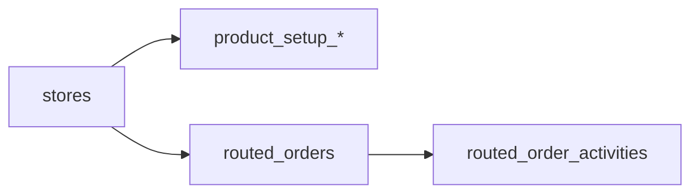

# Data Ownership

## Service-Owned Datastores

## Auth Data Ownership

## IAM Data Ownership

## Backoffice Data Ownership

## Notes

- The target architecture is service-owned persistence with no shared write access.
- `auth` keeps only a small IAM projection for hot read paths.
- Kafka events plus projections replace direct cross-service table reads.
