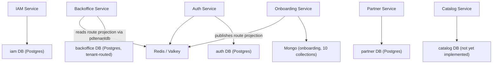
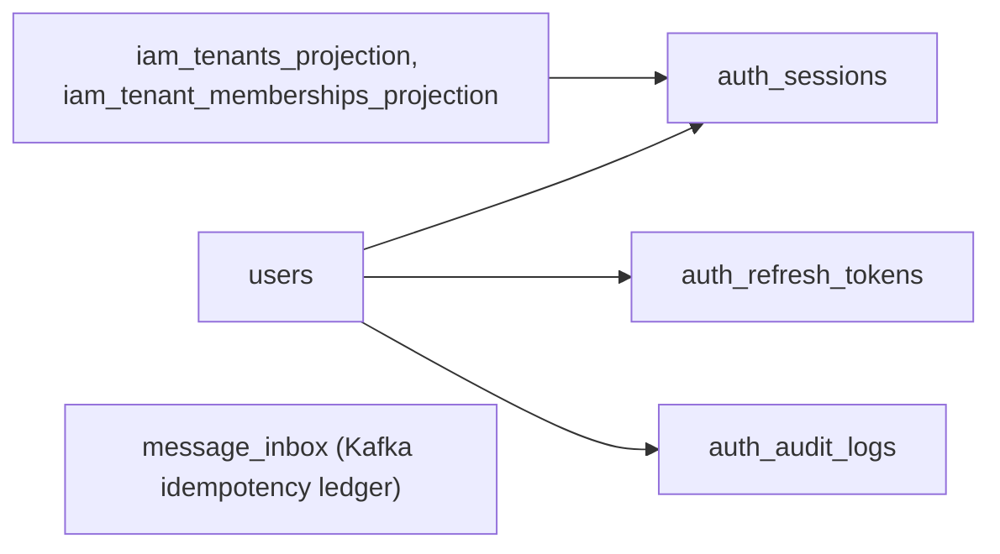
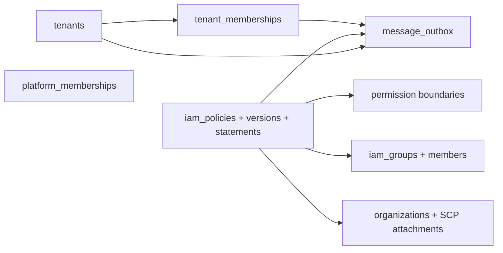
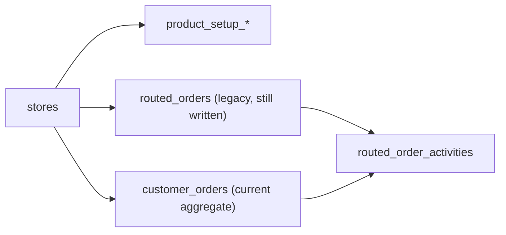

# Data Ownership

## Service-Owned Datastores

Corrected 2026-07-11: the KV route projection published by onboarding and
read by `pkg/pdtenantdb` is **Redis/Valkey, not Mongo** — a prior version
of this diagram mislabeled it as "Mongo runtime_kv". See
[`03-architecture-detail-design/services/onboarding/db-design.md`](../03-architecture-detail-design/services/onboarding/db-design.md)
"Not A Database Table: KV Route Projection".

## Auth Data Ownership

Full schema, columns, and indexes:
[`03-architecture-detail-design/services/auth/db-design.md`](../03-architecture-detail-design/services/auth/db-design.md).

## IAM Data Ownership

Full schema (32 tables), columns, and indexes:
[`03-architecture-detail-design/services/iam/db-design.md`](../03-architecture-detail-design/services/iam/db-design.md).

## Backoffice Data Ownership

Full schema, columns, and indexes:
[`03-architecture-detail-design/services/backoffice/db-design.md`](../03-architecture-detail-design/services/backoffice/db-design.md).
Postgres only — no Mongo (corrected 2026-07-11; see linked doc for the
grep evidence).

## Notes

- The target architecture is service-owned persistence with no shared write access.
- `auth` keeps only a small IAM projection for hot read paths.
- Kafka events plus projections replace direct cross-service table reads.
