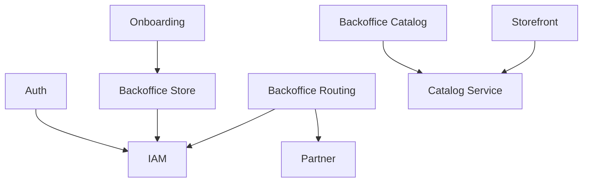
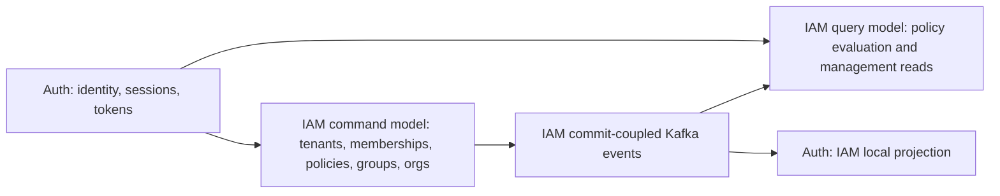
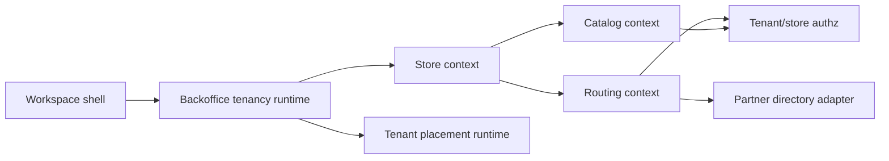
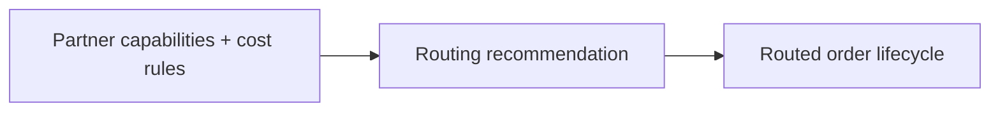

# Bounded Contexts

## Context Landscape

## Auth and IAM Boundary

## Backoffice Boundary

## DDD Rules

- Each service-local bounded context owns its aggregate rules, commands, queries, and repository contracts.
- Cross-context dependencies must stay behind adapters, projections, or explicit service APIs.
- Backoffice remains one deployable service but is split into store, catalog, and routing contexts.
- Backoffice context dependencies should point inward to domain input/output ports, not sideways into another context's repository.
- IAM separates command contracts from query contracts. Commands mutate the write model and emit commit-coupled events; queries read/evaluate state or read models.
- IAM inbound handlers are split into command and query handlers behind the gRPC service facade.
- IAM exposes command/query gRPC services while keeping the legacy IAM service for REST compatibility during migration.
- IAM read models can be rebuilt from the command model and event stream. They must not become the write source of truth.

## Partner and Routing Boundary

## Notes

- `Auth` and `IAM` are now separate contexts with gRPC and Kafka integration points.
- `Backoffice` is still one deployable service, but internally split into `store`, `catalog`, and `routing`.
- `Backoffice` also needs a tenancy runtime layer that separates:
  - edge/runtime tenant routing
  - application placement resolution
  - store-scoped business execution
- `Partner` influences routing decisions through capability and cost metadata.
- `Onboarding` owns connection/placement publication and is distinct from operator workflow surfaces.
