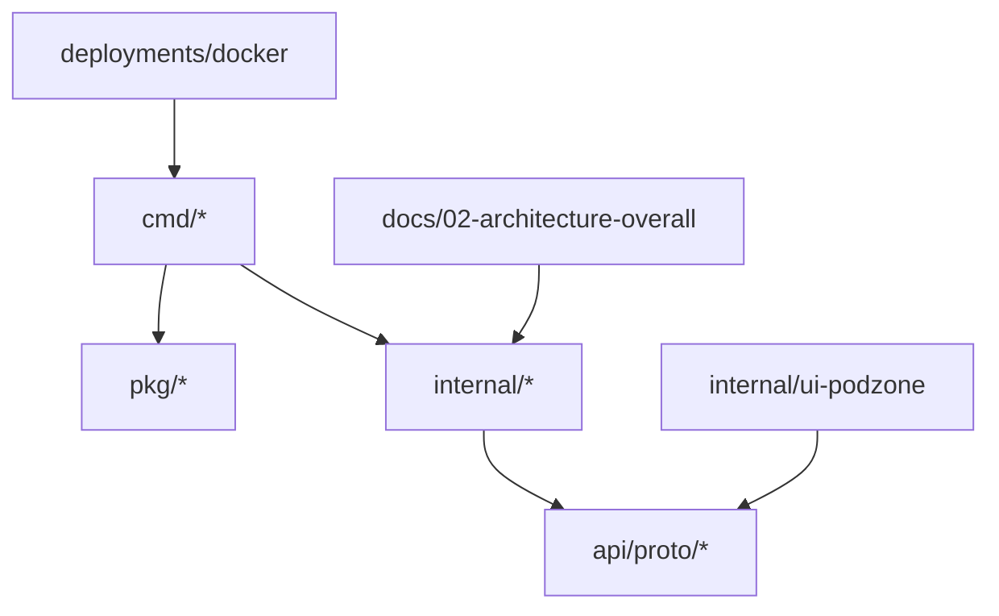
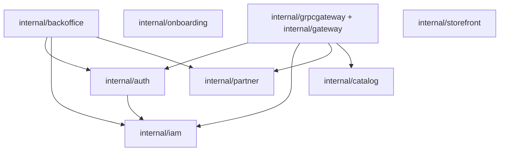
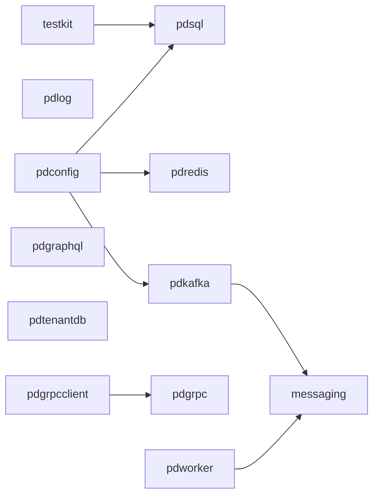

# Code Map

## Top-Level Code Structure

## Internal Service Map

## Shared Package Map

## Notes

- `cmd/*` wires service processes and Fx modules.
- `internal/*` contains service-owned code and adapters.
- `pkg/*` contains reusable platform/runtime packages.
- `api/proto/*` is the source of gRPC/gateway contracts.
- `docs/02-architecture-overall` and `docs/03-architecture-detail-design` are the current architecture description set.
