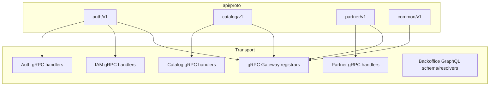
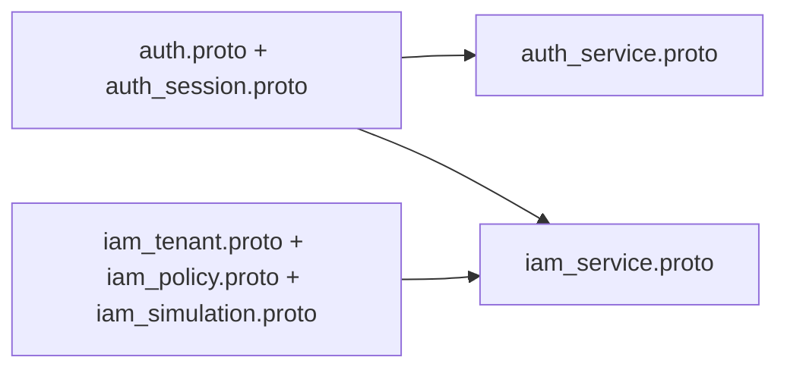
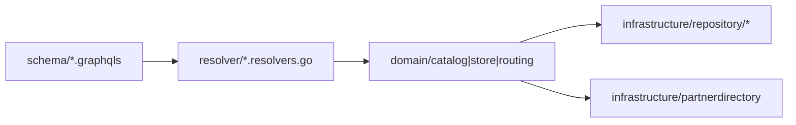
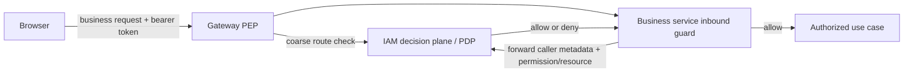

# Transport and Contracts

## API Surface Ownership



## Auth and IAM Proto Split



## Backoffice Transport Split



## Authorization Boundary



## Slice 0.3: Store Readiness Contract (Backbone)

**Source:** SRS-ONB-002, SRS-ONB-003, backbone-flow-refactor.md
**PZEP:** [PZEP-0001](../09-pzep/PZEP-0001-onboarding-store-readiness-endpoint.md)

This contract defines the user-facing readiness check the FE store-chooser
calls to decide whether to allow opening Backoffice.

### Endpoint

```
GET /api/v1/onboarding/requests/:id/readiness
```

Requires: `Authorization: Bearer <user-jwt>`, tenant extracted from JWT claims.

### Request

| Field | Source | Notes |
| --- | --- | --- |
| `:id` | path param | Store request ObjectID (hex string) |
| tenant | JWT claim | Must match `store_request.workspace_id` |

### Response — 200 OK

```json
{
  "request_id": "<id>",
  "request_status": "ready",
  "readiness": {
    "store_ready": true,
    "placement_allocation_ready": true,
    "route_ready": true
  },
  "failure_reason": "",
  "ui_state": "ready"
}
```

`ui_state` is one of: `pending | provisioning | blocked | failed | ready`.

**Mapping from domain status to `ui_state`:**

| `request_status` | `ui_state` |
| --- | --- |
| `requested`, `planning`, `planned`, `pending_approval` | `pending` |
| `queued`, `provisioning`, `pending_platform_setup` | `provisioning` |
| `failed_retryable` | `blocked` |
| `failed`, `failed_non_retryable`, `rejected`, `cancelled`, `suspended`, `archived` | `failed` |
| `ready` + placement allocation ready + route ready | `ready` |
| `ready` + placement NOT ready | `blocked` |

### Response — 404 Not Found

```json
{ "error": "store request not found" }
```

### Response — 403 Forbidden

```json
{ "error": "access denied" }
```

Returned when the authenticated workspace does not own this store request.

### Permissions

- Checked at the handler level using JWT workspace claim.
- No IAM gRPC call required — workspace ownership check is sufficient for
  this read.
- Future: IAM policy check when multi-owner stores are introduced.

### UI behavior

| `ui_state` | Store-chooser display |
| --- | --- |
| `pending` | "Setting up…" spinner |
| `provisioning` | "Provisioning…" with step indicator |
| `blocked` | "Blocked" badge + retry button |
| `failed` | "Failed" badge + `failure_reason` + contact support link |
| `ready` | "Open Backoffice" CTA enabled |

### Implementation notes

- This endpoint is a read-only query — no state mutation.
- Must call `domain/store/inputport.Usecase.GetStoreRequest` (status, workspace check)
  and `domain/infrasmanager/inputport.Usecase.GetTenantPlacementStatus` (allocation + route).
- Both calls share the same `ctx`. Tenant ID comes from the store request's `workspace_id`, not from the path.
- The endpoint must NOT be accessible to the infrasmanager admin routes. It is
  a user-facing route under `RequireUser` middleware.

---

## Notes

- `AuthService` owns identity, session, and token lifecycle.
- `IAMService` owns authorization, tenant, membership, policy, boundary, simulation, and assume-role decisioning.
- Frontends do not call permission-check endpoints to gate workflows. Backoffice
  and onboarding enforce access at their inbound boundaries through IAM query
  gRPC; IAM-owned endpoints enforce policy internally.
- Gateway checks are optional coarse PEPs. Resource- and state-dependent
  authorization remains mandatory at service handlers. See
  [IAM Platform](./11-iam-platform.md).
- `Backoffice` is GraphQL-owned and maps into context-local domain packages.
- `grpcgateway` is only a transport adapter, not business logic.
