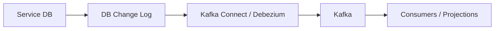
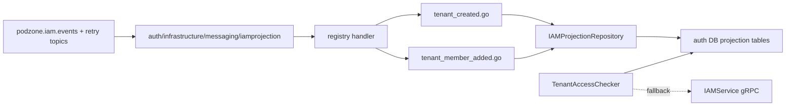

# Async Messaging

## Messaging Runtime

Not every async job should use an outbox. Pick the dispatch path by the consistency requirement:

| Workload                     | Dispatch path                                   | Use when                                                            |
| ---------------------------- | ----------------------------------------------- | ------------------------------------------------------------------- |
| Transactional domain event   | Transactional outbox, preferably drained by CDC | The event must not be lost after the service commits state.         |
| Best-effort operational job  | Direct `messaging.Publisher` pub/sub            | The job can be retried from source state or safely missed.          |
| Local background maintenance | Service-owned worker queue/table                | The work is private to one service and does not need Kafka fan-out. |

Use outbox for events such as tenant creation, IAM membership changes, policy attachment,
store provisioning state transitions, payment/order state changes, and connection placement commits.
Use direct pub/sub for cache refreshes, index warmups, non-critical notifications, telemetry,
UI hints, and other jobs that do not require atomic commit with business state.

Polling an outbox table is only an MVP/fallback relay. At scale, service databases should expose
outbox changes through CDC, for example Debezium/Postgres logical replication or MongoDB change
streams, and publish those records to Kafka without periodically scanning hot tables.

## CDC Component

Podzone uses Kafka Connect as the CDC runtime boundary:



Current component choice:

- **Postgres**: Debezium PostgreSQL connector over logical replication (`pgoutput`).
- **Postgres outbox routing**: Debezium Outbox Event Router after the outbox schema is aligned.
- **MongoDB**: MongoDB change streams after Mongo runs as a replica set or sharded cluster.

Local Docker includes `cdc-connect` in `deployments/docker/infras.yml` and a raw IAM outbox
connector template at `deployments/docker/cdc/connectors/iam-message-outbox-raw.json`.
The raw connector is intentionally a bridge step: it proves WAL-based CDC without changing the
existing `message_outbox` table yet. The next schema step is a Debezium-compatible outbox table
with explicit aggregate, event type, topic, key, and payload fields.

## Transactional Outbox Runtime

```mermaid
flowchart LR
    Domain["Service Domain / Interactor"]
    Outbox["Transactional Outbox"]
    Relay["CDC Connector or Fallback Relay"]
    Kafka["Kafka Topics"]
    ConsumerRuntime["Consumer Runtime"]
    Handler["Inbound Event Handler Registry"]
    TypedHandlers["Typed Event Handlers"]
    Projection["Projection / Local Read Model"]

    Domain -->|"append event in same tx"| Outbox
    Outbox -->|"CDC stream or bounded fallback polling"| Relay
    Relay --> Kafka
    Kafka --> ConsumerRuntime
    ConsumerRuntime --> Handler
    Handler --> TypedHandlers
    TypedHandlers --> Projection
```



## Package Ownership

- `pkg/pdkafka`
  - Kafka infra wiring
  - Sarama config, producer/admin/consumer factory
  - topic bootstrap on startup
- `pkg/messaging`
  - envelope contract
  - retry / DLT strategy
  - observer hooks
  - idempotency middleware
  - direct publisher and outbox / inbox abstractions
- `internal/<service>/controller/eventhandler/...`
  - inbound event handler that maps a consumed event into application behavior
- `internal/<service>/infrastructure/messaging/...`
  - worker, subscriber runtime, consumer wiring, inbox store selection

## Clean Architecture Notes

- Event handlers are inbound adapters, so they live under `controller/eventhandler`.
- Consumer workers and Kafka runtime wiring live under `infrastructure/messaging`.
- Business rules stay in `domain` / `interactor`.
- Projections are persistence adapters and read-model maintenance, not domain source of truth.
- Domain code should depend on a publishing/output port that matches the guarantee it needs:
  direct pub/sub for best-effort signals, transactional outbox for commit-coupled events.

## Consumer Architecture Rules

- Default runtime shape is `1 worker binary = 1 consumer runtime`.
- Do not introduce a multi-consumer supervisor until one binary truly owns multiple independent consumers.
- Keep API runtimes and worker runtimes in separate binaries when Kafka workloads are real:
  - `cmd/<service>` for gRPC/HTTP/API
  - `cmd/<service>-worker` for Kafka projections, outbox relays, or sagas
- If a worker binary later owns multiple consumers, each consumer should run in its own goroutine under a supervisor.

## Handler Dispatch Rules

- Do not grow one `switch envelope.Type` as event surface expands.
- Use `pkg/messaging.Registry` with `TypedHandler` implementations.
- Each event should live in its own file inside the service-owned inbound adapter package.
- `handler.go` should only assemble the registry.

Recommended shape:

```text
internal/<service>/controller/eventhandler/<consumer>/
  handler.go
  <event_one>.go
  <event_two>.go
```

## Concurrency Rules

- Keep message handling sequential inside a partition claim by default.
- Do not add goroutine-per-message processing unless offset commit and ordering semantics are redesigned explicitly.
- Safe concurrency points are:
  - Kafka partitions
  - separate consumer groups
  - separate consumers under a worker supervisor
- Unsafe default to avoid:
  - fire-and-forget goroutines inside `Handle(...)`
  - early offset marking while background work still runs

## When To Add A Multi-Consumer Worker

Introduce a supervisor only when at least one of these becomes true:

- one worker binary owns multiple unrelated consumers
- projection, audit, saga, or redrive flows need independent restart behavior
- lag, retry, or DLT behavior diverges per consumer
- one runtime needs multiple consumer groups for one service

Until then, prefer:

- one worker runtime
- one consumer
- one registry
- many typed handlers behind that registry

## Current Auth IAM Projection



## Runtime Toggles

Messaging runtime behavior is optional and config-driven:

- `messaging.<service>.consumers.<consumer_name>`
  - enable/disable consumer runtime
  - retry attempts / base delay
  - observability logging
  - idempotency and inbox table
- `messaging.kafka.<service>.topics`
  - enable/disable topic bootstrap
  - main / retry / DLT topic expansion

If config is missing, package defaults apply.
