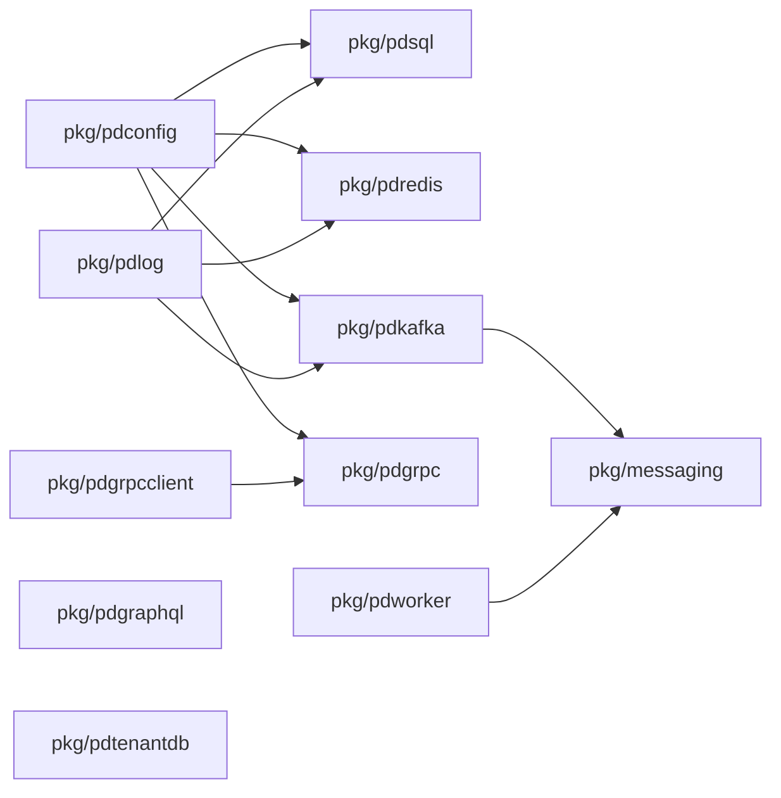
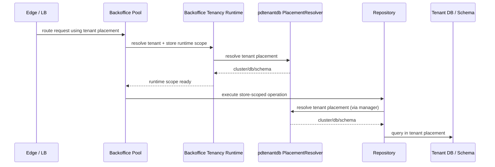
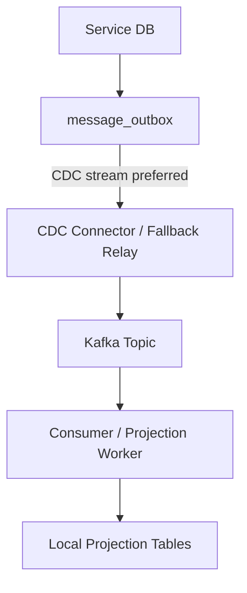

# Shared Runtime and Platform Modules

## Runtime Foundation

## Package Intent

- `pkg/pdconfig`: Koanf-backed configuration bootstrap
- `pkg/pdlog`: logging abstraction and Fx module
- `pkg/pdsql`: named SQL connection modules per service
- `pkg/pdredis`: named Redis connection modules
- `pkg/pdkafka`: Kafka client/admin/consumer-group wiring with Sarama
- `pkg/messaging`: envelope, outbox, publisher/consumer contracts, Kafka adapters
- `pkg/pdgrpc` and `pkg/pdgrpcclient`: gRPC server/client lifecycle
- `pkg/pdgraphql`: GraphQL runtime wiring
- `pkg/pdtenantdb`: tenant placement and multi-tenant DB resolution
- `pkg/pdworker`: long-running worker lifecycle abstraction

## Tenant Runtime Routing

Notes:

- edge/runtime routing decides which backoffice runtime pool receives tenant traffic
- application runtime placement decides which DB/schema receives tenant traffic
- store scope lives inside the resolved tenant placement

## Data and Event Backbone

This pattern is for transactional integration events, not every async job:

- write business state and the outbox record in the same service-owned transaction
- publish outbox records through CDC where possible; bounded polling is only a fallback
- downstream services materialize local read models when needed

Use direct pub/sub through `messaging.Publisher` for best-effort operational jobs that do not need
atomic commit with service state. Examples: cache refresh, search indexing hints, warmups,
non-critical notifications, telemetry, and UI task hints.

The CDC runtime boundary is Kafka Connect/Debezium:

- Postgres service databases publish changes through logical replication.
- The local Docker component is `cdc-connect`.
- MongoDB CDC requires Mongo change streams, so local Mongo must become a replica set before Mongo
  collections such as onboarding `connection_outbox` can use CDC reliably.
