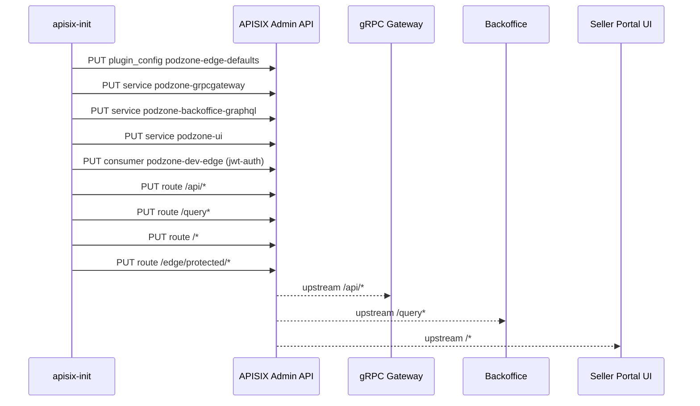

# Gateway Bootstrap

## APISIX Seed Flow

## Ownership

- `internal/gateway/apisix_conf`
  - APISIX node/admin/etcd base config
- `deployments/docker/apisix-init/seed.sh`
  - local docker seed for services, routes, and example plugins
- `deployments/docker/services.yml`
  - one-shot `apisix-init` job

## Notes

- `jwt-auth` in APISIX is seeded as an edge-level example route and consumer.
- Application JWT validation still happens inside services today.
- When APISIX becomes the main production edge, move route/plugin seed into:
  - Kubernetes Job / Helm hook
  - Terraform + APISIX provider or Admin API bootstrap
  - per-environment declarative manifests
