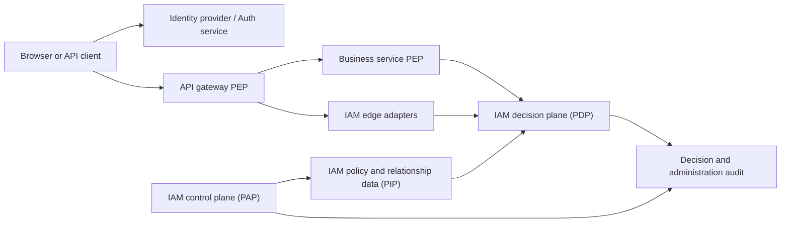
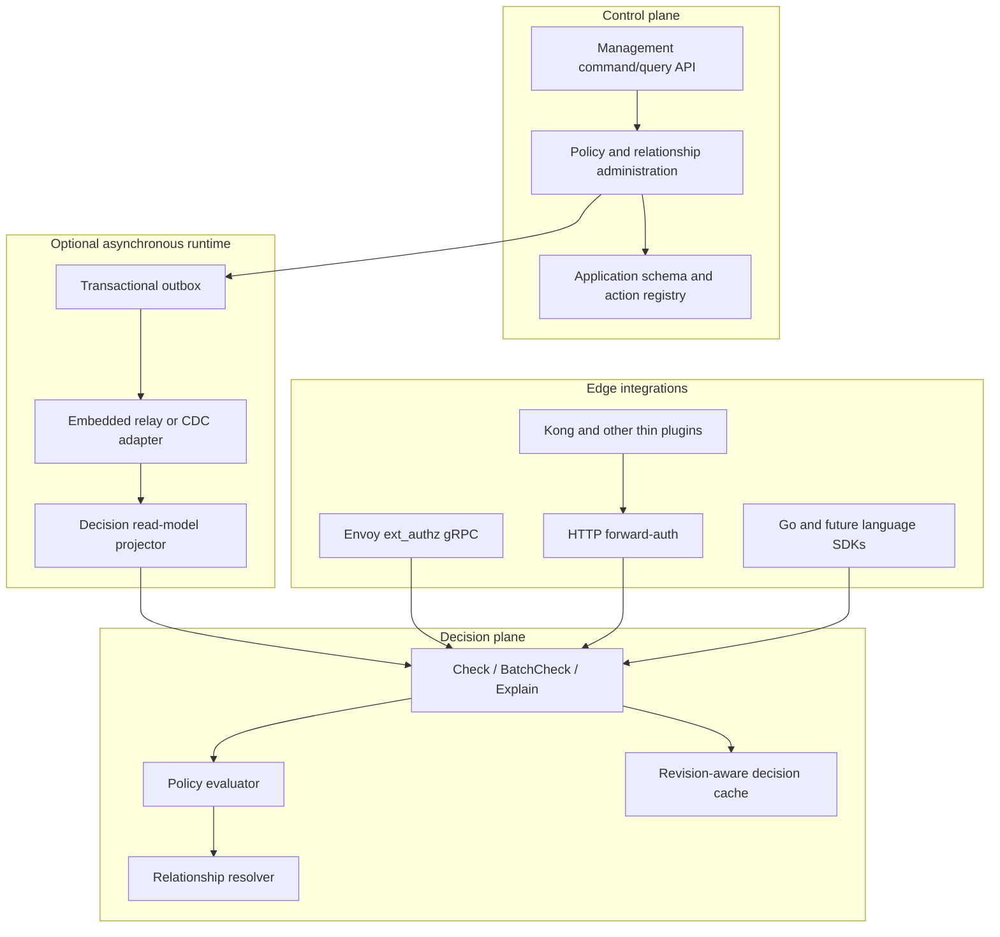

# IAM Platform Architecture

Status: proposed target architecture.

## Goal

Build an identity-provider-neutral authorization platform that can be deployed
independently and used by unrelated products. Podzone is the first integration,
not the owner of the IAM domain or public contract.

The platform owns authorization. It does not own passwords, login sessions,
social login, or application business data.

## Product Independence Invariants

IAM core must:

- compile, test, migrate, and run without importing any Podzone package;
- use its own repository, release lifecycle, database, API versioning, and
  deployment artifacts when extraction begins;
- treat every integrating product, including Podzone, as a registered
  application;
- accept opaque principals from configured identity issuers;
- let applications register action and resource schemas instead of shipping
  product permissions in IAM migrations;
- expose only generic organization, application, principal, relationship,
  policy, resource, action, and decision concepts;
- keep product-specific route, GraphQL field, resource, and error mappings in
  application adapters or SDK integration code;
- provide a standalone installation that does not require Podzone Auth,
  Backoffice, Onboarding, Kafka, Mongo runtime KV, or Kubernetes.

IAM core must never contain:

- Podzone tenant, workspace, store, order, partner, or onboarding entities;
- Podzone JWT secrets or session validation logic;
- hard-coded `store:create`, `orders:manage`, or other product action catalogs;
- foreign keys into a product-owned user or business database;
- assumptions that one identity provider or one API gateway is present.

## Current Readiness And Gaps

Reusable foundations already exist:

- separate Auth and IAM runtimes and datastores;
- command/query gRPC contracts and split handlers;
- organizations, memberships, groups, managed/inline policies, boundaries,
  organization guardrails, trust policies, and access simulation;
- service-side permission enforcement;
- transactional outbox and an independently deployable worker.

The current implementation is not yet a reusable platform because:

- public checks require Podzone `tenant_id` and numeric `user_id`;
- IAM and service adapters know Podzone Auth session and JWT details;
- Backoffice, Partner, and Onboarding duplicate identity and IAM client logic;
- action catalogs and Podzone bootstrap permissions are installed by IAM
  migrations;
- policy evaluation, management reads, and Podzone membership fallbacks share
  one application model;
- the public compatibility service mixes management and decision APIs;
- there is no standard Envoy or HTTP external-authorization adapter.

The extraction must therefore begin at the Decision API and identity contract,
not by moving `internal/iam` unchanged into another repository.

Also unresolved: there is currently no cross-tenant "root admin" concept.
Platform-scope roles (`platform_owner`, `platform_admin`) grant no implicit
access to any tenant's store — `CheckPermissionForResource` never consults
platform roles/policies on the tenant-scoped path, only tenant memberships
and an org-`manage_iam` fallback scoped to that tenant's own org. See
[ADR-0003](../08-adr/ADR-0003-platform-scope-tenant-access-override.md)
(Proposed) for the analysis and a candidate audited override mechanism.

## Product Boundary



The standard authorization roles are:

- **PAP**: policy administration point. Manages organizations, applications,
  policies, roles, groups, relationships, schemas, and policy versions.
- **PDP**: policy decision point. Answers authorization checks and explanations.
- **PEP**: policy enforcement point. Runs at a gateway, service handler,
  GraphQL resolver boundary, or SDK middleware.
- **PIP**: policy information point. Supplies relationships, attributes, policy
  revisions, and resource metadata to the PDP.

## Core Domain Language

The public contract must not expose Podzone-specific `tenant_id` or numeric user
IDs.

| Concept           | Meaning                                                                    |
| ----------------- | -------------------------------------------------------------------------- |
| Organization      | Administrative and isolation boundary owned by a customer                  |
| Application       | Permission namespace registered by one product or service                  |
| Principal         | Opaque actor reference such as `user:issuer:subject` or `service:payments` |
| Resource          | Typed object reference owned by an application                             |
| Action            | Namespaced operation such as `orders:cancel`                               |
| Relationship      | Principal-to-resource or resource-to-resource edge                         |
| Policy            | Versioned permit/deny rules and conditions                                 |
| Decision          | Allow/deny result with revision, reason, and audit identifier              |
| System admin      | Deployment operator; never implied by organization ownership               |
| Organization root | First durable owner of one organization; no global platform authority      |

Applications own their resource types and action catalog. IAM validates and
evaluates those contracts but does not own the underlying order, store, or
document.

Podzone maps its current model into the generic contract:

| Current Podzone concept | Target representation                         |
| ----------------------- | --------------------------------------------- |
| Organization            | IAM organization                              |
| Tenant/workspace        | Podzone application resource or policy scope  |
| Store                   | Child resource of a workspace                 |
| Numeric user ID         | Mapping to an opaque issuer/subject principal |
| Permission string       | Registered Podzone application action         |
| Tenant membership       | Principal/resource relationship               |
| SCP and boundary        | Organization guardrail and principal boundary |

## Deployable Components



These are module and deployment boundaries, not mandatory microservices. The
default open-source installation may run one binary with PostgreSQL. Operators
can split management, decision, edge, and worker binaries when scale or security
boundaries require it. Kafka, Redis, and CDC must remain optional.

## Public API Families

### Decision API

The decision contract is stable, small, and independent from management APIs.

```text
Check(
  organization,
  application,
  principal,
  action,
  resource,
  context,
  minimum_revision?
) -> {
  outcome,
  reason_code,
  decision_id,
  policy_revision,
  matched_policy_ids?
}
```

Required operations:

- `Check`: one decision.
- `BatchCheck`: bounded set of independent decisions.
- `Explain`: privileged diagnostic result; never returned by default.
- `ListResources` or `ListSubjects`: later, after relationship semantics are
  stable.

Rules:

- principal and resource IDs are opaque strings;
- default outcome is deny;
- unknown actions, malformed resources, invalid policies, and missing context
  fail closed;
- the response carries a machine-readable reason and decision ID;
- detailed matched policy data is privileged because it can leak security
  configuration;
- management writes return a revision that callers may pass as
  `minimum_revision` when read-after-write consistency matters.

### Management API

Keep command and query contracts separate:

- organization and system administration;
- application/action/resource schema registration;
- principal, group, role, and relationship management;
- managed and inline policy lifecycle;
- policy validation, versioning, activation, and rollback;
- boundaries, organization guardrails, and trust policy management;
- audit and decision-log queries.

The existing Podzone `IAMCommandService` and `IAMQueryService` remain migration
facades. A new generic `v2` API must coexist until all consumers migrate.

### Identity Contract

IAM accepts a normalized principal; it does not call an application Auth service
to validate sessions.

Supported trust inputs:

- OIDC JWT validated against configured issuer/JWKS metadata;
- workload identity over mTLS/SPIFFE;
- a signed identity envelope from a trusted gateway;
- explicit service credentials for management automation.

Never trust public `X-User-*` headers. Edge adapters must strip caller-supplied
identity headers and inject signed or mutually authenticated identity context.

## Enforcement Placement

Gateway and service enforcement are complementary.

| Check type                                          | Gateway | Service handler                 |
| --------------------------------------------------- | ------- | ------------------------------- |
| Token/issuer validity                               | Yes     | Verify trusted identity context |
| Static route and HTTP method permission             | Yes     | Defense in depth                |
| Resource ID present in a stable path parameter      | Yes     | Yes                             |
| GraphQL field or mutation permission                | No      | Yes                             |
| Resource owner/status loaded from a database        | No      | Yes                             |
| Request-body-dependent or state-transition decision | No      | Yes                             |
| Internal gRPC/Kafka-triggered command               | No      | Yes                             |

Gateway-only authorization is forbidden for business mutations. It can be
bypassed by internal traffic and lacks application state. The authoritative
resource-level PEP remains at each service inbound boundary.

Services should use a shared SDK:

```text
Authorize(ctx, principal, action, resource, context) -> Decision
```

HTTP/gRPC middleware may map routes to coarse actions. GraphQL keeps explicit
field-to-action mappings and resolves resource identifiers in the service.
Application use cases receive an authorized principal or authorization context,
not a boolean supplied by the frontend.

## Gateway Integrations

Do not build another general-purpose API gateway.

| Gateway/runtime | Integration                                                        |
| --------------- | ------------------------------------------------------------------ |
| Envoy / Istio   | Implement `envoy.service.auth.v3.Authorization/Check`              |
| Apache APISIX   | HTTP forward-auth endpoint with route metadata                     |
| NGINX           | `auth_request` subrequest to the HTTP forward-auth endpoint        |
| Kong Gateway    | Thin Lua plugin calling forward-auth; OPA-compatible adapter later |
| Custom Go edge  | Go SDK middleware or reverse proxy reference adapter               |

The edge adapter translates gateway request metadata into the canonical
Decision API. It contains no policy semantics.

Route configuration must explicitly provide:

- organization/application resolution strategy;
- required action;
- resource template when derivable from method/path;
- forwarded identity and context headers allowlist;
- timeout and fail behavior.

Sensitive routes use fail-closed behavior. Fail-open is opt-in only for
non-sensitive telemetry and must emit a metric and audit event.

## Policy Engine Strategy

Keep the evaluator behind explicit ports:

```text
PolicyCompiler
PolicyValidator
PolicyEvaluator
RelationshipResolver
AttributeProvider
```

Phase one can reuse the current AWS-style evaluator after extracting it from
Podzone entities. Before calling it a public engine, add:

- a versioned policy language and schema;
- strict action/resource type validation;
- deterministic permit/explicit-deny precedence;
- compiled policy caching keyed by revision;
- conformance tests and decision test vectors;
- limits for policy size, condition depth, batch size, and evaluation time.

Do not make OPA, OpenFGA, or Cedar mandatory:

- OPA is a strong optional policy-engine adapter and already integrates with
  Envoy/Kong, but it does not provide this IAM management model.
- OpenFGA is a strong optional relationship resolver for hierarchical sharing
  and reverse lookups, but organization guardrails, permission boundaries, and
  explicit deny remain policy-plane concerns.
- Cedar is a candidate future policy-language adapter because its
  principal/action/resource/context model and schema validation fit this
  decision contract.

The canonical Decision API must remain stable when an engine adapter changes.

## Data Ownership And Consistency

PostgreSQL is the default source of truth:

- organizations, applications, principals, groups, and relationships;
- policy schemas, policies, versions, and attachments;
- policy and relationship revision;
- administration audit;
- transactional outbox.

The decision plane may use a separate read model and local cache. Redis is a
cache, never policy truth. Kafka/CDC may distribute revisions and rebuild read
models, but a single-node installation must work with an embedded bounded relay.

Decision cache keys include organization, application, principal, action,
resource, relevant context, and policy revision. Policy changes invalidate by
revision rather than attempting unbounded key deletion.

## Security And Operations

- Separate management and decision listeners, credentials, and rate limits.
- Require mTLS or equivalent workload authentication for internal calls.
- Deny by default and use bounded deadlines at every PEP.
- Emit decision latency, allow/deny/error counts, cache revision, and stale-read
  metrics without logging bearer tokens or sensitive context.
- Store immutable administration audit records and configurable decision logs.
- Support policy shadow evaluation before enforcement.
- Treat organization root and system admin as separate durable bindings.
- Require explicit bootstrap/recovery procedures for the first system admin —
  see [SRS-IAM-004](../01-srs/iam/SRS-IAM-004-platform-admin-bootstrap-and-recovery.md)
  and [PZEP-0002](../09-pzep/PZEP-0002-platform-admin-bootstrap-and-recovery.md)
  (Draft, `cmd/iam-bootstrap`) for the confirmed gap and proposed fix.
- Version every public proto, policy schema, event envelope, and SDK behavior.

## Target Repository Shape

```text
cmd/
  iam
  iam-control
  iam-decision
  iam-edge
  iam-worker
internal/iam/
  domain/
    administration/
    authorization/
    relationships/
    audit/
  application/
  controller/
    managementgrpc/
    decisiongrpc/
    envoyauthz/
    forwardauth/
  infrastructure/
    repository/
    policyengine/
    relationship/
    messaging/
sdk/
  go/
api/
  iam/v2/
  envoy/
integrations/
  apisix/
  nginx/
  kong/
```

One `cmd/iam` may compose all modules during migration. The smaller binaries
must not import management handlers into the decision runtime.

## Migration Plan

### Phase 0: Freeze semantics

- document current allow, explicit deny, boundaries, guardrails, trust, and
  assumed-role precedence;
- create evaluator conformance fixtures;
- inventory every permission and resource mapping in each service.

### Phase 1: Canonical decision boundary

- add generic principal, action, resource, context, decision, and reason types;
- introduce the `v2` Decision API beside current `CheckPermission`;
- build a Go SDK and migrate duplicated IAM clients into it;
- retain service handler enforcement.

### Phase 2: Decouple authentication

- replace numeric user IDs with opaque principal references in public APIs;
- remove direct IAM dependency on Podzone Auth/session RPCs;
- add OIDC/JWKS and workload identity verification adapters;
- migrate current users and memberships to principal mappings.

### Phase 3: Split runtime modules

- isolate management, decision, edge, and worker Fx modules;
- keep one composed binary first, then add separate binaries;
- build a revisioned decision read model and bounded cache.

### Phase 4: Gateway adapters

- implement Envoy ext_authz and HTTP forward-auth;
- configure APISIX in shadow mode and compare gateway/service decisions;
- add NGINX examples and a tested Kong plugin;
- enforce only after decision parity and failure-mode tests pass.

### Phase 5: Open-source extraction

- move generic API, engine ports, migrations, SDK, examples, and conformance
  suite to an independent repository;
- keep Podzone permission catalogs and resource mappers in Podzone;
- publish compatibility, upgrade, threat-model, and security-reporting docs.

### Phase 6: Optional engines and scale

- add OPA/Cedar policy adapters or OpenFGA relationship adapter only behind the
  stable Decision API;
- add distributed decision-plane deployment, revision propagation, and
  consistency benchmarks.

## Non-Goals

- replacing an OIDC identity provider;
- storing application business resources in IAM;
- trusting frontend capability checks;
- making every authorization decision at the gateway;
- requiring Kafka, Redis, Kubernetes, or one policy engine for a basic install;
- preserving Podzone tenant/user naming in the public `v2` contract.

## External References

- [Envoy external authorization filter](https://www.envoyproxy.io/docs/envoy/latest/configuration/http/http_filters/ext_authz_filter.html)
- [OPA Envoy plugin](https://www.openpolicyagent.org/docs/envoy)
- [Apache APISIX forward-auth](https://apisix.apache.org/docs/apisix/3.12/plugins/forward-auth/)
- [NGINX auth request module](https://nginx.org/en/docs/http/ngx_http_auth_request_module.html)
- [Kong custom plugins](https://developer.konghq.com/custom-plugins/)
- [OpenFGA authorization concepts](https://openfga.dev/docs/authorization-concepts)
- [Cedar policy validation](https://docs.cedarpolicy.com/policies/validation.html)
