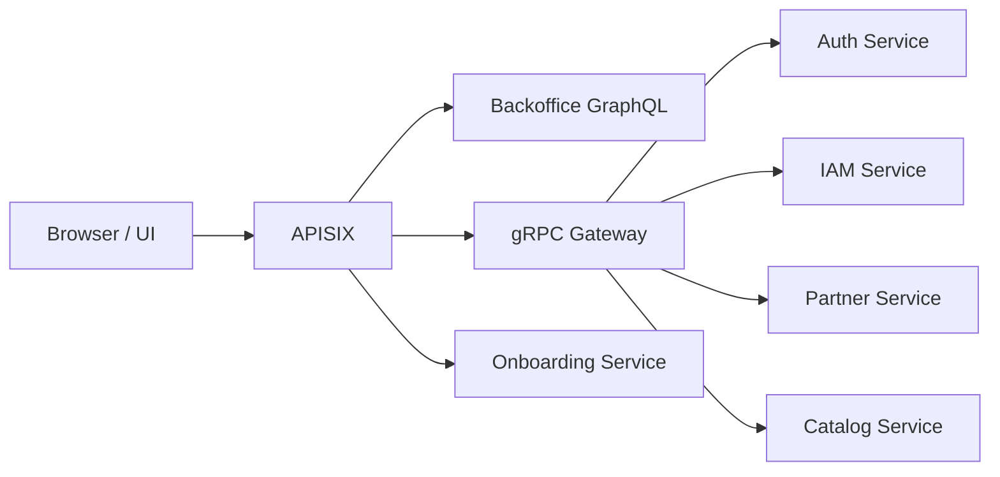
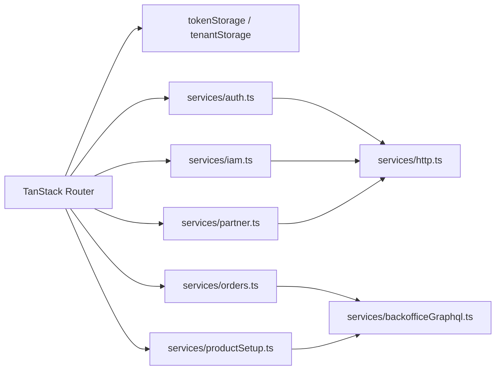

# Frontend and Edge

**Staleness note (2026-07-11):** the diagrams below predate the Module
Federation split (`frontend/src` HOST + `frontend/apps/{iam,backoffice,
onboarding}` remotes + `frontend/packages/shared`). Route paths and service
adapter names may not match current code. Not re-verified line by line in
this pass — treat as directional, confirm against actual routes.ts files
before relying on specifics.

## Seller Portal Route Structure

```mermaid
flowchart TB
    Root["Root Layout"]
    Auth["/auth/*"]
    Admin["/admin/*"]
    Tenant["/t/:tenantId/*"]

    Login["/auth/login"]
    Register["/auth/register"]
    Google["/auth/google/callback"]
    Invite["/auth/invite/accept"]
    DevBootstrap["/auth/dev/bootstrap"]

    AdminHome["/admin"]
    AdminSettings["/admin/settings"]
    AdminIAM["/admin/iam"]

    TenantHome["/t/:tenantId"]
    TenantOrders["/t/:tenantId/orders"]
    TenantAudit["/t/:tenantId/orders/audit"]
    TenantPartners["/t/:tenantId/partners"]
    TenantPartnerDetail["/t/:tenantId/partners/:partnerId"]
    TenantProducts["/t/:tenantId/products/setup"]

    Root --> Auth
    Root --> Admin
    Root --> Tenant

    Auth --> Login
    Auth --> Register
    Auth --> Google
    Auth --> Invite
    Auth --> DevBootstrap

    Admin --> AdminHome
    Admin --> AdminSettings
    Admin --> AdminIAM

    Tenant --> TenantHome
    Tenant --> TenantOrders
    Tenant --> TenantAudit
    Tenant --> TenantPartners
    Tenant --> TenantPartnerDetail
    Tenant --> TenantProducts
```

## Edge Request Flow

## UI Service Adapters

## Notes

- `frontend/` is the operator-facing web app (HOST shell + Module Federation remotes).
- Admin paths are HTTP/gRPC-gateway oriented.
- Tenant workspace paths are GraphQL-first through `backoffice`.
- `APISIX` is the single edge entry in the local platform runtime.
