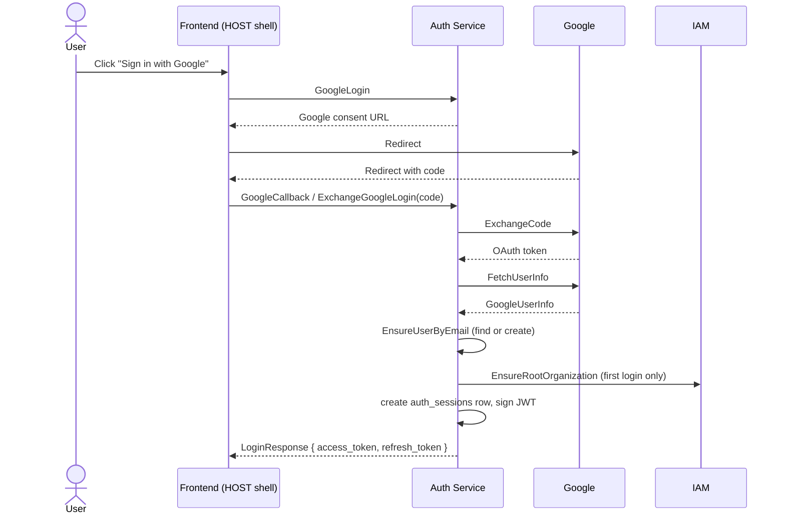

# Component: Auth Service

Parent: [Services Index](../README.md) · [DB Design](./db-design.md)

## Purpose

Owns human identity, session lifecycle, and token issuance for the whole
platform. Every other service trusts a JWT minted here (verified via
`pkg/pdauthn`) instead of re-implementing authentication.

## Responsibilities

- Sign in (username/password, Google OAuth), sign up, sign out.
- Session lifecycle: create, list, revoke, refresh-token rotation.
- Issue and sign the platform JWT (`pkg/pdauthn.Claims`) — user identity,
  active tenant, session policy, assumed-role state.
- Tenant switch (`SwitchActiveTenant`) and role assumption
  (`AssumeRole`/`ClearAssumedRole`) as session-state transitions.
- Session-scoped audit log (`ListAuditLogs`).
- Maintain a local, rebuildable projection of IAM tenant/membership data
  (`iam_tenants_projection`, `iam_tenant_memberships_projection`) so auth
  can validate tenant switches without a synchronous IAM call on every
  request.

## Non-Responsibilities

- Does not own permission/policy evaluation — that's IAM
  (`docs/03-architecture-detail-design/11-iam-platform.md`). Auth calls
  IAM synchronously for account bootstrap, role assumption, and
  membership checks; it does not decide *what* a role/permission means.
- Does not own tenant/organization data — `iam_tenants_projection` is a
  read-only projection, not the source of truth (SRS-ONB-003 pattern: KV
  projections are rebuildable, not authoritative).
- Does not serve any Backoffice/onboarding business data.

## Frontend Surface

No dedicated MFE remote. Auth screens live inside the HOST shell at
`frontend/src/modules/shell/pages/auth/`:

- `LoginPage.tsx` / `createLoginViewModel.ts`
- `RegisterPage.tsx` / `createRegisterViewModel.ts`
- `GoogleCallbackPage.tsx`
- `AcceptInvitePage.tsx`
- `DevAuthBootstrapPage.tsx` (dev-only bootstrap flow)

Follows the same `Page -> ViewModel -> API Client` pattern as every other
frontend module — see `agent/SOLID_STYLE_GUIDE.md`. Not split into a
remote because sign-in must work before any MFE remote can load (a remote
load failure boundary assumes the user is already authenticated into the
shell).

## Owned Data

See [DB Design](./db-design.md) for full schema. Summary:

| Data | Storage | Source of truth? |
|---|---|---|
| `users` | Postgres | yes |
| `auth_sessions`, `auth_refresh_tokens` | Postgres | yes |
| `auth_audit_logs` | Postgres | yes |
| `iam_tenants_projection`, `iam_tenant_memberships_projection` | Postgres | no — projection of IAM, rebuildable |
| `message_inbox` | Postgres | infra-only (Kafka idempotency ledger) |
| OAuth CSRF state | Redis (`redis-auth`) | yes, TTL-bound |

## Interfaces

### Inbound APIs

gRPC service `auth.v1.AuthService` (`api/proto/auth/v1/auth_service.proto`),
exposed over HTTP via `grpcgateway`.

| RPC | Caller | Notes |
|---|---|---|
| `Login`, `Register` | Frontend (HOST shell) | username/password |
| `GoogleLogin`, `GoogleCallback`, `ExchangeGoogleLogin` | Frontend (HOST shell) | OAuth code flow |
| `RefreshToken` | Frontend | refresh-token rotation |
| `Logout` | Frontend | revokes session |
| `SwitchActiveTenant` | Frontend | changes `active_tenant_id` on the session |
| `AssumeSessionPolicy`, `ClearSessionPolicy` | Frontend / internal | scoped session policy |
| `AssumeRole`, `ClearAssumedRole` | Frontend / internal | role assumption |
| `GetSession`, `ListSessions`, `RevokeSession` | Frontend, other services (e.g. `partner` calls `GetSession` for authz — see `internal/partner/controller/grpchandler/authz.go`) | |
| `ListAuditLogs` | Frontend | |
| `GetUserByIdentity`, `EnsureUserByEmail`, `GetUserByID`, `ListUsers` | Other services (e.g. IAM directory lookups) | |

Kafka inbound: `internal/auth/controller/eventhandler/iamprojection`
consumes `tenant.created` and `tenant.member.added` from IAM, writes to
the projection tables above. Unknown event types on the topic are a
no-op, not an error — see `pkg/messaging.ErrHandlerNotFound` handling in
that package.

### Outbound Calls

| Target | Protocol | Reason |
|---|---|---|
| IAM (`iamclient`) | gRPC | `AccountBootstrapper.EnsureRootOrganization`, `RoleAssumer.AssumeRole`, `TenantAccessChecker.EnsureActiveMembership` |
| Google OAuth | HTTPS | `GoogleOauthExternal` — code exchange, user info fetch |
| Redis (`redis-auth`) | TCP | OAuth CSRF state (`OauthStateRepository`), TTL-bound |
| Kafka | TCP | consume IAM projection events (worker), publish auth domain events (via `pkg/messaging` outbox pattern, `cmd/auth-worker`) |

## Dependencies

| Dependency | Type | Reason |
|---|---|---|
| Postgres | DB | see DB Design |
| Redis | Cache | OAuth state, keyed `redis-auth` |
| Kafka | Event Bus | IAM projection consumption, outbox publish |
| IAM service | gRPC | account bootstrap, role assumption, membership check |
| Google OAuth | External HTTPS | login provider |

## Runtime Flows

Two runtimes deploy from this codebase (see `01-modules.md`): `cmd/auth`
(the gRPC API above) and `cmd/auth-worker` (Kafka projection consumer
only, no inbound gRPC).

## Failure Modes

| Failure | Expected Behavior |
|---|---|
| Google OAuth exchange fails | `GoogleCallback`/`ExchangeGoogleLogin` returns an error; no session created |
| IAM unreachable during `EnsureRootOrganization` | Login fails rather than creating a user with no organization — see `auth_interactor.go` |
| Refresh token reused after rotation | Rejected — `replaced_by_token_id` chain marks prior tokens revoked |
| Unknown Kafka event type on the IAM projection topic | No-op (forward-compatible), not an error — see `pkg/messaging` registry note above |
| `message_inbox` shows a message stuck `processing` | Indicates consumer crash mid-handle; see `pkg/messaging`/`pkg/pdkafka` retry/dead-letter docs (`07-async-messaging.md`) |

## Security

- Authentication: this service *is* the authentication authority — no
  upstream auth dependency for its own inbound calls except the JWT
  itself for session-scoped RPCs (`GetSession`, `ListSessions`, ...).
- Authorization: coarse — a caller can only act on their own session/user
  unless the RPC is explicitly service-to-service (e.g.
  `GetUserByIdentity`).
- Tenant/workspace/store isolation: `active_tenant_id` on the session, not
  enforced at the DB row level (auth data itself is platform-scoped, not
  per-tenant tables).
- Sensitive data: see [DB Design](./db-design.md) "Secrets" — password
  bcrypt hash, refresh-token SHA-256 hash, JWT signing secret via config
  (never a DB column).

## Observability

- Logs: `pkg/pdlog`, stdout (see
  `docs/00-governance/twelve-factor.md` Factor XI).
- Metrics: none added beyond platform defaults.
- Traces: none added.
- Alerts: none added.

## Config

Loaded via `pkg/pdconfig` (`internal/auth/config/auth_config.go`):
`JWT_SECRET`, `JWT_KEY`, `APP_REDIRECT_URL`, IAM gRPC host/port. See
`docs/00-governance/twelve-factor.md` Factor III — never hardcode these,
never commit a real value.

## Agent Rules

- Do not put session/token business logic in `controller/grpchandler` —
  it belongs in `domain/` (`auth_interactor.go`, `token_interactor.go`).
- Do not bypass `pkg/pdauthn` to hand-roll JWT parsing/signing elsewhere.
- Do not write directly to `iam_tenants_projection` /
  `iam_tenant_memberships_projection` from request-handling code — only
  the Kafka projection handler writes these tables.
- Do not change the auth proto (`api/proto/auth/v1/*.proto`) without a
  PZEP — every other service depends on this contract.
