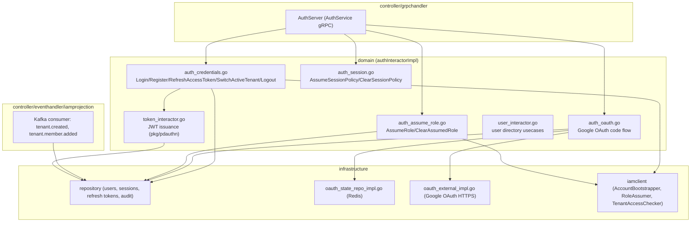
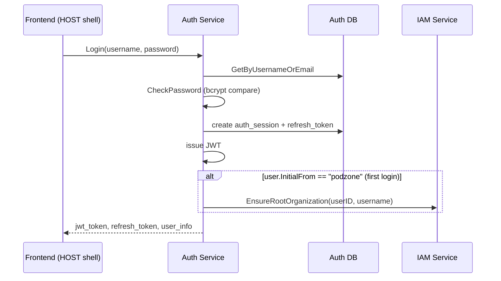
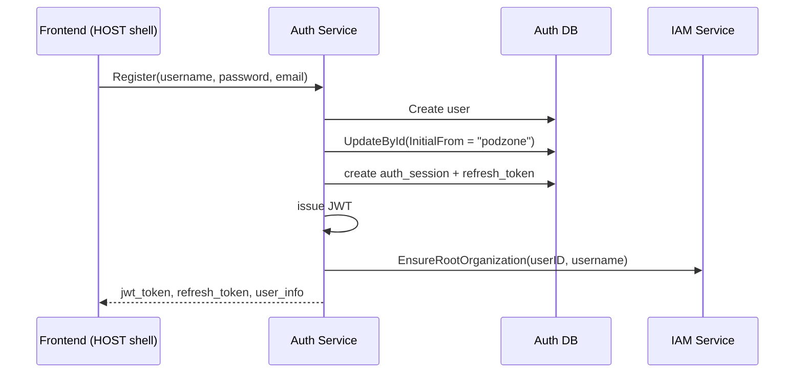
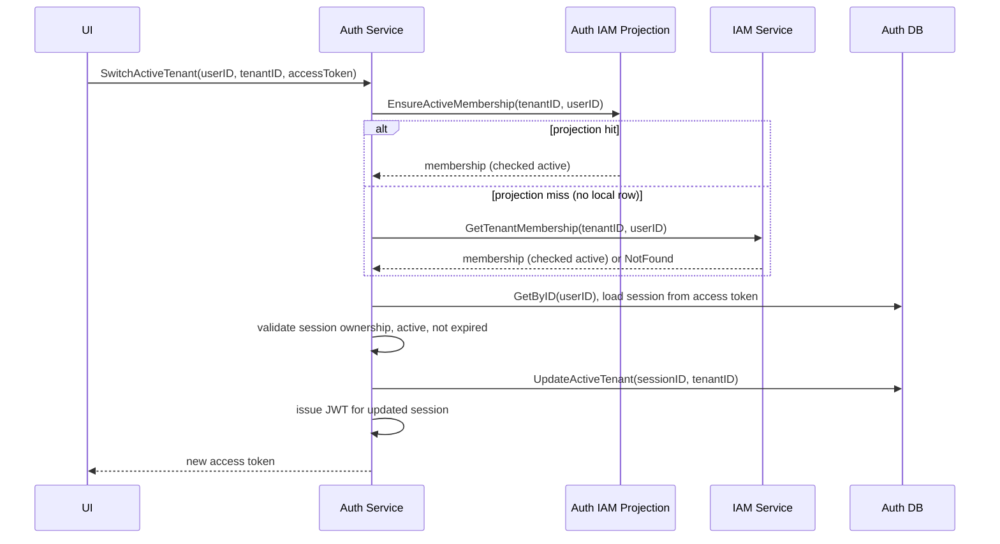
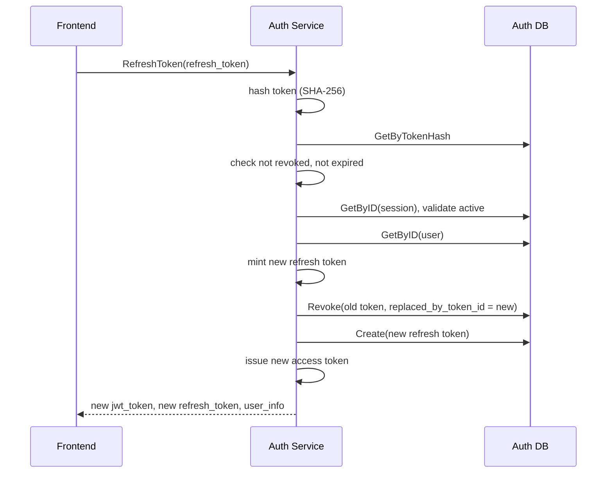
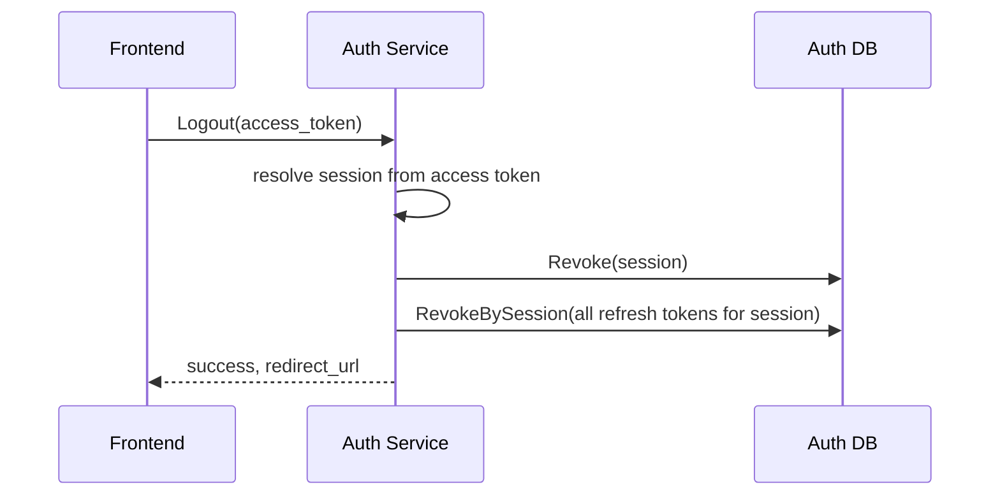
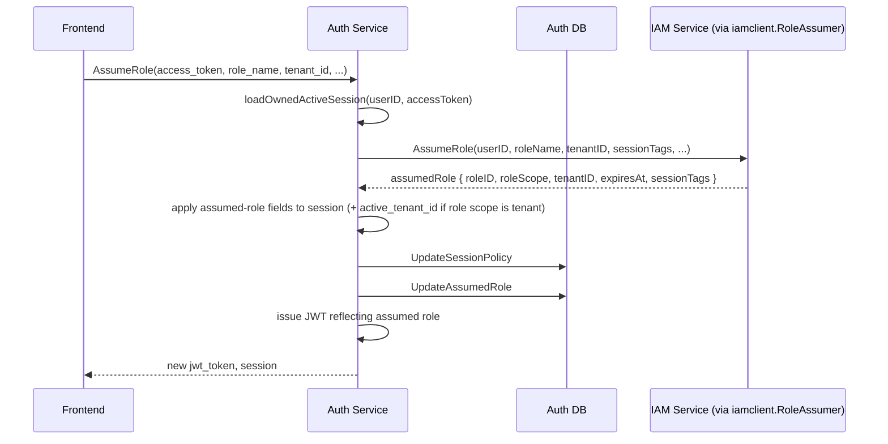

# Auth Service — API Design

Parent: [Services Index](../README.md) · [auth README](./README.md) · [DB Design](./db-design.md)

## C3: Component View

Two binaries build from this codebase: `cmd/auth` (gRPC API, everything
above except `events`) and `cmd/auth-worker` (`events` only, no inbound
gRPC) — see `01-modules.md`.

## gRPC API Surface

Service `auth.v1.AuthService` (`api/proto/auth/v1/{auth,auth_session}.proto`),
also exposed over HTTP via `grpcgateway` (`google.api.http` annotations
below). 19 RPCs.

| RPC | HTTP | Request | Response | Errors |
|---|---|---|---|---|
| `Login` | `POST /auth/v1/login` | `username, password` | `jwt_token, user_info, refresh_token` | `Unauthenticated` (wrong password/not found) |
| `Register` | `POST /auth/v1/register` | `username, password, email` | same as `Login` | `InvalidArgument` (duplicate username/email) |
| `GoogleLogin` | `GET /auth/v1/google/login` | `redirect_after_login` | `redirect_url` | — |
| `GoogleCallback` | `GET /auth/v1/google/callback` | `state, code` | `exchange_code, redirect_url, user_info` | `Internal` (OAuth exchange failure) |
| `ExchangeGoogleLogin` | `POST /auth/v1/google/exchange` | `exchange_code` | same as `Login` | `Unauthenticated`/`Internal` |
| `RefreshToken` | `POST /auth/v1/refresh` | `refresh_token` | same as `Login` | `Unauthenticated` (`ErrRefreshTokenInvalid`/`ErrRefreshTokenExpired`/`ErrSessionRevoked`) |
| `Logout` | `POST /auth/v1/logout` | `token` | `success, redirect_url` | — |
| `SwitchActiveTenant` | `POST /auth/v1/iam/tenants:switch` | `user_id, tenant_id, access_token` | `jwt_token, user_info, refresh_token` | `InvalidArgument` (`ErrInvalidUserID`), `Unauthenticated` (`ErrSessionRevoked`) |
| `AssumeSessionPolicy` | `POST /auth/v1/sessions:assume-policy` | `access_token, statements` | `jwt_token, session` | `InvalidArgument` (`ErrInvalidSessionPolicy`) |
| `ClearSessionPolicy` | `POST /auth/v1/sessions:clear-policy` | `access_token` | `jwt_token, session` | — |
| `AssumeRole` | `POST /auth/v1/sessions:assume-role` | `access_token, role_name, tenant_id, session_policy, external_id, session_name, source_identity, duration_seconds, service_principal, session_tags` | `jwt_token, session` | `InvalidArgument`, propagates IAM `RoleAssumer` errors |
| `ClearAssumedRole` | `POST /auth/v1/sessions:clear-assumed-role` | `access_token` | `jwt_token, session` | `InvalidArgument` (`ErrInvalidUserID`) |
| `GetSession` | `GET /auth/v1/sessions/{session_id}` | `session_id` | `session` | `NotFound` |
| `ListSessions` | `GET /auth/v1/sessions` | `collection` (pagination) | `sessions, page_info` | — |
| `RevokeSession` | `DELETE /auth/v1/sessions/{session_id}` | `session_id` | `{}` | `NotFound` |
| `ListAuditLogs` | `GET /auth/v1/audit-logs` | `page_size` (legacy), `collection` | `logs, page_info` | — |
| `GetUserByIdentity` | `GET /auth/v1/users:by-identity` | `identity` | `user_info` | `NotFound` |
| `EnsureUserByEmail` | `POST /auth/v1/users:ensure-by-email` | `email` | `user_info, created` | — |
| `GetUserByID` | `GET /auth/v1/users/{user_id}` | `user_id` | `user_info` | `NotFound` |
| `ListUsers` | internal only, no HTTP annotation | `collection` | `users, page_info` | — (see proto comment: "Internal directory query. Public IAM management APIs authorize callers before proxying directory results.") |

Error mapping (`authStatusError` in `auth_server.go`): `ErrUserNotFound` →
`NotFound`; `ErrWrongPassword` → `Unauthenticated`;
`ErrUserAlreadyExists`/`ErrUsernameExisted`/`ErrEmailExisted`/
`ErrInvalidSessionPolicy`/`ErrInvalidUserID` → `InvalidArgument`;
`ErrSessionNotFound`/`ErrSessionRevoked`/`ErrRefreshTokenInvalid`/
`ErrRefreshTokenExpired` → `Unauthenticated`; everything else → `Internal`.

Kafka inbound (not gRPC): `tenant.created`, `tenant.member.added` from
IAM — see [IAM service API design](../iam/api-design.md) "IAM Event
Projected into Auth" for the producer-side sequence (this doc doesn't
duplicate it).

## C4: Sequences Per Usecase

### Login (username/password)

### Register

### Switch Active Tenant

### Refresh Token (rotation)

Reused (raw) token is a rotation chain — a replayed/reused old refresh
token is rejected once `replaced_by_token_id` marks it superseded (see
[DB Design](./db-design.md) `auth_refresh_tokens`).

### Logout

### Assume Role

`ClearAssumedRole` is the inverse: same session load, zero out all
`assumed_role_*` fields + `session_tags`, `UpdateAssumedRole`, re-issue
JWT. No call to IAM on clear.

### Google OAuth Login

See [auth README](./README.md) "Runtime Flows" — the full
`GoogleLogin -> GoogleCallback -> ExchangeGoogleLogin` sequence lives
there already; not duplicated here.

## Cross-Service Dependencies

**Auth calls out to:**
- IAM (`iamclient`, gRPC): `AccountBootstrapper.EnsureRootOrganization`
  (first login/register), `RoleAssumer.AssumeRole` (role assumption).
  `TenantAccessChecker.EnsureActiveMembership` is called by
  `SwitchActiveTenant` — implementation reads the local IAM projection
  tables (`iam_tenants_projection`, `iam_tenant_memberships_projection`),
  not a live IAM gRPC call, per [DB Design](./db-design.md).
- Google OAuth (HTTPS): code exchange, user info fetch.
- Redis (`redis-auth`): OAuth CSRF state, TTL-bound.

**Auth is called by:**
- Frontend (HOST shell), via `grpcgateway`/APISIX, for all user-facing
  RPCs above.
- Other services for internal directory/session lookups: `partner`
  calls `GetSession` for authz (`internal/partner/controller/grpchandler/authz.go`);
  IAM and other services may call `GetUserByIdentity`/`EnsureUserByEmail`/
  `GetUserByID`/`ListUsers` for directory resolution.
- IAM (indirectly, via Kafka): `tenant.created`/`tenant.member.added`
  events consumed by `cmd/auth-worker` to maintain the local projection —
  see [IAM API design](../iam/api-design.md).
