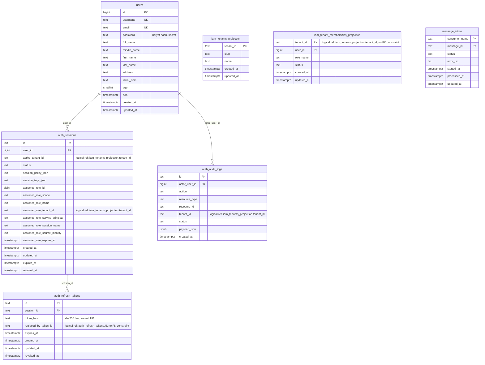

# Auth Service — DB Design

Parent: [Services Index](../README.md) · [auth README](./README.md)

Database: **Postgres**, single schema (no `pkg/pdtenantdb` tenant-routing —
auth is platform-scoped, not tenant-scoped storage). Migrations:
`internal/auth/migrations/authsql/` (goose, files `0001`–`0024`, not all
numbers present — gaps are migrations owned by other services sharing the
same goose sequence numbering convention, not missing files here).

See also: [Data Ownership](../../../02-architecture-overall/04-data-ownership.md),
[Legacy Inventory](../../../06-recovery/legacy-inventory.md).

## ERD

Only edges backed by an actual `REFERENCES` constraint in the migrations
are drawn as relationships. Cross-table associations that exist only as a
plain column (no FK constraint) are called out as **logical references**
below the diagram, not drawn here — see per-table notes.

## Tables

### `users`

Owner: auth. Scope: platform (not tenant/workspace/store-scoped — one row
per human identity across the whole platform).

| Column | Type | Null | Default | Notes |
|---|---|---|---|---|
| `id` | `BIGSERIAL` | no | auto | PK |
| `username` | `TEXT` | no | `''` | `UNIQUE`, indexed |
| `email` | `TEXT` | no | `''` | `UNIQUE`, indexed |
| `password` | `TEXT` | no | `''` | **secret** — bcrypt hash (`entity.GeneratePasswordHash`), never log |
| `full_name`, `middle_name`, `first_name`, `last_name`, `address`, `initial_from` | `TEXT` | no | `''` | |
| `age` | `SMALLINT` | no | `0` | |
| `dob` | `TIMESTAMPTZ` | no | `now()` | |
| `created_at`, `updated_at` | `TIMESTAMPTZ` | no | `now()` | |

Indexes: `idx_users_email`, `idx_users_username` (both non-unique btree —
uniqueness is enforced by the `UNIQUE` column constraint, not these).

### `auth_sessions`

Owner: auth. Scope: platform storage, but each row is tenant-contextual
(`active_tenant_id`) once a user selects a workspace.

| Column | Type | Null | Default | Notes |
|---|---|---|---|---|
| `id` | `TEXT` | no | — | PK |
| `user_id` | `BIGINT` | no | — | FK → `users.id` `ON DELETE CASCADE` |
| `active_tenant_id` | `TEXT` | no | `''` | logical ref, see above |
| `status` | `TEXT` | no | `'active'` | `active` \| `revoked` |
| `session_policy_json` | `TEXT` | no | `'[]'` | serialized `[]pdauthn.PolicyStatement` |
| `session_tags_json` | `TEXT` | no | `'{}'` | serialized `map[string]string` |
| `assumed_role_id` | `BIGINT` | no | `0` | 0 = no assumed role |
| `assumed_role_scope`, `assumed_role_name`, `assumed_role_tenant_id`, `assumed_role_service_principal`, `assumed_role_session_name`, `assumed_role_source_identity` | `TEXT` | no | `''` | populated only when a role is assumed |
| `assumed_role_expires_at` | `TIMESTAMPTZ` | yes | — | |
| `created_at`, `updated_at`, `expires_at` | `TIMESTAMPTZ` | no | `now()` (created/updated) | `expires_at` has no default — caller-supplied |
| `revoked_at` | `TIMESTAMPTZ` | yes | — | |

Indexes: `idx_auth_sessions_user_id`, `idx_auth_sessions_status`.

### `auth_refresh_tokens`

Owner: auth. Scope: platform.

| Column | Type | Null | Default | Notes |
|---|---|---|---|---|
| `id` | `TEXT` | no | — | PK |
| `session_id` | `TEXT` | no | — | FK → `auth_sessions.id` `ON DELETE CASCADE` |
| `token_hash` | `TEXT` | no | — | **secret** — SHA-256 hex of the raw token (`entity.HashToken`), `UNIQUE`; raw token is never stored |
| `replaced_by_token_id` | `TEXT` | yes | — | logical ref (rotation chain), no FK constraint |
| `expires_at`, `created_at`, `updated_at` | `TIMESTAMPTZ` | no | `now()` (created/updated) | |
| `revoked_at` | `TIMESTAMPTZ` | yes | — | |

Index: `idx_auth_refresh_tokens_session_id`.

### `auth_audit_logs`

Owner: auth. Scope: platform storage, tenant-contextual per row
(`tenant_id`).

| Column | Type | Null | Default | Notes |
|---|---|---|---|---|
| `id` | `TEXT` | no | — | PK |
| `actor_user_id` | `BIGINT` | no | — | FK → `users.id` `ON DELETE CASCADE` |
| `action`, `resource_type` | `TEXT` | no | — | |
| `resource_id` | `TEXT` | no | `''` | |
| `tenant_id` | `TEXT` | no | `''` | logical ref, see above |
| `status` | `TEXT` | no | — | |
| `payload_json` | `JSONB` | no | `'{}'` | |
| `created_at` | `TIMESTAMPTZ` | no | `now()` | |

Indexes: `idx_auth_audit_logs_actor_created_at (actor_user_id, created_at DESC)`,
`idx_auth_audit_logs_tenant_created_at (tenant_id, created_at DESC)`,
`idx_auth_audit_logs_resource_created_at (resource_type, resource_id, created_at DESC)`.

### `iam_tenants_projection` / `iam_tenant_memberships_projection`

Owner: auth (local read-model), **source of truth is IAM**. Rebuildable —
populated by `internal/auth/controller/eventhandler/iamprojection` from
Kafka events published by IAM, not written directly by auth request
handlers. See `docs/03-architecture-detail-design/07-async-messaging.md`.

`iam_tenants_projection`: PK `tenant_id`; `slug`, `name`, timestamps.

`iam_tenant_memberships_projection`: composite PK `(tenant_id, user_id)`;
`role_name`, `status`, timestamps. Index: `idx_iam_tenant_memberships_projection_user_id`.

### `message_inbox`

Owner: auth. Scope: platform, infra-only (not domain data). Idempotency
ledger for the Kafka consumer — composite PK `(consumer_name, message_id)`,
`status`, `error_text`, `started_at`, `processed_at`, `updated_at`. Index:
`idx_message_inbox_status`. See `pkg/messaging` for the generic
inbox/idempotency pattern this table backs.

## Secrets

- `users.password` — bcrypt hash. Never log, never return in any API
  response (confirmed not present in any proto response field).
- `auth_refresh_tokens.token_hash` — SHA-256 hash of the raw refresh
  token. The raw token itself is never persisted anywhere; only the caller
  holds it.
- `pkg/pdauthn` JWT signing secret (`JWTSecret` in `AuthConfig`) is
  process config, not a DB column — see
  `docs/00-governance/twelve-factor.md` Factor III.
