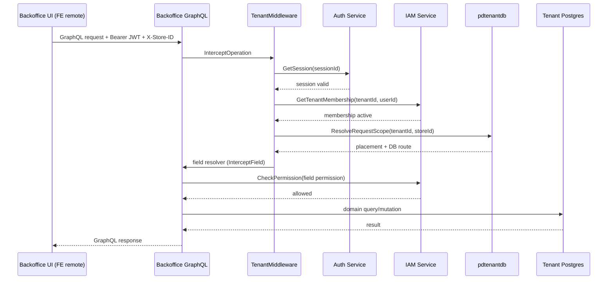

# Backoffice Service

Parent: [Services Index](../README.md)

## Purpose

Store-scoped operating surface for sellers: product setup, order routing,
fulfillment exceptions, settlement, and partner visibility. Opens only
after a store is provisioned and ready (see
[onboarding](../onboarding/README.md) and
[backbone-flow-refactor.md](../../../06-recovery/backbone-flow-refactor.md)).

## Responsibilities

- Store lifecycle within backoffice scope (create/activate/deactivate —
  not provisioning, that's onboarding's job).
- Product setup draft → candidate promotion workflow.
- Order routing, exception handling, shipment tracking, settlement,
  operator queue control.
- Order activity feed (audit trail) per order/store.
- Partner directory read-through (via `partner` service).
- Enforcing tenant/store-scoped GraphQL access with IAM-backed permission
  checks per field.

## Non-Responsibilities

- Does not provision stores or resolve placement — that's `onboarding`
  (`GET /requests/:id/readiness`, see
  [onboarding README](../onboarding/README.md)).
- Does not own identity, sessions, or tenant/org/policy data — that's
  `auth`/`iam`.
- Does not own partner records — reads them through
  `infrastructure/partnerdirectory`, a gRPC client to the `partner`
  service, not a local copy.
- Does not evaluate permissions itself — delegates every check to IAM via
  gRPC (`CheckPermission`, `GetTenantMembership`).

## Owned Data

See [DB Design](./db-design.md) for the full ERD. Summary: one Postgres
database, resolved per-tenant through `pkg/pdtenantdb` (no shared
cross-tenant schema) — `stores`, `product_setup_drafts`,
`product_setup_candidates`, `routed_orders`, `routed_order_activities`,
`customer_orders`.

**Correction to `docs/06-recovery/legacy-inventory.md`**: that doc lists
backoffice as "Postgres (tenant DB via `pdtenantdb`) + Mongo (store-scoped
runtime)". Direct code inspection (grep for `mongo.` across
`internal/backoffice`, review of all three repository packages —
`store`, `catalog`, `routing`) found **zero MongoDB usage**. All
repositories use `sqlx` + `squirrel` against Postgres via
`pdtenantdb.Manager`. This service is Postgres-only today; the Mongo
mention in the inventory is either aspirational or stale — flag for
correction there.

## Interfaces

### Inbound APIs

GraphQL-only (no REST/gRPC inbound). Schema:
`internal/backoffice/controller/graphql/schema/{store,catalog,routing,common}.graphqls`.

| Operation | Type | Notes |
|---|---|---|
| `stores(collection)` | Query | Paginated store list |
| `store(id)` | Query | Single store |
| `createStore(input)` | Mutation | |
| `activateStore(id)` | Mutation | |
| `deactivateStore(id)` | Mutation | |
| `productSetupSnapshot` | Query | Draft + candidate state for current store |
| `createProductSetupDraft(input)` | Mutation | |
| `promoteProductSetupCandidate(input)` | Mutation | Draft → candidate |
| `updateProductSetupCandidateStatus(id, status)` | Mutation | |
| `routedOrders(collection)` | Query | Paginated order list |
| `routedOrderActivities(input)` | Query | Paginated activity feed |
| `routedOrderRecommendation(input)` | Query | Routing recommendation |
| `createRoutedOrder(input)` | Mutation | |
| `forceRerouteBlockedOrder(input)` | Mutation | |
| `advanceRoutedOrder(id)` | Mutation | |
| `openOrderException(input)` / `updateOrderExceptionStatus(input)` | Mutation | |
| `updateOrderShipment(input)` / `updateOrderSettlement(input)` / `updateOrderIssueHandling(input)` / `updateOrderQueueControl(input)` | Mutation | |
| `bulkUpdateRoutedOrders(input)` | Mutation | |

Permission mapping per field lives in `tenant_middleware.go`
(`permissionForField`) — see Security below.

### Outbound Calls

| Target | Protocol | Reason |
|---|---|---|
| `auth` service | gRPC (`AuthServiceClient.GetSession`) | Validate session from bearer token |
| `iam` service | gRPC (`IAMQueryServiceClient.GetTenantMembership`, `CheckPermission`) | Tenant membership + per-field permission check |
| `partner` service | gRPC (`infrastructure/partnerdirectory/adapter.go`) | Partner directory read-through |
| Postgres (tenant DB) | `pkg/pdtenantdb` route resolution | All domain reads/writes |

## Dependencies

| Dependency | Type | Reason |
|---|---|---|
| Postgres | DB | Tenant-scoped operational data, routed via `pdtenantdb` |
| `pkg/pdtenantdb` | Internal pkg | Resolves tenant DB connection from KV route projection (published by onboarding) |
| `auth`, `iam`, `partner` | gRPC | Session validation, permission checks, partner directory |
| `99designs/gqlgen` | Library | GraphQL server codegen |

## Runtime Flows

Tenant-scoped GraphQL request path:

Field-level permission denial returns a `PermissionMappingError` or IAM
`allowed: false` — the GraphQL response carries the error, the UI keeps it
in the current screen (see Frontend Surface).

## Failure Modes

| Failure | Expected Behavior |
|---|---|
| `auth.GetSession` fails/unreachable | GraphQL error response, request rejected before reaching resolver |
| `iam.GetTenantMembership` returns inactive/not-found | GraphQL error, tenant access denied |
| `iam.CheckPermission` denies | Field-level error with permission detail (not a blanket auth failure) |
| `pdtenantdb` route not resolvable (store not ready) | Request rejected — backoffice must not open store-scoped mode without ready placement (see `backbone-flow-refactor.md` exit criteria) |
| Postgres unavailable | Standard `database/sql` error surfaced through resolver error path |

## Security

- Authentication: Bearer JWT, parsed with `golang-jwt/jwt/v5` in
  `tenant_middleware.go` (see `docs/08-adr/` for the JWT v3→v5 migration —
  not yet backfilled as an ADR at time of writing, only PZEP-0001 and the
  two MFE/pnpm ADRs exist so far).
- Authorization: every GraphQL field with a permission mapping goes
  through IAM `CheckPermission` — this service does not evaluate
  permissions locally.
- Tenant/workspace/store isolation: `X-Store-ID` header + JWT tenant claim
  cross-checked; DB access routed per-tenant via `pdtenantdb`, no shared
  cross-tenant table.
- Sensitive data: none stored directly beyond order/customer names already
  present in domain tables — no payment card data, no credentials.

## Observability

- Logs: `pkg/pdlog` to stdout, per `docs/00-governance/twelve-factor.md`.
- Metrics/Traces/Alerts: not verified in this pass — no findings to
  report either way.

## Config

Loaded via `pkg/pdconfig` — service host/port, Postgres connection
routing (via `pdtenantdb`), auth/iam/partner gRPC endpoints. See
`deployments/docker/config/backoffice.yml` for the dev shape.

## Agent Rules

- Do not add a Mongo dependency without an ADR — this service is
  Postgres-only today (see Owned Data correction above); if legacy-
  inventory.md's Mongo mention reflects real planned work, that decision
  needs its own ADR, not a silent addition.
- Do not bypass `TenantMiddleware` — every resolver must go through the
  session/membership/permission chain, not a per-resolver ad hoc check.
- Do not call `partner`, `auth`, or `iam` directly from a resolver —
  route through the existing adapters (`partnerdirectory`, `authz.go`).
- `customer_orders` is the newer order aggregate (see DB Design) — new
  order-domain work should target it, not `routed_orders`, unless
  explicitly extending legacy behavior. Confirm which table a change
  should touch before writing to both.

## Frontend Surface

Dedicated MFE remote: `frontend/apps/backoffice`. Routes
(`frontend/apps/backoffice/src/routes.ts`), all under `/t/$tenantId/*`:

- **Home** — `/t/$tenantId` (`pages/home/`)
- **Orders** — `/t/$tenantId/orders` (`pages/orders/` — has `shared/`,
  `hooks/`, `panels/`, `order-card/` subfolders; largest page area)
- **Order Audit** — `/t/$tenantId/orders/audit` (`pages/order-audit/`)
- **Order Finance** — `/t/$tenantId/orders/finance` (`pages/order-finance/`)
- **Partners** — `/t/$tenantId/partners` and
  `/t/$tenantId/partners/$partnerId` (`pages/partners/`)
- **Product Setup** — `/t/$tenantId/products/setup` (`pages/product-setup/`)

Each route is wrapped with `remotePage()` from
`@podzone/shared/ui/remotePage` for error isolation (see
[MFE Federation Contract](../../14-mfe-federation-contract.md)). ViewModel
pattern and state conventions: `agent/SOLID_STYLE_GUIDE.md` — not
re-explained here.
