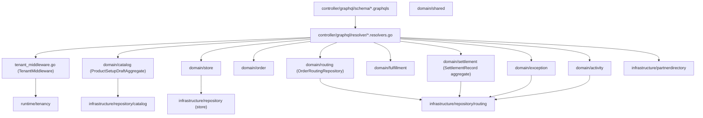
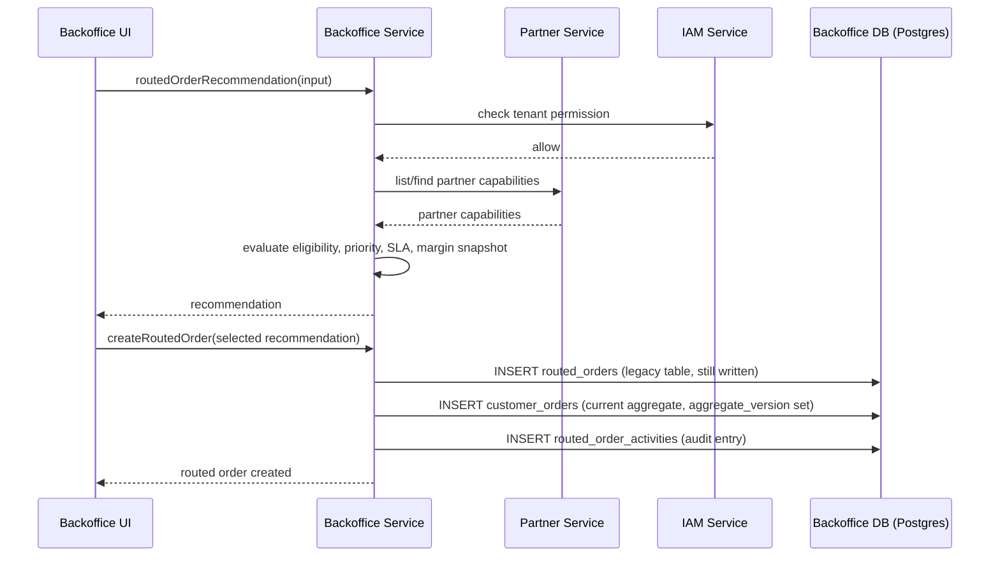
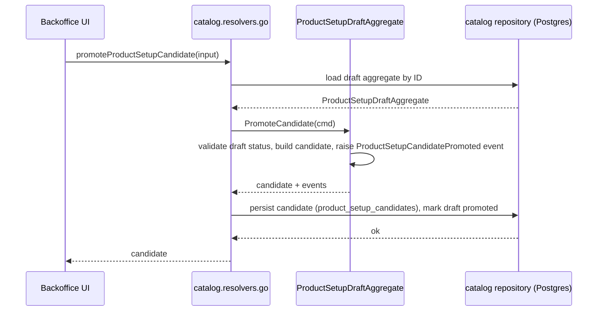
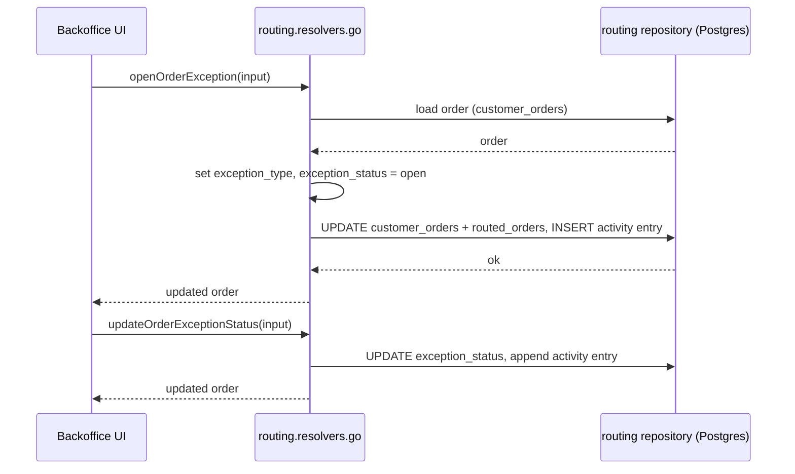
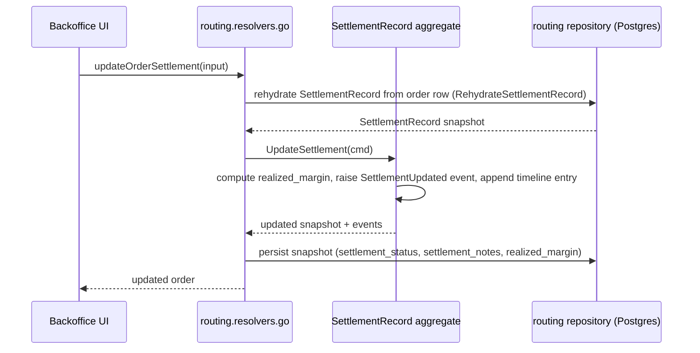

# Backoffice Service — API Design

Parent: [Services Index](../README.md) · [Backoffice README](./README.md) · [DB Design](./db-design.md)

## C3: Component View

Domain subdomains confirmed from `internal/backoffice/domain/`: `activity`,
`catalog`, `exception`, `fulfillment`, `order`, `routing`, `settlement`,
`store` (plus `shared`, common code, not a subdomain). `catalog` and
`settlement` use explicit DDD aggregate roots with domain events
(`ProductSetupDraftAggregate.PromoteCandidate`, `SettlementRecord.
UpdateSettlement`/`UpdateIssueHandling`) — the others are simpler
CRUD-shaped usecases over the `routing` repository, which backs
`routed_orders`/`customer_orders`/`routed_order_activities` for all of
routing, fulfillment, settlement, exception, and activity concerns (see
[DB Design](./db-design.md) — one wide table set, several domain packages
reading/writing it).

## GraphQL API Surface

Schema files: `internal/backoffice/controller/graphql/schema/
{store,catalog,routing,common}.graphqls`. Full operation list already
enumerated in [README.md](./README.md#interfaces) — summarized here by
subdomain:

| Subdomain | Queries | Mutations |
|---|---|---|
| store | `stores`, `store` | `createStore`, `activateStore`, `deactivateStore` |
| catalog (product setup) | `productSetupSnapshot` | `createProductSetupDraft`, `promoteProductSetupCandidate`, `updateProductSetupCandidateStatus` |
| routing / order | `routedOrders`, `routedOrderRecommendation` | `createRoutedOrder`, `forceRerouteBlockedOrder`, `advanceRoutedOrder`, `bulkUpdateRoutedOrders` |
| exception | — | `openOrderException`, `updateOrderExceptionStatus` |
| fulfillment | — | `updateOrderShipment` |
| settlement | — | `updateOrderSettlement`, `updateOrderIssueHandling` |
| activity | `routedOrderActivities` | — |
| operator queue | — | `updateOrderQueueControl` |

All mutations/queries go through `TenantMiddleware` (`InterceptOperation` +
per-field `InterceptField`) before reaching a resolver — see Runtime Flows
in [README.md](./README.md#runtime-flows) for that request path, not
repeated here.

## C4: Sequences Per Usecase

### Create Routed Order Recommendation → Create Routed Order

Reused from the former `docs/02-architecture-overall/05-sequences.md`,
corrected: `Create` in `infrastructure/repository/routing/repository.go`
inserts into **both** `routed_orders` and `customer_orders` in the same
call (dual-write, not a `routed_orders`-only legacy path) — the given
diagram's single "persist routed order + activity" step undersold this.

### Product Setup Draft → Candidate Promotion

### Open Order Exception → Update Exception Status

### Settlement Update (DDD Aggregate)

`updateOrderIssueHandling` follows the same aggregate-rehydrate-persist
shape via `SettlementRecord.UpdateIssueHandling` — not diagrammed
separately, same pattern.

## Cross-Service Dependencies

| Direction | Target/Caller | Protocol | Purpose |
|---|---|---|---|
| Outbound | `auth` service | gRPC (`AuthServiceClient.GetSession`) | Session validation in `TenantMiddleware` |
| Outbound | `iam` service | gRPC (`GetTenantMembership`, `CheckPermission`) | Tenant membership + per-field permission checks |
| Outbound | `partner` service | gRPC (`infrastructure/partnerdirectory/adapter.go`) | Partner capability/directory read-through |
| Outbound | Postgres (tenant-routed) | `pkg/pdtenantdb` | All domain reads/writes — DB route resolved from the KV projection onboarding publishes |
| Inbound | Frontend (`frontend/apps/backoffice`) | GraphQL over HTTPS, via APISIX `/backoffice/graphql` → rewritten to `/query` | Only inbound caller — see
[knowledge base: backoffice GraphQL 404](../../../10-knowledge-base/local-dev/2026-07-11-backoffice-graphql-404.md)
for why that route exists instead of hitting the service's own port directly |

No inbound gRPC/REST — this service has no server-to-server callers besides
the frontend through the gateway.
