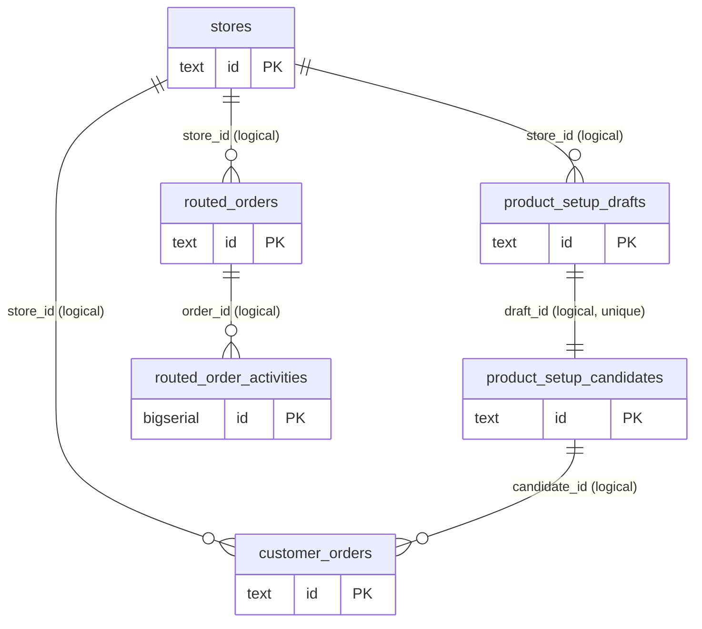
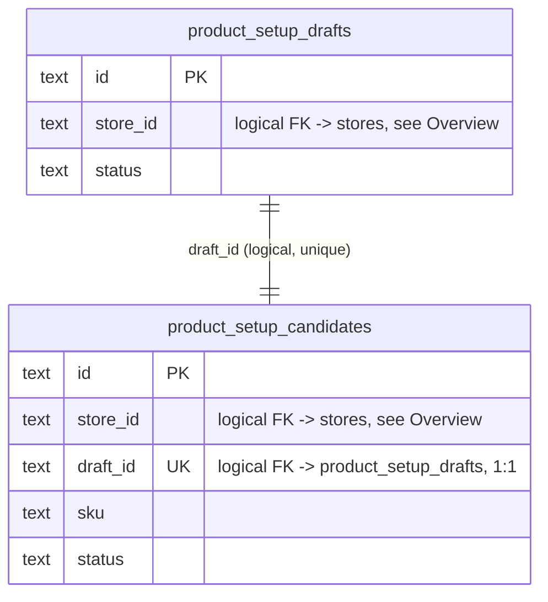
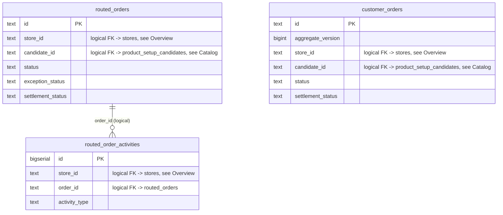

# Backoffice Service — DB Design

Parent: [Services Index](../README.md) · [backoffice README](./README.md)

Database: **Postgres only**, tenant-scoped, resolved per-tenant through
`pkg/pdtenantdb` (no shared cross-tenant schema). Migrations:
`internal/backoffice/migrations/sql/` (goose, files `0001`–`0015`; two
files share the number `0015` — `0015_add_store_scope_to_product_setup.sql`
and `0015_create_customer_order_aggregate_store.sql` — a real duplicate
migration number in the repo, not a transcription error here; both are
applied, goose evidently tolerates or orders them by filename).

**No MongoDB.** `docs/06-recovery/legacy-inventory.md` lists this service
as "Postgres + Mongo (store-scoped runtime)" — a direct grep for `mongo.`
across `internal/backoffice` and review of every repository package
(`store`, `catalog`, `routing`) found no Mongo client, driver import, or
collection anywhere. Correct that inventory entry.

See also: [Data Ownership](../../../02-architecture-overall/04-data-ownership.md),
[Legacy Inventory](../../../06-recovery/legacy-inventory.md),
[DDD And Clean Architecture](../../03-ddd-clean-architecture.md).

## Entity-Relationship Diagrams

**No table in this schema has a `REFERENCES` foreign-key constraint.**
Every cross-table link below is a plain `TEXT` column matched by
convention (a "logical reference"), enforced only in application code —
diagrams draw these logical links for readability, do not read them as
DB-enforced relationships. `routed_orders` alone carries ~30 columns
accumulated from the routing/fulfillment/settlement/exception subdomains
(migrations `0003`–`0014`); cramming all 6 tables with full column lists
into one diagram was unreadable, so this is split into a compact overview
plus one diagram per subdomain, matching the "Owner" subdomain noted for
each table under `## Tables` below. Each diagram keeps only PK/FK/UK
columns — full column lists are in `## Tables`.

### Overview

`stores` is the root every other table fans out from via a logical
`store_id`; it has no incoming logical references itself, so it is not
redrawn as its own diagram below — see `### \`stores\`` under `## Tables`
for its full column list.

### Catalog (Product Setup)

### Order, Fulfillment And Settlement

**`customer_orders` vs `routed_orders`**: `customer_orders` was created in
migration `0015` as an aggregate copy of `routed_orders` (backfilled via
`INSERT ... SELECT ... FROM routed_orders ON CONFLICT DO NOTHING`) and adds
`aggregate_version` for optimistic concurrency. The `routing` repository's
`GetCustomerOrder` reads from `customer_orders`, confirming it is the
currently-read aggregate — `routed_orders` remains present and is still
written to by other code paths. Treat `customer_orders` as the current
order aggregate; confirm with the routing domain code before assuming
`routed_orders` is dead.

## Tables

### `stores`

- Owner: backoffice (store lifecycle within backoffice scope; does not
  own provisioning — see [onboarding](../onboarding/README.md)).
- Scope: tenant-scoped conceptually (resolved via `pdtenantdb` per
  tenant), not itself carrying a `tenant_id` column — the tenant
  boundary is the Postgres database/schema selected by `pdtenantdb`, not
  a row-level column.
- No indexes beyond the primary key found in migrations.
- No secrets.

### `product_setup_drafts`

- Owner: backoffice (catalog subdomain).
- Scope: store-scoped (`store_id`, added in migration `0015a`, defaulted
  `''` then backfilled — rows created before that migration may have an
  empty `store_id` if backfill logic didn't match; verify in a real
  environment before relying on it being always populated).
- Index: `idx_product_setup_drafts_store_id (store_id, created_at DESC)`.
- No secrets.

### `product_setup_candidates`

- Owner: backoffice (catalog subdomain).
- Scope: store-scoped (`store_id`, same backfill caveat as above).
- `draft_id` is `UNIQUE` — enforces 1:1 with `product_setup_drafts` at
  the DB level (unique constraint, still not a `REFERENCES` FK).
- Index: `idx_product_setup_candidates_store_id (store_id, updated_at DESC)`.
- No secrets. `variants_json`/`artwork_checklist_json` are opaque JSON
  blobs stored as `TEXT`, not `JSONB` — no DB-level JSON validation.

### `routed_orders`

- Owner: backoffice (routing/fulfillment/settlement/exception subdomains
  — this one table accumulated columns from all of them across
  migrations `0003`–`0014`).
- Scope: store-scoped (`store_id`, migration `0014`).
- Index: `idx_routed_orders_store_id (store_id, created_at DESC)`.
- No secrets. Money fields (`total`, `base_cost_snapshot`,
  `fulfillment_cost`, `shipping_cost`, `realized_margin`, `issue_cost`)
  are `TEXT`, not a numeric/decimal type — formatted strings like
  `'$0.00'`, not DB-arithmetic-safe. Flag if aggregate queries over money
  are ever needed; today they'd require app-side parsing.
- `activity_log_json` existed here (migration `0008`) and was dropped
  (migration `0010`) once `routed_order_activities` took over — do not
  expect this column, it no longer exists.

### `routed_order_activities`

- Owner: backoffice (activity subdomain — audit trail for order changes).
- Scope: store-scoped (`store_id`, migration `0014`) and order-scoped
  (`order_id`).
- Indexes (5 total, all covering different query shapes): by `created_at`
  globally, by `order_id`, by `activity_type`+`created_at`, by
  `order_id`+`created_at`, by `actor`+`created_at`, by non-system
  activity (`WHERE activity_type <> 'system'`) — this table is read with
  several distinct filter patterns (global feed, per-order feed, per-actor
  feed, human-only feed), the index set reflects that.
- No secrets.

### `customer_orders`

- Owner: backoffice (routing subdomain — current order aggregate, see
  note above).
- Scope: store-scoped (`store_id`).
- `aggregate_version BIGINT` — optimistic concurrency version, absent
  from `routed_orders`. New order-domain work using optimistic locking
  should target this table.
- Index: `idx_customer_orders_store_id (store_id, created_at DESC)`.
- No secrets. Same `TEXT`-for-money caveat as `routed_orders`.

## Verification

Schema derived directly from reading all 16 files in
`internal/backoffice/migrations/sql/` and cross-checked against the row
structs in `internal/backoffice/infrastructure/repository/{store,catalog,
routing}/repository.go`. No columns or relationships were inferred beyond
what these files state. The Mongo-vs-Postgres correction above is a
direct grep result (`grep -rln "mongo\." internal/backoffice`), not an
assumption.
