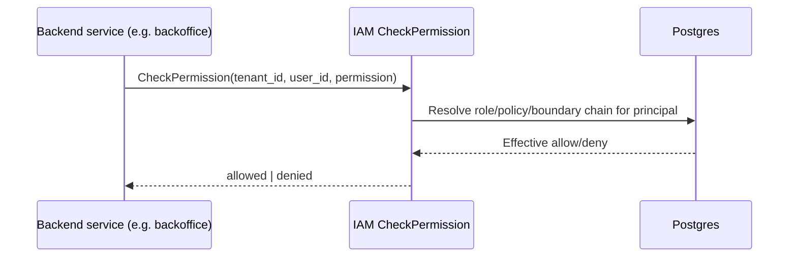

# Component: IAM Service

Parent: [Services Index](../README.md)
DB design: [db-design.md](./db-design.md)
Target architecture (proposed, not yet reached): [11-iam-platform.md](../../11-iam-platform.md)

This document describes the **current implemented state** of
`internal/iam`. `11-iam-platform.md` describes where IAM is meant to go
(a product-independent, identity-provider-neutral authorization platform).
Do not duplicate that doc here — where this README and that target
architecture disagree, the disagreement is called out explicitly below,
not silently resolved.

## Purpose

Central authorization source of truth for Podzone: tenants, organizations,
memberships, roles, managed/inline policies, permission boundaries, role
trust (assume-role), and access decision evaluation (`CheckPermission`,
`SimulateAccess`).

## Responsibilities

- Own the tenant registry (`tenants` table) and organization hierarchy
  (`iam_organizations`, memberships).
- Own RBAC (`iam_roles`, `iam_permissions`) and a policy-statement engine
  (managed policies with versions, inline policies, permission
  boundaries, group policies) layered on top of it.
- Evaluate `CheckPermission`/`CheckPlatformPermission`/`SimulateAccess` —
  the only place permission decisions are made.
- Publish tenant lifecycle domain events (`tenant.created`, tenant member
  events) via transactional outbox for downstream projections.
- Enforce organization/tenant/platform scope boundaries on every write.

## Non-Responsibilities

- Does not own user identity, passwords, sessions, or JWT issuance — that
  is `auth` (`internal/auth`). IAM reads user identity as an opaque
  `BIGINT user_id` with no foreign key into an auth table.
- Does not own business data (orders, products, stores) — permission
  *names* for those domains are registered here (`store:create`, etc.)
  but the resources themselves live in `backoffice`/`onboarding`.
- Does not expose an HTTP API — gRPC only (`IAMService`, split into
  `IAMCommandService`/`IAMQueryService` for CQRS).

## Owned Data

See [db-design.md](./db-design.md) for the full ERD and per-table detail.
Summary: Postgres, single schema, 24 tables across organization/tenant
registry, RBAC core, managed policy engine, permission boundaries, groups,
three parallel inline-policy families, audit log, and transactional
outbox.

| Data | Access | Notes |
|---|---|---|
| `tenants`, `iam_organizations` | read/write | Registry only — not the tenant's business data |
| `iam_roles`, `iam_permissions`, `iam_policies` + statements/versions | read/write | Authorization model |
| `iam_audit_logs` | write (append-only) | Read by admin UI (directory/assignments views) |
| `message_outbox` | read/write | Drained by `outbox_worker.go`, not read externally |

## Interfaces

### Inbound APIs

gRPC only, ~60 RPCs across three services in
`api/proto/iam/v1/iam_service.proto`. Grouped by capability (see the
proto file for the exact request/response shapes and full method list —
not reproduced here to avoid drift):

| Capability | Representative RPCs | Caller |
|---|---|---|
| Tenant/org lifecycle | `CreateTenant`, `CreateOrganization`, `AttachTenantToOrganization` | `onboarding` (tenant creation), platform admin UI |
| Membership | `AddTenantMember`, `CreateTenantInvite`, `AcceptTenantInvite`, `AddOrganizationMember` | `frontend/apps/iam`, `onboarding` |
| Permission decision | `CheckPermission`, `CheckPlatformPermission`, `SimulateAccess` | Every backend service's inbound guard (`backoffice`, `partner`, `onboarding`), `frontend/apps/iam` trust-simulation page |
| Policy management | `CreatePolicy`, `CreatePolicyVersion`, `SetDefaultPolicyVersion`, `AttachTenantUserPolicy`, `Put*InlinePolicy` | `frontend/apps/iam` policies section |
| Groups | `CreateGroup`, `AddGroupMember`, `AttachGroupPolicy` | `frontend/apps/iam` groups section |
| Role trust / boundaries | `PutRoleTrustPolicy`, `PutRolePermissionBoundary`, `AssumeRole` | Platform admin, cross-account-style role assumption |
| Directory | `ListDirectoryUsers`, `ListUserTenants` | `frontend/apps/iam` directory section |

### Outbound Calls

| Target | Protocol | Reason | Notes |
|---|---|---|---|
| `auth` service | gRPC (`authclient/user_directory.go`) | Resolve user identity/email for directory listing | IAM never writes to auth's tables |
| Kafka (`message_outbox` → `pkg/messaging`/`pkg/pdkafka`) | async event | Publish `tenant.created`, tenant member events | Commit-coupled via outbox, not direct publish — see `docs/07-async-messaging.md` |

Consumers of IAM's published events: `internal/auth/controller/eventhandler/iamprojection/` (`tenant_created.go`, `tenant_member_added.go`) — auth keeps a small local IAM projection for its own read paths.

## Dependencies

| Dependency | Type | Reason |
|---|---|---|
| Postgres | DB | `pkg/pdsql`, single schema — see db-design.md |
| Kafka | Event Bus | Outbox-published tenant lifecycle events |
| `auth` gRPC | Sync call | User directory lookups only |

## Runtime Flows

Permission evaluation combines: role-attached managed policies + directly
attached user policies + inline policies + group policies, all clipped by
the principal's permission boundary (if one is set) — see
`internal/iam/domain/inputport/usecase_authz.go` and the interactor for
the exact precedence logic; not reproduced here to avoid drifting from
code.

## Failure Modes

| Failure | Expected Behavior |
|---|---|
| Postgres unreachable | `CheckPermission` fails closed (deny), not fails open — verify against current interactor code before relying on this for a security review |
| Outbox publish failure | Row stays `status='pending'`, retried by `next_attempt_at` — no event lost, no duplicate-publish guard issue at IAM's side (dedup is the consumer's job) |
| Unknown permission boundary policy referenced | Evaluation should treat as most-restrictive, not most-permissive — verify against code |

## Security

- Authentication: none at IAM's own gRPC boundary — callers are trusted
  backend services on the internal network, not end users directly.
- Authorization: IAM **is** the authorization system; there is no meta-
  authorization layer in front of it beyond network boundary.
- Tenant/workspace/store isolation: enforced per-table, see "Tenant
  Scoping Summary" in db-design.md.
- Sensitive data: `tenant_invites.token_hash` (hash, not raw token,
  correctly). `iam_audit_logs.payload_json` can contain caller-supplied
  detail — do not put secrets in audit payloads.

## Observability

- Logs: `pkg/pdlog` to stdout, per twelve-factor rule
  (`docs/00-governance/twelve-factor.md`).
- Metrics: not verified in this pass.
- Traces: not verified in this pass.
- Alerts: not verified in this pass.

## Config

Loaded via `pkg/pdconfig` (see `docs/00-governance/twelve-factor.md`
Factor III). Service-specific config key: `sql-iam-config` for the
Postgres connection.

## Frontend Surface

Dedicated MFE remote at `frontend/apps/iam`, single route `/admin/iam`
(search-param `section` selects the active tab, not sub-routes — see
`agent/SOLID_STYLE_GUIDE.md` for the tab/section URL-state rule this
follows). Sections under `frontend/apps/iam/src/pages/admin-iam/`:

- `organizations/` — organization list/detail, member management
- `principals/` — platform/tenant user policy & boundary management
- `assignments/` — role/policy attachment views
- `groups/` — group CRUD, membership, group policy attachment
- `policies/` — managed policy CRUD, versioning
- `directory/` — user directory listing (calls `auth` via IAM's `ListDirectoryUsers`)
- `trust-simulation/` — `SimulateAccess` UI (role trust + permission boundary dry-run)
- `shared/` — cross-section presentation helpers

State/data flow follows the `createAdminIamViewModel` pattern (state in
`createAdminIamState.ts`, actions in `createAdminIamActions.ts`, resources
in `createAdminIamResources.ts`, contexts in `createAdminIamContexts.ts`)
— see `agent/SOLID_STYLE_GUIDE.md` for the ViewModel pattern itself, not
re-explained here.

## Agent Rules

- Do not put permission-evaluation logic in the gRPC handler — it belongs
  in `domain/inputport/usecase_authz.go` and its interactor.
- Do not bypass the usecase/interactor layer from `controller/grpchandler`.
- Do not add a Podzone-specific permission name assumption into shared
  IAM code without checking `11-iam-platform.md`'s product-independence
  invariants first — this is exactly the coupling that doc flags as a
  blocker to extraction.
- Do not access `iam_*` tables from another service's repository — go
  through IAM's gRPC API.
- Do not change public contracts (proto) without a PZEP — see
  `docs/09-pzep/README.md`.
