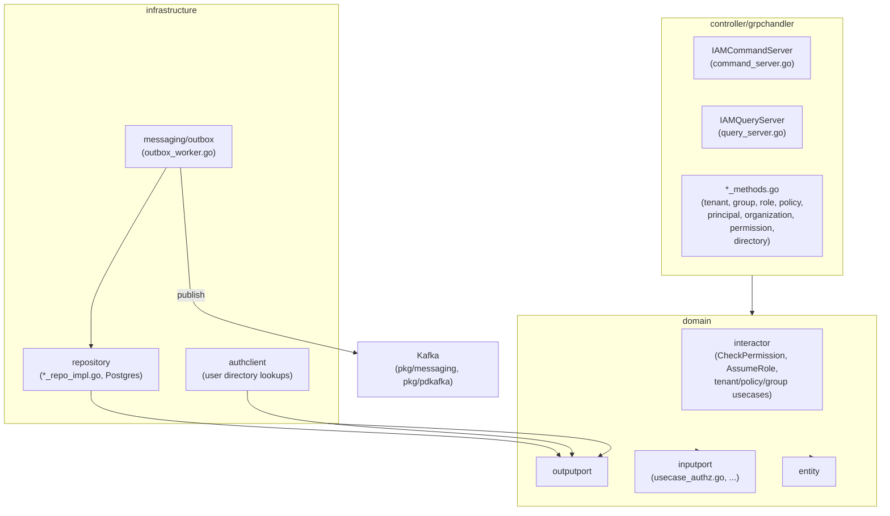
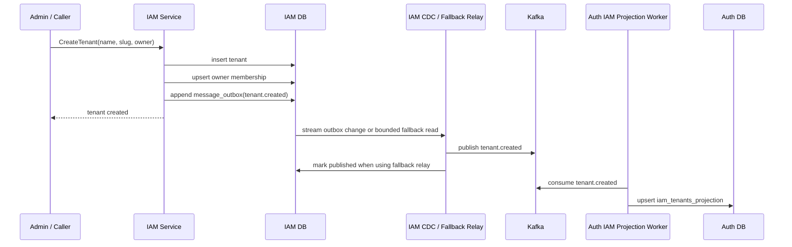
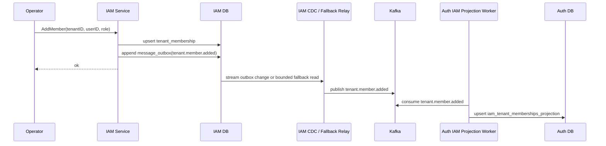
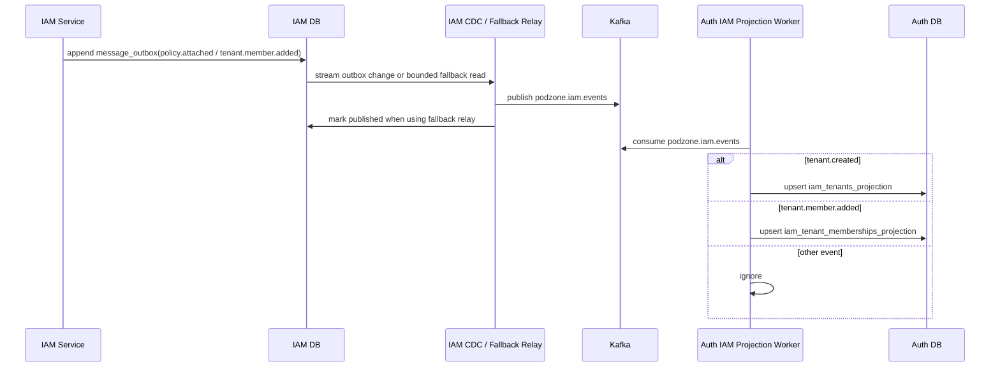
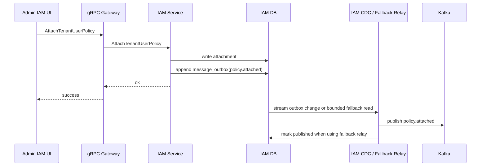
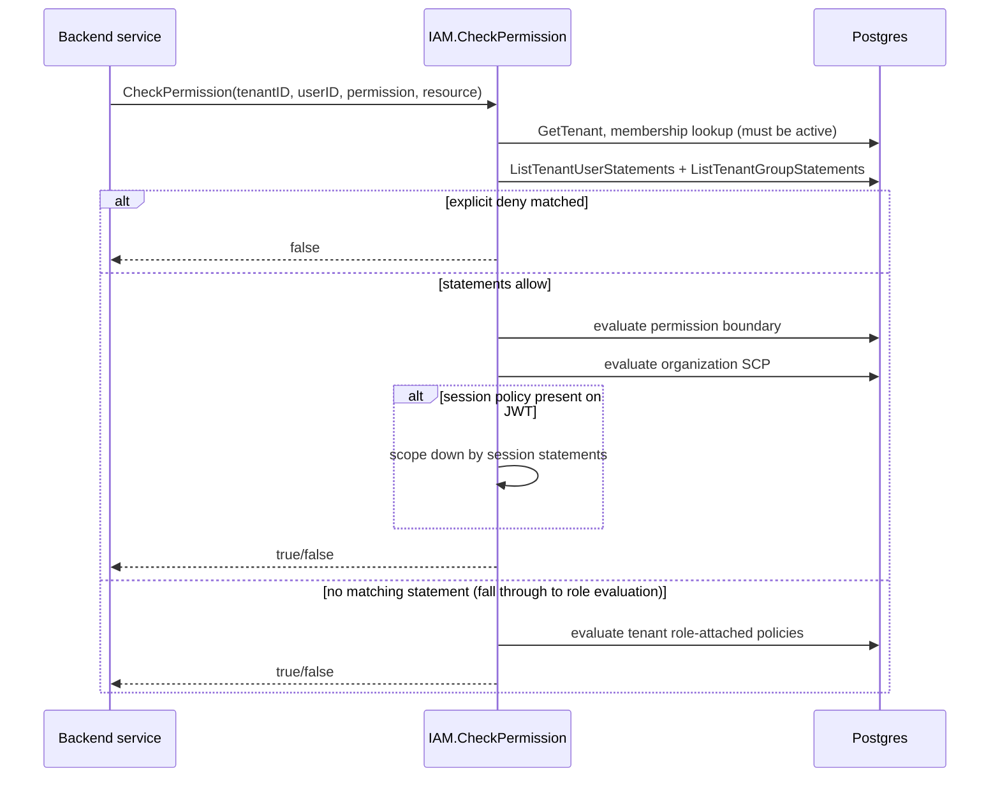
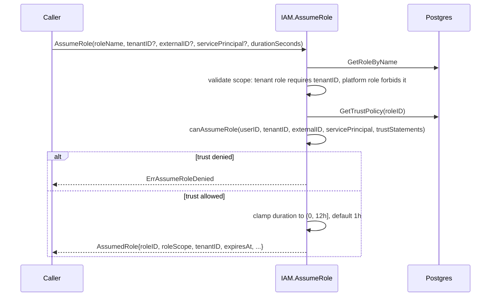

# IAM Service — API Design

Parent: [Services Index](../README.md) · [IAM README](./README.md) · [DB Design](./db-design.md)

gRPC only, no HTTP. Full request/response message shapes live in
`api/proto/iam/v1/{iam_service,iam_tenant,iam_policy,iam_simulation}.proto`
— not reproduced field-by-field here to avoid drift; this doc lists method
names, groups, and callers.

## C3: Component View

`IAMServer` (`server.go`) embeds both `IAMCommandServer` and
`IAMQueryServer` to satisfy the legacy unified `IAMServiceServer`
interface — new callers should target the split
`IAMCommandService`/`IAMQueryService` for CQRS routing.

## gRPC API Surface

`IAMService` (unified, 78 RPCs) is the canonical proto definition;
`IAMCommandService` (47 RPCs) and `IAMQueryService` (32 RPCs, overlapping
on read-only methods like `CheckPermission`) are the CQRS-split surfaces
actually intended for new callers. Grouped by domain area:

| Domain area | Representative RPCs | Caller |
|---|---|---|
| Tenant/org lifecycle | `CreateTenant`, `CreateOrganization`, `EnsureRootOrganization`, `AttachTenantToOrganization`, `DetachTenantFromOrganization` | `onboarding` (tenant creation), platform admin UI |
| Organization membership | `AddOrganizationMember`, `RemoveOrganizationMember`, `ListOrganizationMembers` | `frontend/apps/iam` organizations section |
| Tenant membership | `AddTenantMember`, `AddTenantMemberByIdentity`, `RemoveTenantMember`, `ListTenantMembers`, `GetTenantMembership` | `onboarding`, `frontend/apps/iam` |
| Tenant invites | `CreateTenantInvite`, `RevokeTenantInvite`, `AcceptTenantInvite`, `ListTenantInvites` | `frontend/apps/shell` invite-accept flow, `frontend/apps/iam` |
| Permission decision | `CheckPermission`, `CheckPermissionForResource`, `CheckPlatformPermission`, `SimulateAccess` | Every backend service's inbound guard (`backoffice`, `partner`, `onboarding`), `frontend/apps/iam` trust-simulation page |
| Managed policy engine | `CreatePolicy`, `CreatePolicyVersion`, `SetDefaultPolicyVersion`, `DeletePolicyVersion`, `DeletePolicy`, `GetPolicy`, `ListPolicies`, `ListPolicyVersions`, `ListPolicyAttachments` | `frontend/apps/iam` policies section |
| Policy attachment (by principal) | `AttachTenantUserPolicy`/`Detach...`, `AttachPlatformUserPolicy`/`Detach...`, `AttachGroupPolicy`/`Detach...` | `frontend/apps/iam` |
| Inline policies (4 parallel families: platform user, tenant user, group, and role-adjacent) | `Put/Get/List/Delete{Platform,TenantUser,Group}InlinePolicy` | `frontend/apps/iam` |
| Permission boundaries | `Put/Get/Delete{Platform,TenantUser,Role}PermissionBoundary` | `frontend/apps/iam` |
| Groups | `CreateGroup`, `DeleteGroup`, `ListGroups`, `AddGroupMember`/`Remove...`, `ListGroupMembers` | `frontend/apps/iam` groups section |
| Role / role trust | `AddPlatformRole`, `RemovePlatformRole`, `ListPlatformRoles`, `PutRoleTrustPolicy`, `GetRoleTrustPolicy`, `DeleteRoleTrustPolicy`, `AssumeRole` | Platform admin, cross-account-style role assumption |
| Service control policies (org-level) | `AttachServiceControlPolicy`, `DetachServiceControlPolicy`, `ListServiceControlPolicies` | Platform admin |
| Directory | `ListDirectoryUsers`, `ListUserTenants`, `ListPermissions` | `frontend/apps/iam` directory section |

Errors: standard gRPC status codes: `NotFound` (unknown tenant/policy/role
ID), `InvalidArgument` (malformed input, e.g. `AssumeRole` with tenant ID
on a platform-scope role), `PermissionDenied` (`AssumeRole` trust
statement rejects, `CheckPermission`-style denials return `false` in the
response body, not a gRPC error — the RPC itself succeeds).

## C4: Sequences Per Usecase

### Create Tenant with Outbox

### Add Tenant Member

### IAM Event Projected into Auth

### Admin IAM Policy Attachment

### CheckPermission Evaluation (Normal Membership)

Not an assumed-role call. Precedence, from `domain/interactor/authz.go`:
identity + group policy statements are evaluated first; an **explicit
deny** short-circuits to `false` immediately. Otherwise the request must
also clear the user's permission boundary and the tenant's organization
service-control-policy (SCP) ceiling, then optionally get scoped down
further by any session policy statements attached to the caller's JWT.

### AssumeRole

Later `CheckPermission` calls in an assumed-role context branch
differently (see the assumed-role check at the top of
`CheckPermissionForResource`): a tenant-scoped assumed role is rejected
outright if its `TenantID` doesn't match the request's tenant, otherwise
evaluation runs against the assumed role's own policy instead of the
caller's direct membership.

## Cross-Service Dependencies

Inbound (who calls IAM): `auth` (`SwitchActiveTenant` → `GetTenantMembership`
on projection miss), `onboarding` (tenant/store provisioning membership
checks), `backoffice` (`CheckPermission` on every GraphQL resolver via
`tenant_middleware.go`), `partner` (`CheckPermission` via its
`TenantAuthorizer`), `frontend/apps/iam` (all admin console operations).

Outbound (who IAM calls): `auth` gRPC, read-only, for user directory
lookups (`ListDirectoryUsers`) — IAM never writes to auth's tables. Kafka
publish via the outbox — see "IAM Event Projected into Auth" above; the
only consumer today is `internal/auth/controller/eventhandler/iamprojection/`.

For the target-state gap between this implemented API and where IAM is
meant to go (product-independent action catalog, identity-provider
neutrality), see [11-iam-platform.md](../../11-iam-platform.md) — not
re-described here.
