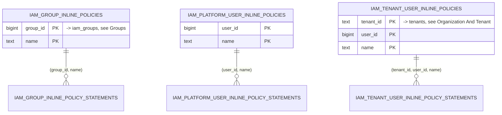

# IAM — DB Design

Parent: [IAM Service](./README.md) · [Services Index](../README.md)

Database: **Postgres**, single schema (`pkg/pdsql`, config key
`sql-iam-config`). IAM does **not** use `pkg/pdtenantdb` — it is the
platform/control-plane database, not tenant-routed. This is consistent
with IAM being the single source of truth for authorization decisions
across all tenants, not a per-tenant resource.

Schema built by reading all 23 schema-affecting migrations in
`internal/iam/migrations/sql/` (0001–0029; some numbers are data-only and
add no new table/column — noted inline where relevant).

## Entity-Relationship Diagrams

32 tables in one diagram is unreadable, so this is split into a one-screen
overview (anchor entities only) plus one focused diagram per functional
group — same grouping as the `## Tables` sections below, so each diagram
sits right above the prose that documents its columns in full. `user_id`
throughout this schema is a **plain `BIGINT` with no foreign key** — user
identity is owned by the `auth` service; IAM treats it as an opaque
external ID. Cross-group foreign keys are called out as a note under each
diagram rather than redrawn everywhere.

### Overview — Anchor Entities

```mermaid
erDiagram
    IAM_ORGANIZATIONS ||--o{ TENANTS : "org_id (soft ref, no FK)"
    IAM_ORGANIZATIONS ||--o{ IAM_GROUPS : "org_id (nullable)"
    TENANTS ||--o{ IAM_GROUPS : "tenant_id (nullable)"
    IAM_ROLES ||--o{ TENANT_MEMBERSHIPS : "role_id"
    TENANTS ||--o{ TENANT_MEMBERSHIPS : "tenant_id"
    IAM_POLICIES ||--o{ IAM_ROLES : "permission boundary (1:1, nullable)"
    IAM_GROUPS ||--o{ IAM_POLICIES : "policy attachments"

    IAM_ORGANIZATIONS {
        text id PK
        text slug UK
        bigint root_user_id "unique when > 0"
    }
    TENANTS {
        text id PK
        text slug UK
        text org_id "indexed, no FK constraint"
    }
    IAM_ROLES {
        bigint id PK
        text name UK
        text scope "tenant | platform | organization"
    }
    IAM_POLICIES {
        bigint id PK
        text scope "tenant | platform | organization"
        text name "unique per (scope, org_id)"
    }
    IAM_GROUPS {
        bigint id PK
        text scope "platform | organization | tenant"
        text name "unique per scope"
    }
    TENANT_MEMBERSHIPS {
        text tenant_id PK_FK
        bigint user_id PK
        bigint role_id FK
    }
```

Everything below expands one of these five anchors plus its junction and
detail tables.

### Organization And Tenant

```mermaid
erDiagram
    IAM_ORGANIZATIONS ||--o{ TENANTS : "org_id (soft ref, no FK)"
    IAM_ORGANIZATIONS ||--o{ IAM_ORGANIZATION_MEMBERSHIPS : "org_id"
    IAM_ORGANIZATIONS ||--o{ IAM_ORG_SERVICE_CONTROL_POLICIES : "org_id"
    TENANTS ||--o{ TENANT_MEMBERSHIPS : "tenant_id"
    TENANTS ||--o{ TENANT_INVITES : "tenant_id"

    IAM_ORGANIZATIONS {
        text id PK
        text slug UK
        bigint root_user_id "unique when > 0"
    }
    TENANTS {
        text id PK
        text slug UK
        text org_id "indexed, no FK constraint"
    }
    TENANT_MEMBERSHIPS {
        text tenant_id PK_FK
        bigint user_id PK
        bigint role_id FK "-> iam_roles, see RBAC Core"
    }
    TENANT_INVITES {
        text id PK
        text tenant_id FK
        bigint role_id FK "-> iam_roles, see RBAC Core"
        text token_hash UK
    }
    IAM_ORGANIZATION_MEMBERSHIPS {
        text org_id PK_FK
        bigint user_id PK
        bigint role_id FK "-> iam_roles, see RBAC Core"
    }
    IAM_ORG_SERVICE_CONTROL_POLICIES {
        text org_id PK_FK
        bigint policy_id PK_FK "-> iam_policies, see Policy Engine"
    }
```

### RBAC Core

```mermaid
erDiagram
    IAM_ROLES ||--o{ IAM_ROLE_PERMISSIONS : "role_id"
    IAM_ROLES ||--o{ USER_PLATFORM_ROLES : "role_id"
    IAM_ROLES ||--o{ IAM_ROLE_TRUST_STATEMENTS : "role_id"
    IAM_ROLES ||--o| IAM_ROLE_PERMISSION_BOUNDARIES : "role_id (1:1)"
    IAM_PERMISSIONS ||--o{ IAM_ROLE_PERMISSIONS : "permission_id"

    IAM_ROLES {
        bigint id PK
        text name UK
        text scope "tenant | platform | organization"
        boolean is_system
    }
    IAM_PERMISSIONS {
        bigint id PK
        text name UK "e.g. store:create"
        text resource
        text action
    }
    IAM_ROLE_PERMISSIONS {
        bigint role_id PK_FK
        bigint permission_id PK_FK
    }
    USER_PLATFORM_ROLES {
        bigint user_id PK
        bigint role_id PK_FK
    }
    IAM_ROLE_TRUST_STATEMENTS {
        bigint id PK
        bigint role_id FK
        text principal_type "platform_role | tenant_role"
    }
    IAM_ROLE_PERMISSION_BOUNDARIES {
        bigint role_id PK_FK
        bigint policy_id FK "-> iam_policies, see Policy Engine"
    }
```

### Policy Engine (Managed Policies)

```mermaid
erDiagram
    IAM_POLICIES ||--o{ IAM_POLICY_STATEMENTS : "policy_id"
    IAM_POLICIES ||--o{ IAM_POLICY_VERSIONS : "policy_id"
    IAM_POLICY_VERSIONS ||--o{ IAM_POLICY_VERSION_STATEMENTS : "(policy_id, version)"
    IAM_POLICIES ||--o{ IAM_ROLE_POLICY_ATTACHMENTS : "policy_id"
    IAM_POLICIES ||--o{ IAM_USER_POLICY_ATTACHMENTS : "policy_id"
    IAM_POLICIES ||--o{ IAM_TENANT_USER_POLICY_ATTACHMENTS : "policy_id"
    IAM_POLICIES ||--o{ IAM_GROUP_POLICY_ATTACHMENTS : "policy_id"

    IAM_POLICIES {
        bigint id PK
        text scope "tenant | platform | organization"
        text name "unique per (scope, org_id)"
        text default_version
        text org_id FK "nullable, -> iam_organizations"
    }
    IAM_POLICY_STATEMENTS {
        bigint id PK
        bigint policy_id FK
        text effect
        text action_pattern
    }
    IAM_POLICY_VERSIONS {
        bigint id PK
        bigint policy_id FK
        text version UK "per policy_id"
    }
    IAM_POLICY_VERSION_STATEMENTS {
        bigint policy_id PK_FK
        text version PK
        int statement_index PK
    }
    IAM_ROLE_POLICY_ATTACHMENTS {
        bigint role_id PK_FK "-> iam_roles, see RBAC Core"
        bigint policy_id PK_FK
    }
    IAM_USER_POLICY_ATTACHMENTS {
        bigint user_id PK
        text scope PK
        bigint policy_id PK_FK
    }
    IAM_TENANT_USER_POLICY_ATTACHMENTS {
        text tenant_id PK_FK "-> tenants, see Organization And Tenant"
        bigint user_id PK
        bigint policy_id PK_FK
    }
    IAM_GROUP_POLICY_ATTACHMENTS {
        bigint group_id PK_FK "-> iam_groups, see Groups"
        bigint policy_id PK_FK
    }
```

`iam_policies` is also referenced (not redrawn) by
`iam_org_service_control_policies.policy_id` (Organization And Tenant),
`iam_role_permission_boundaries.policy_id` (RBAC Core), and both
Permission Boundaries tables below.

### Permission Boundaries (Max-Grant Ceiling)

```mermaid
erDiagram
    IAM_POLICIES ||--o| IAM_PLATFORM_USER_PERMISSION_BOUNDARIES : "policy_id"
    IAM_POLICIES ||--o{ IAM_TENANT_USER_PERMISSION_BOUNDARIES : "policy_id"

    IAM_POLICIES {
        bigint id PK
        text scope
        text name
    }
    IAM_PLATFORM_USER_PERMISSION_BOUNDARIES {
        bigint user_id PK
        bigint policy_id FK
    }
    IAM_TENANT_USER_PERMISSION_BOUNDARIES {
        text tenant_id PK_FK "-> tenants, see Organization And Tenant"
        bigint user_id PK
        bigint policy_id FK
    }
```

### Groups

```mermaid
erDiagram
    IAM_GROUPS ||--o{ IAM_GROUP_MEMBERS : "group_id"
    IAM_GROUPS ||--o{ IAM_GROUP_POLICY_ATTACHMENTS : "group_id"
    IAM_GROUPS ||--o{ IAM_GROUP_INLINE_POLICIES : "group_id"

    IAM_GROUPS {
        bigint id PK
        text scope "platform | organization | tenant"
        text tenant_id FK "nullable, -> tenants"
        text org_id FK "nullable, -> iam_organizations"
        text name "unique per scope"
    }
    IAM_GROUP_MEMBERS {
        bigint group_id PK_FK
        bigint user_id PK
    }
    IAM_GROUP_POLICY_ATTACHMENTS {
        bigint group_id PK_FK
        bigint policy_id PK_FK "-> iam_policies, see Policy Engine"
    }
    IAM_GROUP_INLINE_POLICIES {
        bigint group_id PK
        text name PK
    }
```

### Inline Policies (Per-Principal, Not Reusable)

Three parallel families — one per principal scope — each with a parent
"policy name" table and a child "statements" table using a composite FK
back to the parent (not a surrogate ID):



| Family | Parent table | Statements table | Parent PK |
|---|---|---|---|
| Group | `iam_group_inline_policies` | `iam_group_inline_policy_statements` | `(group_id, name)` |
| Platform user | `iam_platform_user_inline_policies` | `iam_platform_user_inline_policy_statements` | `(user_id, name)` |
| Tenant user | `iam_tenant_user_inline_policies` | `iam_tenant_user_inline_policy_statements` | `(tenant_id, user_id, name)` |

All statement tables have `conditions_json TEXT DEFAULT '[]'` (added 0017) alongside `effect`, `action_pattern`, `resource_pattern DEFAULT '*'`, `statement_index`.

## Tables

### Organization And Tenant

#### `iam_organizations`
- Owner: iam. Scope: platform (organizations are the top-level tenancy unit).
- Columns: `id TEXT PK`, `slug TEXT UNIQUE`, `name TEXT`, `root_user_id BIGINT DEFAULT 0` (0027), `created_at`, `updated_at`.
- Indexes: unique partial index on `root_user_id WHERE root_user_id > 0` (one root user per org, but the column itself has no uniqueness when 0/unset).

#### `tenants`
- Owner: iam. Scope: platform (tenant registry — the actual tenant business data lives in `backoffice`/`onboarding`).
- Columns: `id TEXT PK`, `slug TEXT UNIQUE`, `name TEXT`, `org_id TEXT DEFAULT ''` (0021, indexed but **not** a real FK constraint — soft reference), `created_at`, `updated_at`.
- Indexes: `idx_tenants_org_id`.

#### `tenant_memberships`
- Owner: iam. Scope: tenant.
- Columns: `tenant_id FK->tenants CASCADE`, `user_id BIGINT` (no FK), `role_id FK->iam_roles`, `status DEFAULT 'active'`, `created_at`, `updated_at`.
- PK: `(tenant_id, user_id)` — one role per user per tenant.

#### `tenant_invites`
- Owner: iam. Scope: tenant.
- Columns: `id TEXT PK`, `tenant_id FK->tenants CASCADE`, `email TEXT`, `role_id FK->iam_roles CASCADE`, `status DEFAULT 'pending'`, `invited_by_user_id BIGINT`, `accepted_by_user_id BIGINT NULL`, `token_hash TEXT UNIQUE`, `created_at`, `updated_at`, `expires_at`, `accepted_at NULL`, `revoked_at NULL`.
- Indexes: `(tenant_id, created_at DESC)`, `(email, status)`.
- Security: `token_hash` is a hash, never log the raw invite token.

#### `iam_organization_memberships`
- Owner: iam. Scope: organization.
- Columns: `org_id FK->iam_organizations CASCADE`, `user_id BIGINT`, `role_id FK->iam_roles`, `status DEFAULT 'active'`, `created_at`, `updated_at`.
- PK: `(org_id, user_id)`. Index: `user_id`.

#### `iam_org_service_control_policies`
- Owner: iam. Scope: organization. Junction: org ↔ policy (service control policies constrain what tenants under an org may do — AWS SCP-style guardrail).
- Columns: `org_id FK->iam_organizations CASCADE`, `policy_id FK->iam_policies CASCADE`, `created_at`. PK: `(org_id, policy_id)`.

### RBAC Core

#### `iam_roles`
- Owner: iam. Scope: platform (roles are global definitions, not per-tenant rows).
- Columns: `id BIGSERIAL PK`, `name TEXT UNIQUE`, `description`, `is_system BOOLEAN DEFAULT TRUE`, `scope TEXT DEFAULT 'tenant'` (0013 — values: `tenant`, `platform`, `organization`), `created_at`, `updated_at`.
- Seeded system roles: `tenant_owner`, `tenant_admin`, `tenant_editor`, `tenant_viewer`, `platform_owner`, `platform_admin`, `organization_root`, `organization_admin`, `organization_viewer`.

#### `iam_permissions`
- Owner: iam. Scope: platform.
- Columns: `id BIGSERIAL PK`, `name TEXT UNIQUE` (e.g. `store:create`, `tenant:manage_members`), `resource`, `action`, `created_at`, `updated_at`.
- **Note:** these are Podzone-specific action names hardcoded into IAM migrations (`store:*`, `tenant:*`, `partner:*`, `organization:*`, `platform:*`). This is the exact coupling `11-iam-platform.md` calls out under "Current Readiness And Gaps" — a reusable IAM platform would let applications register their own action catalog instead of shipping it in IAM's own migrations.

#### `iam_role_permissions`
- Junction: role ↔ permission. `PK (role_id, permission_id)`, both `ON DELETE CASCADE`.

#### `user_platform_roles`
- Owner: iam. Scope: platform. `user_id BIGINT` (no FK), `role_id FK->iam_roles CASCADE`, `status`, PK `(user_id, role_id)`.

#### `iam_role_trust_statements`
- Owner: iam. Scope: role (who/what may assume this role — used by `AssumeRole`).
- Columns: `id BIGSERIAL PK`, `role_id FK->iam_roles CASCADE`, `effect`, `principal_type` (`platform_role` | `tenant_role`), `principal_pattern`, `tenant_pattern DEFAULT '*'`, `external_id_pattern DEFAULT ''` (0019), `created_at`.
- Index: `role_id`.

#### `iam_role_permission_boundaries`
- Owner: iam. 1:1 role ↔ policy — the maximum permission a role may ever be granted regardless of attached policies.
- Columns: `role_id BIGINT PK FK->iam_roles CASCADE`, `policy_id FK->iam_policies CASCADE`, `created_at`, `updated_at`. Index: `policy_id`.

### Policy Engine (Managed Policies)

#### `iam_policies`
- Owner: iam. Scope column: `tenant | platform | organization`.
- Columns: `id BIGSERIAL PK`, `scope`, `name` (unique per `(scope, coalesce(org_id,''))`, not globally unique since 0029), `description`, `is_system BOOLEAN DEFAULT TRUE`, `default_version TEXT DEFAULT 'v1'` (0016), `org_id TEXT NULL FK->iam_organizations CASCADE` (0029), `created_at`, `updated_at`.
- Constraint `chk_iam_policies_owner`: `scope='organization'` requires `org_id NOT NULL`, every other scope requires `org_id IS NULL`.

#### `iam_policy_statements`
- Owner: iam. The *current* (mutable, pre-versioning) statements for a policy.
- Columns: `id BIGSERIAL PK`, `policy_id FK->iam_policies CASCADE`, `effect`, `action_pattern`, `resource_pattern DEFAULT '*'`, `conditions_json TEXT DEFAULT '[]'` (0017), `created_at`.

#### `iam_policy_versions`
- Owner: iam. Immutable version metadata for a policy (IAM-managed-policy versioning, mirrors AWS IAM policy versions).
- Columns: `id BIGSERIAL PK`, `policy_id FK->iam_policies CASCADE`, `version TEXT`, `is_default BOOLEAN`, `created_at`. `UNIQUE (policy_id, version)`.

#### `iam_policy_version_statements`
- Owner: iam. Immutable statements frozen per version.
- Columns: `policy_id FK->iam_policies CASCADE`, `version`, `statement_index`, `effect`, `action_pattern`, `resource_pattern DEFAULT '*'`, `conditions_json DEFAULT '[]'` (0017), `created_at`. PK `(policy_id, version, statement_index)`.

Four junction tables attach a managed policy to a role / platform-scoped
user / tenant-scoped user / group, respectively. All `ON DELETE CASCADE` on
the policy side.

#### `iam_role_policy_attachments`
- Junction: `role_id FK->iam_roles CASCADE`, `policy_id FK->iam_policies CASCADE`. PK `(role_id, policy_id)`.

#### `iam_user_policy_attachments`
- Junction: `user_id BIGINT` (no FK), `scope`, `policy_id FK->iam_policies CASCADE`. PK `(user_id, scope, policy_id)` — `scope` disambiguates platform vs. other non-tenant attachment contexts.

#### `iam_tenant_user_policy_attachments`
- Junction: `tenant_id FK->tenants CASCADE`, `user_id BIGINT` (no FK), `policy_id FK->iam_policies CASCADE`. PK `(tenant_id, user_id, policy_id)`.

`iam_group_policy_attachments` (group ↔ policy junction) is documented under
Groups below, next to `iam_groups`.

### Permission Boundaries (Max-Grant Ceiling)

#### `iam_platform_user_permission_boundaries`
- `user_id BIGINT PK`, `policy_id FK->iam_policies CASCADE`, `created_at`, `updated_at`. One boundary policy per platform user.

#### `iam_tenant_user_permission_boundaries`
- `tenant_id FK->tenants CASCADE`, `user_id BIGINT`, `policy_id FK->iam_policies CASCADE`, PK `(tenant_id, user_id)`. One boundary policy per user per tenant.

### Groups

#### `iam_groups`
- Owner: iam. Columns: `id BIGSERIAL PK`, `scope` (`platform | organization | tenant`), `tenant_id TEXT NULL FK->tenants CASCADE`, `org_id TEXT NULL FK->iam_organizations CASCADE` (0029), `name`, `description`, `is_system DEFAULT FALSE`, `created_at`, `updated_at`.
- Constraint `chk_iam_groups_owner`: scope-dependent nullability of `tenant_id`/`org_id` (platform → both null, organization → only org_id set, tenant → only tenant_id set).
- Uniqueness: three **partial** unique indexes replaced the original single `UNIQUE(scope, tenant_id, name)` in 0029 — `idx_iam_groups_platform_name` (name unique where scope=platform), `idx_iam_groups_organization_name` ((org_id, name) unique where scope=organization), `idx_iam_groups_tenant_name` ((tenant_id, name) unique where scope=tenant).

#### `iam_group_members`
- Junction: `group_id FK->iam_groups CASCADE`, `user_id BIGINT`, PK `(group_id, user_id)`.

#### `iam_group_policy_attachments`
- Junction: `group_id FK->iam_groups CASCADE`, `policy_id FK->iam_policies CASCADE`, PK `(group_id, policy_id)`.

### Inline Policies (Per-Principal, Not Reusable)

Family/parent-child layout diagrammed above in
[Entity-Relationship Diagrams § Inline Policies](#inline-policies-per-principal-not-reusable).
All statement tables have `conditions_json TEXT DEFAULT '[]'` (added 0017)
alongside `effect`, `action_pattern`, `resource_pattern DEFAULT '*'`, `statement_index`.

#### `iam_group_inline_policies`
- Owner: iam. Parent row for a named inline policy attached directly to one group (not a reusable managed policy). PK `(group_id, name)`, `group_id FK->iam_groups CASCADE`.

#### `iam_group_inline_policy_statements`
- Owner: iam. Statements for a group inline policy. `(group_id, name) FK->iam_group_inline_policies CASCADE`, `statement_index`, `effect`, `action_pattern`, `resource_pattern DEFAULT '*'`, `conditions_json`.

#### `iam_platform_user_inline_policies`
- Owner: iam. Parent row for a named inline policy attached directly to one platform-scoped user. PK `(user_id, name)`, `user_id BIGINT` (no FK — owned by `auth`).

#### `iam_platform_user_inline_policy_statements`
- Owner: iam. Statements for a platform-user inline policy. `(user_id, name) FK->iam_platform_user_inline_policies CASCADE`, `statement_index`, `effect`, `action_pattern`, `resource_pattern DEFAULT '*'`, `conditions_json`.

#### `iam_tenant_user_inline_policies`
- Owner: iam. Parent row for a named inline policy attached directly to one user within one tenant. PK `(tenant_id, user_id, name)`, `tenant_id FK->tenants CASCADE`.

#### `iam_tenant_user_inline_policy_statements`
- Owner: iam. Statements for a tenant-user inline policy. `(tenant_id, user_id, name) FK->iam_tenant_user_inline_policies CASCADE`, `statement_index`, `effect`, `action_pattern`, `resource_pattern DEFAULT '*'`, `conditions_json`.

### Audit And Messaging

#### `iam_audit_logs`
- Owner: iam. Columns: `id TEXT PK`, `actor_user_id BIGINT`, `action`, `resource_type`, `resource_id DEFAULT ''`, `tenant_id DEFAULT ''` (no FK — audit rows must survive tenant deletion), `status`, `payload_json JSONB`, `created_at`.
- Indexes: `(actor_user_id, created_at DESC)`, `(tenant_id, created_at DESC)`, `(resource_type, resource_id, created_at DESC)`.
- Security: `payload_json` can contain request detail — do not log secret values into it.

#### `message_outbox`
- Owner: iam. The transactional outbox — see `docs/03-architecture-detail-design/07-async-messaging.md` for the general pattern; this table is IAM's instance of it, drained by `internal/iam/infrastructure/messaging/outbox/outbox_worker.go`.
- Columns: `id TEXT PK`, `topic`, `message_key DEFAULT ''`, `envelope_json JSONB`, `status DEFAULT 'pending'`, `attempts INT DEFAULT 0`, `next_attempt_at`, `published_at NULL`, `error_text DEFAULT ''`, `created_at`, `updated_at`.
- Index: `(status, next_attempt_at, created_at)` — the worker's poll query.
- Known event types published from here (verified in `controller/grpchandler/tenant_methods.go` and `domain/interactor/interactor.go`): tenant lifecycle events (`tenant.created`, tenant member events) consumed downstream by `auth`'s `iamprojection` handler — see `internal/auth/controller/eventhandler/iamprojection/`.

## Tenant Scoping Summary

Per `docs/00-governance/agent-working-rule.md`'s tenant-scoping rule:

| Table | Tenant-scoped? |
|---|---|
| `tenants`, `iam_organizations`, `iam_roles`, `iam_permissions`, `message_outbox` | No — platform-level |
| `tenant_memberships`, `tenant_invites`, `iam_tenant_user_*` (policy attachments, inline policies, permission boundaries) | Yes — filtered by `tenant_id` |
| `iam_organization_memberships`, `iam_org_service_control_policies` | Org-scoped, not tenant-scoped |
| `iam_groups`, `iam_policies` | Scope-dependent — check the row's `scope` column before assuming isolation |

## Verification Notes

Read all 24 migration files in `internal/iam/migrations/sql/` end to end
(0003, 0012, 0014, 0018, 0022 do not exist as files — goose sequence has
gaps, not an error; 0001 is a no-op placeholder; 0025 and 0026 are
data-only, no schema change). Every foreign key and
constraint above is copied directly from the `CREATE TABLE`/`ALTER TABLE`
statements, not inferred. The one soft (non-FK) relationship —
`tenants.org_id` → `iam_organizations.id` — is called out explicitly
because it looks like it should be a foreign key but isn't one in the
actual migration.
