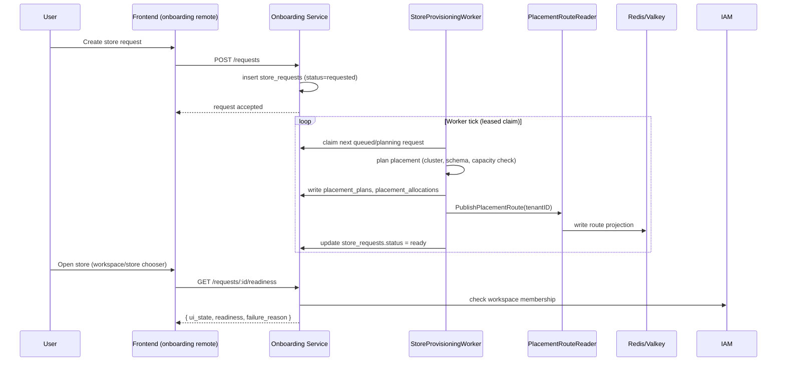

# Component: Onboarding Service

Parent index: [Services](../README.md).

## Purpose

Owns the store-provisioning lifecycle: turning a store request into a
running, store-scoped Backoffice workspace with a resolvable tenant DB
route. This is the backbone-critical service per
[`docs/06-recovery/backbone-flow-refactor.md`](../../../06-recovery/backbone-flow-refactor.md)
and [`docs/06-recovery/legacy-inventory.md`](../../../06-recovery/legacy-inventory.md)
("Core backbone dependency. Provisioning pipeline and placement backbone
are the highest-risk area.").

## Responsibilities

- Track store request lifecycle (15 statuses — see
  `internal/onboarding/domain/store/entity/store.go`).
- Allocate infrastructure placement (DB cluster, schema, k8s namespace,
  runtime pool) for a tenant/store.
- Publish the resolved placement route as a KV/Redis projection that
  `pkg/pdtenantdb` reads to route Backoffice DB queries.
- Report combined store readiness (`GET /requests/:id/readiness`) so the
  frontend can decide pending/blocked/failed/ready in one call — see
  [PZEP-0001](../../../09-pzep/PZEP-0001-onboarding-store-readiness-endpoint.md)
  and [05-transport-contracts.md](../../05-transport-contracts.md) Slice 0.3.
- Manage infrastructure resource inventory (DB clusters, k8s clusters,
  runtime pools) and their capacity/health for placement decisions.

## Non-Responsibilities

- Does not own tenant/membership/permission data (IAM's job).
- Does not own Backoffice's store-scoped runtime data (Backoffice's job).
- Does not enforce authorization decisions itself beyond workspace
  ownership checks — permission evaluation is IAM's job, called via gRPC.

## Owned Data

MongoDB, database `mongo-onboarding` (see
[db-design.md](./db-design.md) for full schema). Ten collections across
two repository packages: `store_requests`, `store_request_transitions`
(store lifecycle) and `connections`, `connection_events`,
`connection_outbox`, `placement_allocations`, `placement_plans`,
`resource_db_clusters`, `resource_k8s_clusters`, `resource_runtime_pools`
(infrastructure/placement).

Also publishes (does not own as a DB table) a KV/Redis route projection —
see [data-ownership.md](../../../02-architecture-overall/04-data-ownership.md)
and SRS-ONB-003 ("placement allocation is source of truth, KV entries are
rebuildable projections").

## Interfaces

### Inbound APIs

HTTP (gin), not gRPC — the only backbone service using HTTP as its native
transport (auth/iam are gRPC-only).

| API | Path | Contract | Caller | Notes |
|---|---|---|---|---|
| Create store request | `POST /requests` | Partial (no formal doc) | Frontend (onboarding remote) | |
| List store requests | `GET /requests` | Partial | Frontend | Paginated, workspace-scoped |
| Get store request | `GET /requests/:id` | Partial | Frontend | |
| Get store readiness | `GET /requests/:id/readiness` | [05-transport-contracts.md](../../05-transport-contracts.md) Slice 0.3 | Frontend (planned — not wired yet) | Combined `ui_state` |
| List request transitions | `GET /requests/:id/transitions` | Partial | Frontend (audit view) | |
| Retry store request | `POST /requests/:id/retry` | Partial | Frontend | |
| Approve/reject store request | `POST /requests/:id/approve`, `/reject` | Partial | Frontend | |
| List/get/upsert/delete connections | `/infras/connections*` | Partial | Admin/operator only | Permission-gated (`requireInfrastructureRead`/`Manage`) |
| Get/reconcile tenant placement status | `/infras/placements/:tenantId/*` | Partial | Admin/operator only | Not user-facing |
| Manage resource clusters/pools | `/infras/resources/*` | Partial | Admin/operator only | DB clusters, k8s clusters, runtime pools |

A duplicate `legacy` route group mirrors the `requests` group at a
different path prefix — same handlers, kept for backward compatibility.
Do not add new endpoints only to the legacy group.

### Outbound Calls

| Target | Protocol | Reason | Notes |
|---|---|---|---|
| IAM | gRPC | Workspace membership/permission checks | Inbound guard, not outbound business call |
| Kafka | Async | Publish provisioning events, outbox relay | `pkg/messaging`, `pkg/pdkafka` |
| KV/Redis | Direct | Publish placement route projection | `PlacementRouteReader.PublishPlacementRoute` |

## Dependencies

| Dependency | Type | Reason |
|---|---|---|
| MongoDB (`mongo-onboarding`) | DB | Store requests, placement, resource inventory |
| Redis/Valkey | KV | Route projection publish target |
| Kafka | Event Bus | Provisioning pipeline events, outbox relay |
| IAM (gRPC) | Service | Workspace membership/permission checks |

## Runtime Flows

Provisioning pipeline (per `StoreProvisioningWorker.tick`,
`internal/onboarding/infrastructure/messaging/worker/store_provisioning_worker.go`)
— **this end-to-end sequence is unverified in Docker dev**, per
`docs/STATUS_CURRENT.md`:

## Failure Modes

| Failure | Expected Behavior |
|---|---|
| Placement capacity exhausted | Request stays `queued`/`blocked`, not silently dropped — see `resource_db_clusters` capacity fields in db-design.md |
| Worker crash mid-provisioning | Lease (`lease_owner`, `lease_until` on `store_requests`) allows another worker instance to reclaim after expiry |
| KV route publish fails after DB write | Route projection is rebuildable — `ReconcileTenantPlacement` endpoint re-derives and republishes it |
| Duplicate ready placement for one tenant | Prevented by partial unique index `uniq_ready_placement_allocation_tenant` on `placement_allocations` (status=ready) |

## Security

- Authentication: JWT via `pkg/pdauthn`, same as sibling services.
- Authorization: workspace-ownership check for store-request endpoints;
  `requireInfrastructureRead`/`requireInfrastructureManage` permission
  guards for admin/infra endpoints.
- Permission: delegated to IAM via gRPC, not evaluated locally.
- Tenant/workspace/store isolation: `workspace_id` filter on
  `store_requests`; `tenant_id` filter on placement/connection
  collections.
- Sensitive data: `secret_ref` fields on `connections` and
  `placement_allocations` are references, not raw secret values — do not
  log or return raw secrets.

## Observability

- Logs: `pkg/pdlog` to stdout (see
  [twelve-factor.md](../../../00-governance/twelve-factor.md)).
- Metrics/Traces/Alerts: none added specifically for this service beyond
  shared runtime defaults — not verified in this pass.

## Config

Loaded via `pkg/pdconfig` — see `deployments/docker/config/onboarding.yml`
for the dev config shape (Mongo connection, Redis connection, Kafka
brokers, IAM gRPC endpoint).

## Agent Rules

- Do not bypass `StoreInteractor`/`infrasmanager` usecase ports from a new
  handler — controllers call usecases only.
- Do not treat the KV route projection as source of truth — placement
  allocation in Mongo is authoritative (SRS-ONB-003); the projection must
  always be rebuildable from it.
- Do not add a new HTTP route to the `legacy` group only.
- See `docs/06-recovery/recovery-plan.md` Refactor Constraints — this
  service is in `Stabilize` status, not open for broad redesign.

## Frontend Surface

Dedicated MFE remote at `frontend/apps/onboarding` (route prefix
`/admin`, `/admin/provisioning`). Registered via `remotePage()` in
`frontend/apps/onboarding/src/routes.ts` — see
`agent/SOLID_STYLE_GUIDE.md` for the ViewModel/Panel conventions used
throughout, not repeated here.

Pages (`frontend/apps/onboarding/src/pages/`):

- `AdminHomePage.tsx` → `admin-home/` — workspace/store chooser
  (`StoreChooser.tsx`), create-first-store flow, provisioning-requests
  panel. This is the FE surface that should call the readiness endpoint
  per PZEP-0001's open question — not wired yet.
- `AdminProvisioningPage.tsx` → `admin-provisioning/` — provisioning
  pipeline view, connections editor, resource editor (admin/operator
  surface for the infra-manager APIs above).

`/admin/settings` (sessions/audit, invites, platform roles, team access)
moved out to the shell (`frontend/src/modules/shell/pages/admin-settings/`,
2026-07-12) — every one of those panels called
`@podzone/shared/services/auth` or `@podzone/shared/services/iam`, none
called onboarding's own backend, so it had no business living in this
app's bundle. It briefly passed through the `iam` MFE remote first, but
landed in the shell instead: `apps/iam` is a reuse-extraction candidate if
IAM ever ships as a standalone product (see `11-iam-platform.md`), and
`/admin/settings` is Podzone-product composition, not generic IAM UI. See
[IAM Frontend Surface](../iam/README.md#frontend-surface).

## Links Back To Delivery

- [Backbone Flow Refactor](../../../06-recovery/backbone-flow-refactor.md)
- [Legacy Inventory](../../../06-recovery/legacy-inventory.md)
- [PZEP-0001](../../../09-pzep/PZEP-0001-onboarding-store-readiness-endpoint.md)
- [DB Design](./db-design.md)
