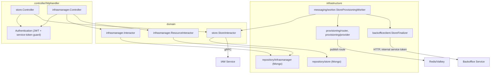
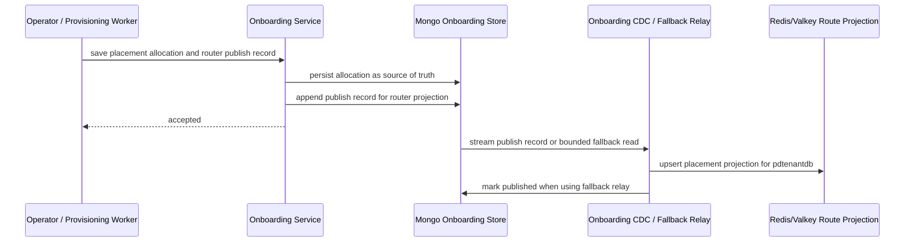
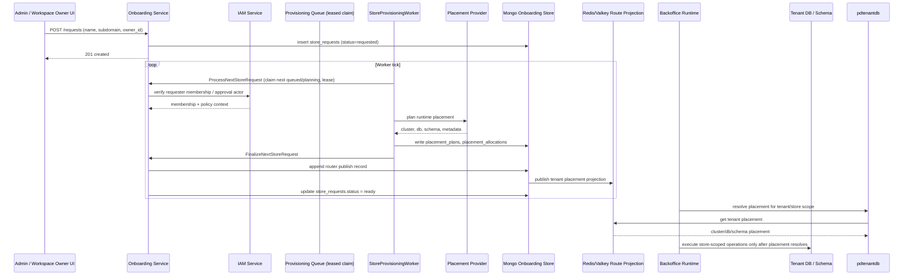
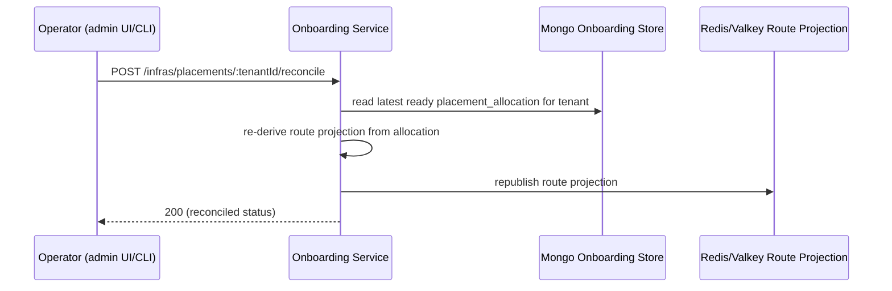

# Onboarding Service — API Design

Parent: [Services Index](../README.md) · [Onboarding README](./README.md) · [DB Design](./db-design.md)

## C3: Component View

Matches the module boundaries in
[`01-modules.md`](../../01-modules.md) and the layering rule in
[`03-ddd-clean-architecture.md`](../../03-ddd-clean-architecture.md):
controllers call usecases only, usecases depend on ports
(`domain/store/inputport`, `domain/infrasmanager/*`), infrastructure
implements those ports.

## HTTP API Surface

All routes are also mirrored under a `legacy` prefix with identical
handlers (kept for backward compatibility — do not add new endpoints only
to the legacy group). Table below lists the canonical path only.

### Store Requests (`/requests`)

| Method + Path | Request | Response | Errors | Notes |
|---|---|---|---|---|
| `POST /requests` | `{name, subdomain, owner_id}` | `201` + `Request` | `400` invalid body | `CreateStoreRequest` |
| `GET /requests` | query: `collection.*` (pagination/filter) | `200` `{items: []Request, pageInfo}` | — | workspace-scoped |
| `GET /requests/:id` | — | `200` `Request` | `404` not found/workspace mismatch | |
| `GET /requests/:id/readiness` | — | `200` `{request_id, request_status, readiness, failure_reason, ui_state}` | `404`, `401` | Full contract: [`05-transport-contracts.md`](../../05-transport-contracts.md) Slice 0.3, [PZEP-0001](../../../09-pzep/PZEP-0001-onboarding-store-readiness-endpoint.md) |
| `GET /requests/:id/transitions` | query: `collection.*` | `200` `{items: []RequestTransition, pageInfo}` | — | Audit trail of status changes |
| `POST /requests/:id/retry` | — | `204` | error mapped via `writeStoreError` | Requeues a failed/blocked request |
| `POST /requests/:id/approve` | — | `204` | requires `authorizeApproval` | For `pending_approval` requests |
| `POST /requests/:id/reject` | — | `204` | requires `authorizeApproval` | |

`Controller.UpdateStoreRequestStatus` (`{status}` body,
`StoreInteractor.UpdateStoreRequestStatus`) is implemented but **not
registered on any route** — verified via full-repo grep, only referenced
internally by `ApproveStoreRequest`/`RejectStoreRequest`. Dead HTTP
handler; do not assume it's reachable.

### Infrastructure Admin (`/infras`, `requireInfrastructureRead`/`Manage` guarded)

| Method + Path | Purpose |
|---|---|
| `GET /infras/connections` | List backing-service connections (`infra_type`: mongo/redis/postgres/elasticsearch/kafka) |
| `GET /infras/connections/:infraType/:name` | Get one connection |
| `POST /infras/connections` | Upsert connection |
| `DELETE /infras/connections/:infraType/:name` | Delete connection |
| `GET /infras/events` | List connection health-check events |
| `GET /infras/placements/:tenantId/status` | `GetTenantPlacementStatus` — `{allocation_ready, route_ready}`, admin-only, not the same as the user-facing readiness endpoint above |
| `POST /infras/placements/:tenantId/reconcile` | `ReconcileTenantPlacement` — re-derive and republish the KV route projection from `placement_allocations` when it's out of sync |
| `GET`/`PUT`/`DELETE /infras/resources/database-clusters/:name` | DB cluster inventory (capacity, health) |
| `GET`/`PUT`/`DELETE /infras/resources/kubernetes-clusters/:name` | K8s cluster inventory |
| `GET`/`PUT`/`DELETE /infras/resources/runtime-pools/:name` | Runtime pool inventory |

None of the `/infras/*` surface is called by the frontend today — see
[README.md](./README.md) "Frontend Surface", `AdminProvisioningPage.tsx`
covers only a subset via its own panels, not confirmed to hit every route
above.

## C4: Sequences Per Usecase

### Onboarding Placement Publish to Runtime KV

Label corrected from the source doc this was moved from
(`docs/02-architecture-overall/05-sequences.md`, now deleted) — "Mongo
runtime_kv" was wrong, it's Redis/Valkey. See
[db-design.md](./db-design.md) "Not A Database Table: KV Route Projection".

### Store Onboarding Request to Ready

Label corrected the same way as above. This is the highest-risk flow in
the system per
[`backbone-flow-refactor.md`](../../../06-recovery/backbone-flow-refactor.md)
and is **unverified end-to-end in Docker dev** — see
[`docs/STATUS_CURRENT.md`](../../../STATUS_CURRENT.md). The worker-loop
detail (`ProcessNextStoreRequest`/`FinalizeNextStoreRequest`, lease-based
claim) was added here from `domain/store/interactor.go` — the original
diagram in the deleted `05-sequences.md` described this at a higher level
via a generic "Worker" participant with a "request placement plan"
round-trip; actual code combines claim+process+finalize as three
interactor calls around one worker tick, not a plan-then-provision
round-trip through the same RPC. Adjusted accordingly.

### Reconcile Tenant Placement (repair path)

Not in the original sequence set — added because
[db-design.md](./db-design.md) "Failure Modes" names this as the recovery
path when the KV publish fails after the Mongo write succeeds.

## Cross-Service Dependencies

**Onboarding calls:**
- IAM (gRPC) — workspace membership/approval-actor checks in
  `CreateStoreRequest`/`ProcessNextStoreRequest` and `authorizeApproval`/
  `authorizeRead`.
- Backoffice (HTTP, internal service token) — `backofficeclient.
  StoreFinalizer` calls back into Backoffice when finalizing a store;
  see `BACKOFFICE_INTERNAL_SERVICE_TOKEN` in
  `deployments/docker/services.yml`. Not covered by an existing sequence
  above — out of scope for this pass, flagged for a future addition.

**Calls onboarding:**
- Frontend (`frontend/apps/onboarding`) via APISIX — store request CRUD,
  readiness (once wired, see PZEP-0001 open question).
- `authentication.go`'s service-token path accepts calls authenticated
  with `ONBOARDING_SERVICE_TOKEN`/`BACKOFFICE_INTERNAL_SERVICE_TOKEN`
  instead of a user JWT — used for service-to-service and
  `dev-bootstrap` seeding, not by end users.

## Links Back To Delivery

- [Onboarding README](./README.md)
- [DB Design](./db-design.md)
- [Backbone Flow Refactor](../../../06-recovery/backbone-flow-refactor.md)
- [PZEP-0001](../../../09-pzep/PZEP-0001-onboarding-store-readiness-endpoint.md)
