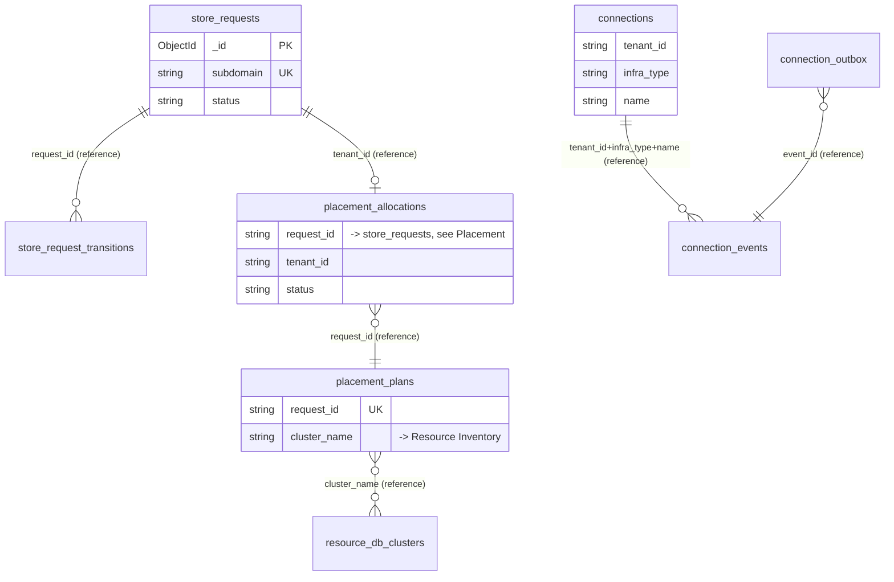
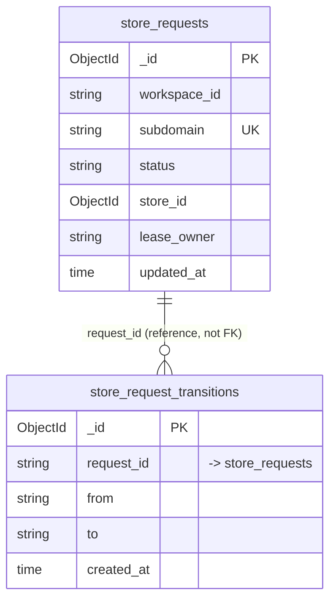
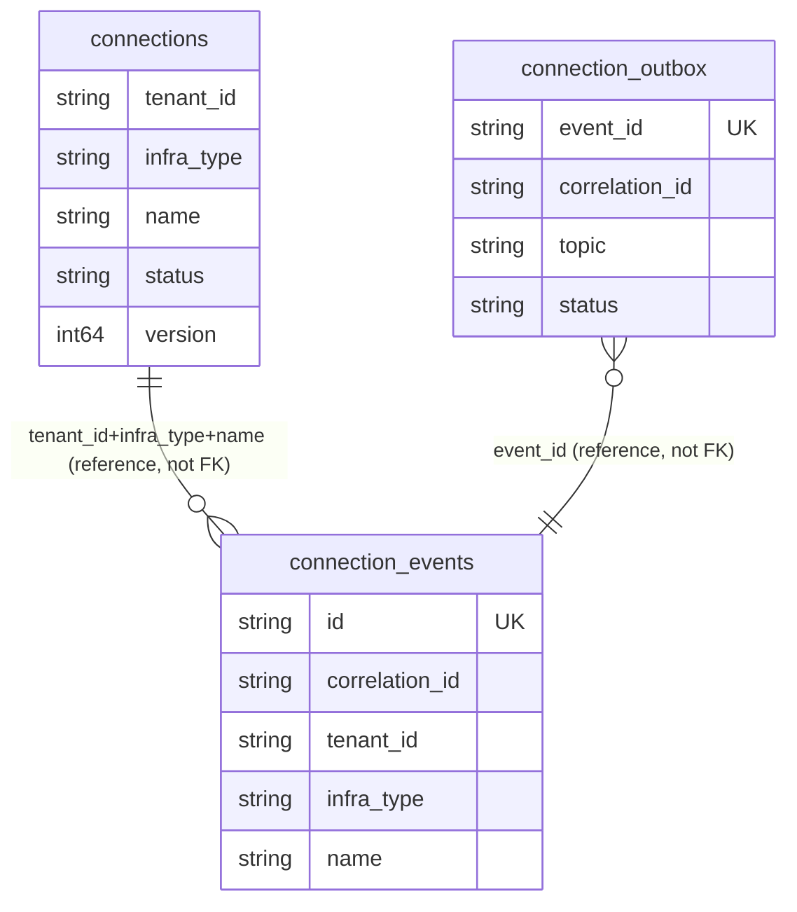
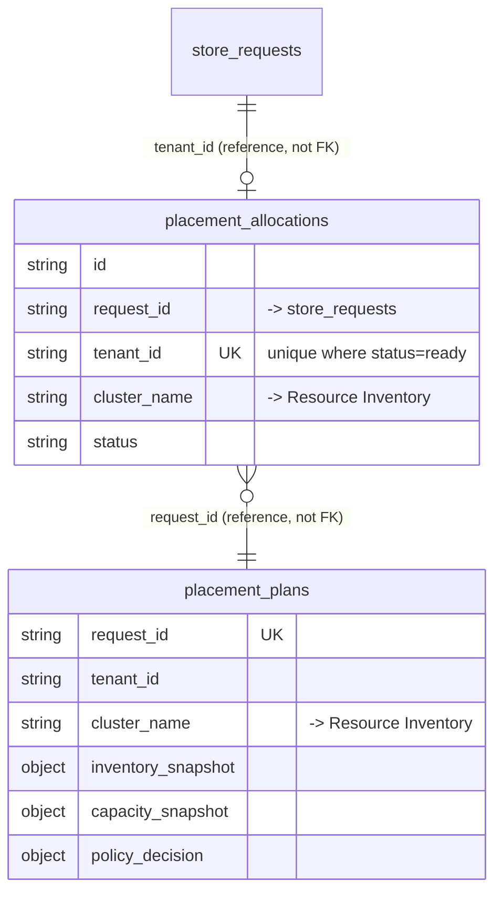
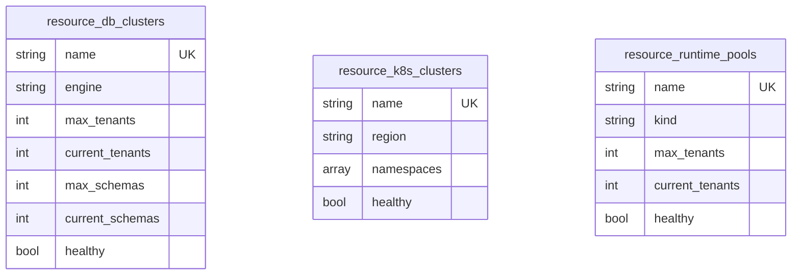

# Onboarding DB Design

Parent index: [Services](../README.md) · [Onboarding README](./README.md).

Database: **MongoDB**, database name `mongo-onboarding` (Mongo has no
foreign-key enforcement — all relationships below are by ID reference
only, not DB-enforced). Ten collections, owned by two repository
packages: `internal/onboarding/infrastructure/repository/store` (store
lifecycle) and `internal/onboarding/infrastructure/repository/infrasmanager`
(placement/infrastructure).

Field lists are taken directly from Go struct `bson` tags — see the
source file cited per collection. Do not add a field to a collection
without updating both the struct and this doc.

## Entity-Relationship Diagrams

One diagram for all 10 collections was hard to follow, so this is split
into a one-screen overview plus one diagram per collection group — same
grouping as `## Collections` below. Mongo has no FK enforcement — every
edge below is an application-level ID reference, not a database
constraint; that is called out per-edge rather than repeated on every
line.

### Overview — Anchor Collections

Everything below expands one of these anchors plus its detail/child
collections.

### Store Lifecycle

Owned by `internal/onboarding/infrastructure/repository/store`.

### Infrastructure Connections

Owned by `internal/onboarding/infrastructure/repository/infrasmanager`.

### Placement

Owned by `internal/onboarding/infrastructure/repository/infrasmanager`.
`placement_allocations` is the source of truth; the Redis/Valkey route
projection read by `pkg/pdtenantdb` is derived from it (see
[Not A Database Table](#not-a-database-table-kv-route-projection) below).

### Resource Inventory

Owned by `internal/onboarding/infrastructure/repository/infrasmanager`.
Three independent capacity/health catalogs — no relationships between
them; each is referenced by name from `placement_plans.cluster_name` /
`placement_allocations.cluster_name` (see Placement above).

## Collections

### Store Lifecycle

#### `store_requests`

**Owner:** onboarding · **Source:** `internal/onboarding/domain/store/entity/store.go` (`StoreRequest`)
**Scope:** workspace-scoped (`workspace_id`). **Source of truth**, not a projection.

| Field | Type | Required | Notes |
|---|---|---|---|
| `_id` | ObjectID | yes | Mongo default PK |
| `workspace_id` | string | yes | Scope filter |
| `name` | string | yes | |
| `subdomain` | string | yes | Unique index |
| `requested_by` | string | yes | |
| `owner_id` | string | no | |
| `status` | string (enum) | yes | 15 values: `requested, planning, planned, pending_approval, queued, provisioning, ready, failed, failed_retryable, failed_non_retryable, pending_platform_setup, rejected, suspended, archived, cancelled` |
| `store_id` | ObjectID | no | Set once provisioned |
| `last_error` | string | no | |
| `lease_owner` | string | no | Worker claim lease |
| `created_at`/`updated_at` | time | yes | |
| `approved_at`/`completed_at`/`lease_until` | time | no | |
| `attempt` | int | no | Retry counter |

Indexes: unique on `subdomain`; `(workspace_id, status)`; `(workspace_id,
updated_at desc)`; `(status, lease_until, updated_at)` (worker claim
query).

#### `store_request_transitions`

**Owner:** onboarding · **Source:** `StoreRequestTransition` in the same file.
**Scope:** not directly scoped — scoped transitively via `request_id`.
Audit trail, append-only.

| Field | Type | Required | Notes |
|---|---|---|---|
| `_id` | ObjectID | yes | |
| `request_id` | string | yes | References `store_requests._id`, no FK |
| `from`/`to` | string (status enum) | yes | |
| `actor` | map[string]string | yes | Who triggered the transition |
| `step` | string | yes | |
| `reason` | string | no | |
| `error_code` | string | no | |
| `created_at` | time | yes | |

Index: `(request_id, created_at desc)`.

### Infrastructure Connections

#### `connections`

**Owner:** onboarding (infrasmanager) · **Source:** `internal/onboarding/infrastructure/repository/infrasmanager/repository.go`.
**Scope:** tenant-scoped (`tenant_id`). Source of truth for provisioned
backing-service connections (Mongo/Redis/Postgres/Elasticsearch/Kafka per
tenant).

| Field | Type | Required | Notes |
|---|---|---|---|
| `tenant_id` | string | yes | |
| `infra_type` | string (enum) | yes | `mongo, redis, postgres, elasticsearch, kafka` |
| `name` | string | yes | e.g. `default`, `analytics` |
| `endpoint` | string | yes | |
| `secret_ref` | string | yes | Reference only, not the raw secret |
| `status` | string | yes | |
| `version` | int64 | yes | Optimistic concurrency |
| `meta` | map | no | |
| `config` | map | no | |
| `created_at`/`updated_at` | time | yes | |
| `deleted_at` | time | no | Soft delete |

Indexes: `(tenant_id, infra_type, name)`; `(infra_type, status)`;
`(tenant_id, updated_at desc)`.

#### `connection_events`

**Owner:** onboarding (infrasmanager). Append-only event log for
connection lifecycle actions (create/destroy/manual_upsert/
publish_kv_store/delete_kv_store).

| Field | Type | Required | Notes |
|---|---|---|---|
| `id` | string | yes | Unique — idempotency key, not `_id` |
| `correlation_id` | string | yes | Groups events from one operation |
| `tenant_id`/`infra_type`/`name` | string | yes | |
| `action`/`status` | string | yes | |
| `request`/`result` | map | no | |
| `error` | string | no | |
| `actor` | map | yes | |
| `created_at` | time | yes | |

Indexes: unique on `id`; `(correlation_id, created_at desc)`;
`(tenant_id, infra_type, name, created_at desc)`.

#### `connection_outbox`

**Owner:** onboarding (infrasmanager). Implements `messaging.OutboxStore`
— transactional outbox for `kv_store.publish`/`kv_store.delete` events.
See [07-async-messaging.md](../../07-async-messaging.md) for the general
outbox pattern.

| Field | Type | Required | Notes |
|---|---|---|---|
| `event_id` | string | yes | Unique — idempotency key |
| `correlation_id` | string | yes | |
| `topic` | string | yes | `kv_store.publish` / `kv_store.delete` |
| `payload` | map | yes | |
| `tenant_id`/`infra_type`/`name` | string | yes | |
| `status` | string | yes | `pending/done/failed` |
| `retry_count` | int | yes | |
| `next_retry` | time | no | |
| `created_at`/`updated_at` | time | yes | |

Indexes: `(status, next_retry)` (due-query); unique on `event_id`.

### Placement

#### `placement_allocations`

**Owner:** onboarding (infrasmanager) · **Scope:** tenant+store-scoped.
**Source of truth per SRS-ONB-003** — the KV/Redis route projection read
by `pkg/pdtenantdb` is derived from this, not the other way around.

| Field | Type | Required | Notes |
|---|---|---|---|
| `id` | string | yes | |
| `request_id` | string | yes | References `store_requests`, no FK |
| `tenant_id`/`store_id` | string | yes | |
| `runtime` | string (enum) | yes | `local_docker, docker, kubernetes, k8s, terraform` |
| `cluster_name`/`mode`/`db_name`/`schema_name` | string | yes | Resolved placement target |
| `endpoint`/`secret_ref` | string | no | |
| `status` | string | yes | |
| `provider_meta` | map | no | |
| `created_at`/`updated_at` | time | yes | |

Indexes: **partial unique** on `tenant_id` where `status = "ready"`
(`uniq_ready_placement_allocation_tenant`) — enforces at most one ready
placement per tenant at the DB level; `(status, updated_at desc)`. A
legacy index `uniq_placement_allocation_tenant_store` is dropped at
startup if present (`dropLegacyPlacementIndex`).

#### `placement_plans`

**Owner:** onboarding (infrasmanager). The planning snapshot that
precedes allocation — captures the inventory/capacity state and policy
decision used to pick a placement target.

| Field | Type | Required | Notes |
|---|---|---|---|
| `request_id` | string | yes | Unique |
| `tenant_id`/`store_id` | string | yes | |
| `runtime`/`cluster_name`/`mode`/`db_name`/`schema_name` | string | yes | |
| `provider_meta` | map | no | |
| `inventory_snapshot` | object (`ResourceInventory`) | yes | Point-in-time capacity snapshot |
| `capacity_snapshot` | object (`CapacitySnapshot`) | yes | |
| `policy_decision` | object (`PlacementPolicyDecision`) | yes | |
| `created_at`/`updated_at` | time | yes | |

Indexes: unique on `request_id`; `(tenant_id, store_id, updated_at desc)`.

### Resource Inventory

#### `resource_db_clusters`

**Owner:** onboarding (infrasmanager). Capacity/health inventory for
Postgres DB clusters available for placement.

| Field | Type | Required | Notes |
|---|---|---|---|
| `name` | string | yes | Unique |
| `engine`/`region`/`placement_db` | string | yes | |
| `max_tenants`/`current_tenants` | int | yes | |
| `max_schemas`/`current_schemas` | int | yes | Schema-counting query was fixed to use `starts_with()` instead of a `LIKE` wildcard that over-counted — see `docs/07-problems/onboarding-provisioning-2026-07-07.md` P1 |
| `max_connections`/`current_connections` | int | yes | |
| `status`/`healthy` | string/bool | yes | |
| `created_at`/`updated_at` | time | yes | |

Index: unique on `name`; `(status, healthy)`.

#### `resource_k8s_clusters`

**Owner:** onboarding (infrasmanager). Capacity/health inventory for
Kubernetes clusters, with nested per-namespace capacity.

| Field | Type | Required | Notes |
|---|---|---|---|
| `name`/`region` | string | yes | Unique on `name` |
| `namespaces` | array of `{name, max_tenants, current_tenants, cpu_milli, memory_mi, status, healthy}` | yes | Embedded document, not a separate collection |
| `status`/`healthy` | string/bool | yes | |
| `created_at`/`updated_at` | time | yes | |

Index: unique on `name`; `(status, healthy)`.

#### `resource_runtime_pools`

**Owner:** onboarding (infrasmanager). Capacity/health inventory for
generic runtime pools (non-DB, non-k8s compute).

| Field | Type | Required | Notes |
|---|---|---|---|
| `name`/`kind` | string | yes | Unique on `name` |
| `max_tenants`/`current_tenants` | int | yes | |
| `status`/`healthy` | string/bool | yes | |
| `created_at`/`updated_at` | time | yes | |

Index: unique on `name`; `(status, healthy)`.

## Not A Database Table: KV Route Projection

`PlacementRouteReader.PublishPlacementRoute`
(`internal/onboarding/infrastructure/provisioning/router/placement_route_reader.go`)
writes a route projection to Redis/Valkey, read by `pkg/pdtenantdb` to
resolve which Postgres cluster/schema a Backoffice tenant query should
hit. This is **not a Mongo collection** and not listed in any diagram
above — it is a derived, rebuildable cache of `placement_allocations`. See
[data-ownership.md](../../../02-architecture-overall/04-data-ownership.md).

## Links Back To Delivery

- [Onboarding README](./README.md)
- [Backbone Flow Refactor](../../../06-recovery/backbone-flow-refactor.md)
- [Legacy Inventory](../../../06-recovery/legacy-inventory.md)
