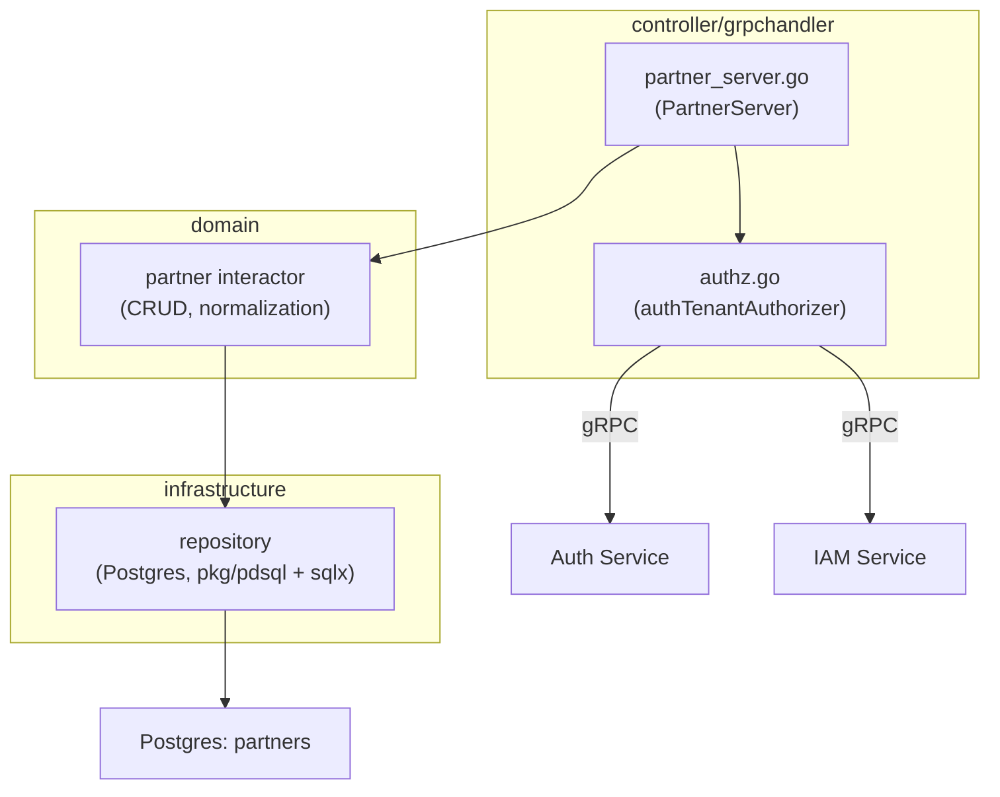
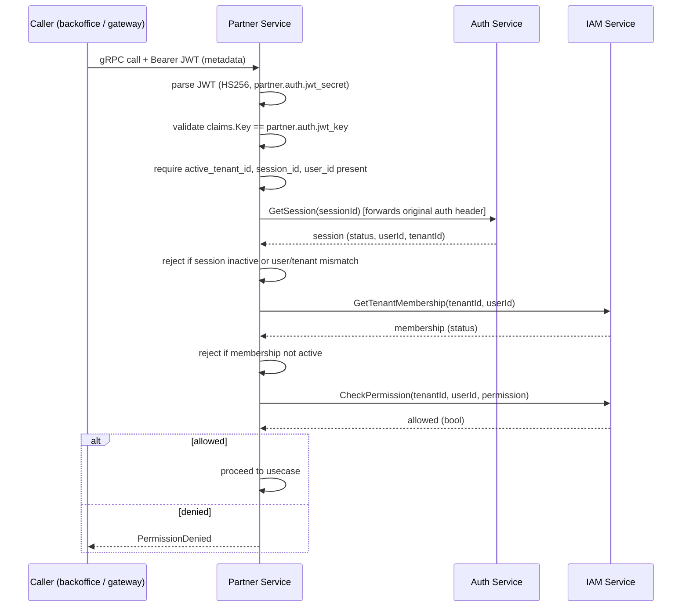

# Partner Service — API Design

Parent: [Services Index](../README.md) · [Partner README](./README.md) · [DB Design](./db-design.md)

## C3: Component View

Two controller files: `partner_server.go` maps transport for all 5 RPCs,
`authz.go` is a separate `TenantAuthorizer` component every RPC calls first
(see [README](./README.md) Runtime Flows). No separate domain package split
by subdomain — this service is small enough that CRUD + normalization logic
lives directly behind the one interactor.

## gRPC API Surface

Full request/response field detail already documented in
[README's Interfaces table](./README.md#interfaces) — summarized here for
the C3/C4 pairing:

| RPC | Permission | Notes |
|---|---|---|
| `CreatePartner` | `partner:manage` | |
| `GetPartner` | `partner:read` | Fetches record first, authorizes against its actual `tenant_id`. |
| `ListPartners` | `partner:read` | Paginated (`pkg/collection`). Backoffice calls this in a loop to build its partner directory — see Cross-Service Dependencies. |
| `UpdatePartner` | `partner:manage` | Fetch-then-authorize, same as `GetPartner`. |
| `UpdatePartnerStatus` | `partner:manage` | Activate/deactivate. |

No separate "list active partners" or "query capabilities" RPC exists —
confirmed against `internal/partner/controller/grpchandler/partner_server.go`
(exactly these 5 methods) and
`internal/backoffice/infrastructure/partnerdirectory/adapter.go`
(`ListActivePartners`, which is a **backoffice-side** domain method, not a
partner-service RPC — it pages through `ListPartners` and filters
client-side).

## C4: Sequences Per Usecase

### Tenant Authorization (every RPC)

`GetPartner`/`UpdatePartner`/`UpdatePartnerStatus` fetch the record by ID
*before* running this flow, then authorize against the record's actual
`tenant_id` — the caller cannot claim a different tenant to bypass the
check (`partner_server.go`).

This is the only genuinely distinct C4 flow in this service — every RPC
funnels through it, and the 5 RPCs themselves are straightforward CRUD with
no other branching business logic worth a separate diagram.

## Cross-Service Dependencies

**Outbound** (partner → other services, always for authorization, never for
data):

- `auth` gRPC — `GetSession`, on every call.
- `iam` gRPC — `GetTenantMembership` + `CheckPermission`, on every call.

**Inbound** (who calls partner):

- `backoffice` via `internal/backoffice/infrastructure/partnerdirectory/adapter.go`
  (`routingctx.PartnerDirectory` port) — pages through `ListPartners` to
  build a partner routing directory during order routing recommendation.
  See
  [`../backoffice/api-design.md`](../backoffice/api-design.md) "Create
  Routed Order Recommendation" for the consuming sequence.
- API gateway (`internal/grpcgateway`) forwards all 5 RPCs for
  HTTP-facing callers — no gateway-side logic beyond transcoding.
