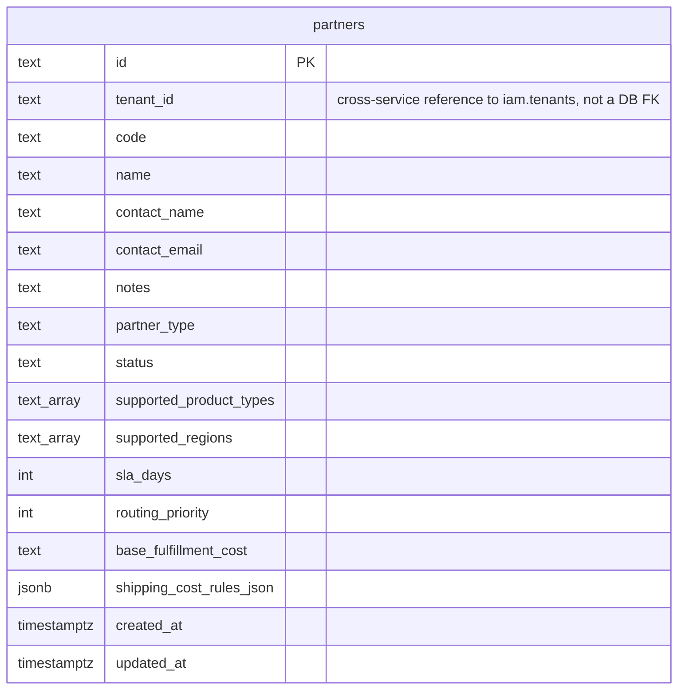

# Partner Service — Database Design

Parent index: [Services](../README.md) · [Partner Service](./README.md).

Database: **Postgres**, single shared database (not routed per-tenant via
`pkg/pdtenantdb` — `tenant_id` is a plain scoping column on one table, not
a schema-per-tenant model). Migrated with `goose`
(`internal/partner/migrations/sql/`). One table.

Cross-reference: [Data Ownership](../../../02-architecture-overall/04-data-ownership.md),
[Legacy Inventory](../../../06-recovery/legacy-inventory.md).

## ERD

No foreign keys exist in this schema — it is a single table. `tenant_id`
references IAM's `tenants` table by convention only, enforced at the
application layer (via the `auth`/`iam` gRPC authorization flow — see
[README](./README.md) Runtime Flows), not by a Postgres foreign key,
because IAM's tenant data lives in a different service/database.

## Table: `partners`

### Owner

- Service: `partner`
- Bounded context: Partner (POD/fulfillment supplier directory)
- Database: Postgres, single shared DB
- Table: `partners`

### Scope

- Tenant scoped: yes (`tenant_id` column)
- Workspace scoped: no
- Store scoped: no (product-vision docs describe a future store-scoped
  model; current schema scopes by tenant only)
- System/platform scoped: no

### Schema

| Column | Type | Required | Default | Notes |
|---|---|---|---|---|
| `id` | `text` | yes | — | App-generated UUID (`uuid.NewString()`), PK. |
| `tenant_id` | `text` | yes | — | Cross-service reference to IAM tenant, not a DB FK. |
| `code` | `text` | yes | — | Slug-normalized (lowercase, `-`-separated) by `normalizePartnerCode`. Unique per tenant. |
| `name` | `text` | yes | — | |
| `contact_name` | `text` | yes | `''` | |
| `contact_email` | `text` | yes | `''` | Lowercased on write. PII — see README Security. |
| `notes` | `text` | yes | `''` | Free text. |
| `partner_type` | `text` | yes | `'print_on_demand'` | One of `print_on_demand` \| `fulfillment` \| `dropship_supplier` — enforced in app code (`NormalizePartnerType`), not a DB `CHECK` constraint. |
| `status` | `text` | yes | — | One of `active` \| `inactive` — enforced in app code (`NormalizePartnerStatus`), not a DB `CHECK` constraint. |
| `supported_product_types` | `text[]` | yes | `ARRAY[]::TEXT[]` | Lowercased, deduped (`NormalizeCapabilityList`). |
| `supported_regions` | `text[]` | yes | `ARRAY[]::TEXT[]` | Lowercased, deduped. |
| `sla_days` | `integer` | yes | `0` | Clamped to ≥0 in app code. |
| `routing_priority` | `integer` | yes | `0` | Clamped to ≥0 in app code. |
| `base_fulfillment_cost` | `text` | yes | `''` | Stored as text, not numeric — no currency/precision handling at the DB layer. |
| `shipping_cost_rules_json` | `jsonb` | yes | `'[]'::jsonb` | Array of `{region, cost}`, deduped by region (`NormalizeShippingCostRules`) in app code before serialize. |
| `created_at` | `timestamptz` | yes | — | Set by app (`time.Now().UTC()`), not a DB default. |
| `updated_at` | `timestamptz` | yes | — | Set by app on every write, not a DB trigger. |

### Indexes

| Name | Fields | Unique | Predicate | Reason |
|---|---|---|---|---|
| `partners_pkey` | `id` | yes | — | Primary key. |
| `uq_partners_tenant_code` | `tenant_id, code` | yes | — | Enforces one code per tenant; violated inserts surface as `ErrPartnerCodeTaken`. |
| `idx_partners_tenant_created_at` | `tenant_id, created_at DESC` | no | — | List-by-tenant, newest-first. |
| `idx_partners_tenant_status` | `tenant_id, status` | no | — | Filter by status within a tenant. |
| `idx_partners_tenant_partner_type` | `tenant_id, partner_type` | no | — | Filter by type within a tenant. |

### Tenant Rules

- Required tenant column: `tenant_id`.
- Required query filters: every repository method that reads/writes takes
  or resolves a `tenant_id`; `ListPartners` rejects an empty `tenant_id`
  (`ErrInvalidTenantID`).
- Unique constraints that include tenant scope: `uq_partners_tenant_code`
  — `code` is only unique within a tenant, not globally.

### Migration History

Schema evolved across 5 files in `internal/partner/migrations/sql/`,
applied via `goose` (`internal/partner/module.go` `RegisterMigration`):

1. `0001_create_suppliers.sql` — created `partners` table with base
   columns + `partner_type` + 3 indexes.
2. `0002_add_partner_type.sql` — redundant `partner_type` column/index
   add (idempotent `IF NOT EXISTS`) — appears to be a historical
   correction, table already had the column from `0001` by the time this
   ran in current form.
3. `0003_rename_suppliers_to_partners.sql` — renamed `suppliers` →
   `partners` (and all index names) — confirms this table predates the
   product rename from "supplier" to "partner" terminology.
4. `0004_add_partner_capabilities.sql` — added
   `supported_product_types`, `supported_regions`, `sla_days`,
   `routing_priority`.
5. `0005_add_partner_cost_rules.sql` — added `base_fulfillment_cost`,
   `shipping_cost_rules_json`.

No down-migration has been exercised in this doc's review — each file
does define a `-- +goose Down` block; not verified to actually round-trip.
