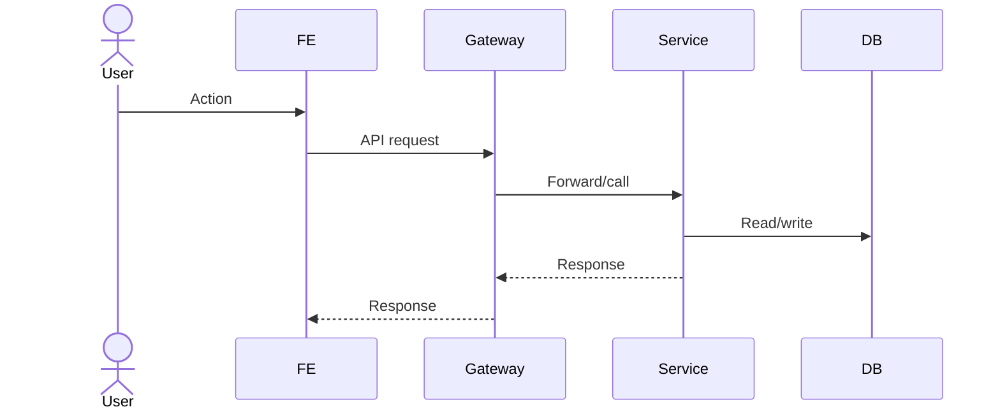

# PZEP Template

PZEP means **Podzone Enhancement Proposal**. Use it to describe the proposed
solution for a feature or vertical slice before implementation.

Create a PZEP when a change touches multiple components, contracts, permissions,
database schema, events, workers, external integrations, or architecture
boundaries.

````markdown
# PZEP-NNNN: <Feature / Slice Name>

## Status
Draft | Review | Approved | Implementing | Done | Rejected

## Requirement Sources
- Business:
- Feature:
- Use Cases:
- Functional Requirements:
- Non-functional Requirements:
- Acceptance Criteria:
- UI Specs:

## Summary
<One paragraph explaining the change.>

## Problem
<Current pain or missing capability.>

## Goals
- ...

## Non-Goals
- ...

## Proposed Solution
<Feature-level design. Do not write low-level implementation code here.>

## Affected Components
- Frontend:
- Gateway:
- Backend:
- Worker:
- Database:
- External Integration:

## Runtime Flow



## API Contract Changes
- ...

## DB Contract Changes
- ...

## Event Contract Changes
- ...

## Permission Changes
- ...

## Error Codes
- ...

## Data Ownership
- Owner component:
- Read/write owner:
- Projection/read-model owner:

## Security Considerations
- Authentication:
- Authorization:
- Tenant/workspace/store isolation:
- Sensitive data:

## Observability
- Logs:
- Metrics:
- Traces:
- Alerts:

## Alternatives Considered

### Option A
Pros:
- ...

Cons:
- ...

### Option B
Pros:
- ...

Cons:
- ...

## Test Plan
- Unit:
- Integration:
- E2E:
- Manual QA:

## Agent Implementation Plan
- TASK-0001:
- TASK-0002:
- TASK-0003:

## Acceptance Criteria Mapping

| AC | Task | Test |
|---|---|---|
| AC-... | TASK-... | ... |

## Open Questions
- ...
````

Rules:

- No PZEP, no cross-component implementation.
- PZEP must reference requirement IDs.
- PZEP must identify affected components.
- PZEP must mention API/DB/event/permission changes when applicable.
- ADR is still required for architecture boundary decisions.
