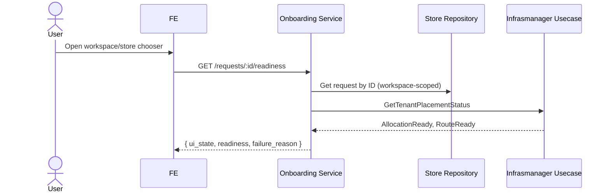

# PZEP-0001: Onboarding store readiness endpoint

## Status
Done (backend). Frontend integration not yet implemented — see "Open
Questions".

## Date
2026-07-10

## Related Commit
`02becbc` feat(onboarding): add store readiness endpoint GET
/requests/:id/readiness

## Requirement Sources
- Business: `docs/00-project-vision/10-store-onboarding-pipeline.md`
- Recovery source: `docs/06-recovery/backbone-flow-refactor.md` — Gap 1
  (no combined readiness endpoint)
- Functional Requirements: SRS-ONB-002, SRS-ONB-003
- Acceptance Criteria: see `docs/04-sprints/tasks/onboarding-readiness-api.md`
- UI Specs: none yet — this is the open gap (see below)

## Summary
Add one HTTP endpoint that tells the frontend whether a store request is
ready to open in Backoffice, combining store request status with placement
allocation and route projection readiness, so the frontend does not have
to make two calls and guess.

## Problem
Before this change, `GET /requests/:id` returned only the store request's
own status (`ready`, `provisioning`, `failed`, ...). A request could show
`status=ready` while its placement allocation or KV route projection was
still not live — Backoffice would then fail to open with no clear reason
shown to the operator. There was no single source of truth the frontend
could poll to decide "show Open Backoffice" vs. "still provisioning" vs.
"blocked, here's why."

## Goals
- One endpoint returns a single `ui_state` the frontend can switch on
  directly: `pending | provisioning | blocked | failed | ready`.
- `ui_state = ready` only when store status is `ready` AND placement
  allocation AND route projection are both ready.
- Failure reason is visible when blocked or failed.

## Non-Goals
- Not changing the existing `GET /requests/:id` handler.
- Not changing Mongo schema, proto contracts, or `infrasmanager` domain
  logic — only calling its existing usecase port.
- Not building the frontend consumer in this slice (see Open Questions).

## Proposed Solution
`Controller.GetStoreReadiness` (HTTP) calls
`StoreInteractor.GetStoreReadiness` (usecase), which reads the store
request via its existing repository port and the placement/route status
via the `infrasmanager` usecase port (already injected — no new
dependency), then maps the combination to one `ui_state` per the mapping
table in `docs/04-sprints/tasks/onboarding-readiness-api.md`.

## Affected Components
- Frontend: not yet — planned consumer is the workspace/store chooser in
  `frontend/src/modules/shell/`.
- Gateway: none (existing onboarding HTTP route group).
- Backend: `internal/onboarding` only — controller + domain/store usecase.
- Worker: none.
- Database: none (read-only, existing collections).
- External Integration: none.

## Runtime Flow

## API Contract Changes
`GET /requests/:id/readiness` — see
`docs/03-architecture-detail-design/05-transport-contracts.md`, "Slice 0.3:
Store Readiness Contract" for the full request/response/error shape.

## DB Contract Changes
None — read-only against existing collections.

## Event Contract Changes
None.

## Permission Changes
None — reuses the existing workspace-ownership check
(`request.WorkspaceID == workspaceID` from JWT), same as `GET
/requests/:id`.

## Error Codes
- `404` — request not found or workspace mismatch.
- `401` — no valid JWT.

## Data Ownership
- Owner component: `internal/onboarding` (store request status, placement
  status already owned here — no new ownership introduced).
- Read/write owner: unchanged.
- Projection/read-model owner: unchanged (KV route projection still owned
  by the onboarding worker that publishes it).

## Security Considerations
- Authentication: JWT required, same as sibling endpoints.
- Authorization: workspace-ownership check only.
- Tenant/workspace/store isolation: enforced via `workspace_id` match.
- Sensitive data: none returned beyond existing request fields.

## Observability
- Logs: standard onboarding HTTP handler logging (no new log lines added
  in this slice).
- Metrics: none added.
- Traces: none added.
- Alerts: none added.

## Alternatives Considered

### Option A: FE calls both existing endpoints and merges client-side
Pros:
- No backend change needed.

Cons:
- Duplicates the ready/blocked mapping logic in the frontend, which then
  drifts from backend logic over time.
- Two round-trips instead of one; two loading states to coordinate.
- This is the status quo the recovery plan explicitly flagged as the gap
  to close.

### Option B (chosen): One backend endpoint owns the combined mapping
Pros:
- Single source of truth for "is this store ready" — backend logic, not
  duplicated in frontend.
- One round-trip, one loading state.

Cons:
- Backend now owns UI-facing state naming (`ui_state` values) — acceptable
  since the mapping is a business rule (readiness), not presentation
  detail.

## Test Plan
- Unit: `internal/onboarding/domain/store/interactor_test.go` — Ready,
  Blocked (placement not ready), Provisioning, Failed, NotFound,
  WorkspaceMismatch, NoAuth cases.
- Integration: `internal/onboarding/controller/httphandler/store/controller_test.go`.
- E2E: not yet run — no frontend consumer exists to drive it end to end in
  Docker (see Open Questions).
- Manual QA: not yet performed.

## Agent Implementation Plan
- TASK: `docs/04-sprints/tasks/onboarding-readiness-api.md` (backend —
  done, commit `02becbc`).
- TASK: wire `frontend/src/modules/shell/` workspace/store chooser to this
  endpoint (not yet created as a task file — see Open Questions).

## Acceptance Criteria Mapping

| AC | Task | Test |
|---|---|---|
| Returns combined `ui_state` for a store request | onboarding-readiness-api.md | `TestGetStoreReadiness_Ready` et al. |
| 404 on not-found or workspace mismatch | onboarding-readiness-api.md | `TestGetStoreReadiness_NotFound`, `TestGetStoreReadiness_WorkspaceMismatchReturns404` |
| 401 with no JWT | onboarding-readiness-api.md | `TestGetStoreReadiness_NoAuth` |

## Open Questions
- No frontend task has been written yet to consume this endpoint. Per
  `docs/06-recovery/backbone-flow-refactor.md` "First Agent-Ready Task
  Candidate", this is the next slice — write that task before starting it,
  it needs its own PZEP update (bump `Status` to include the FE task) or a
  follow-up PZEP if the FE slice turns out to need its own contract
  decisions.
