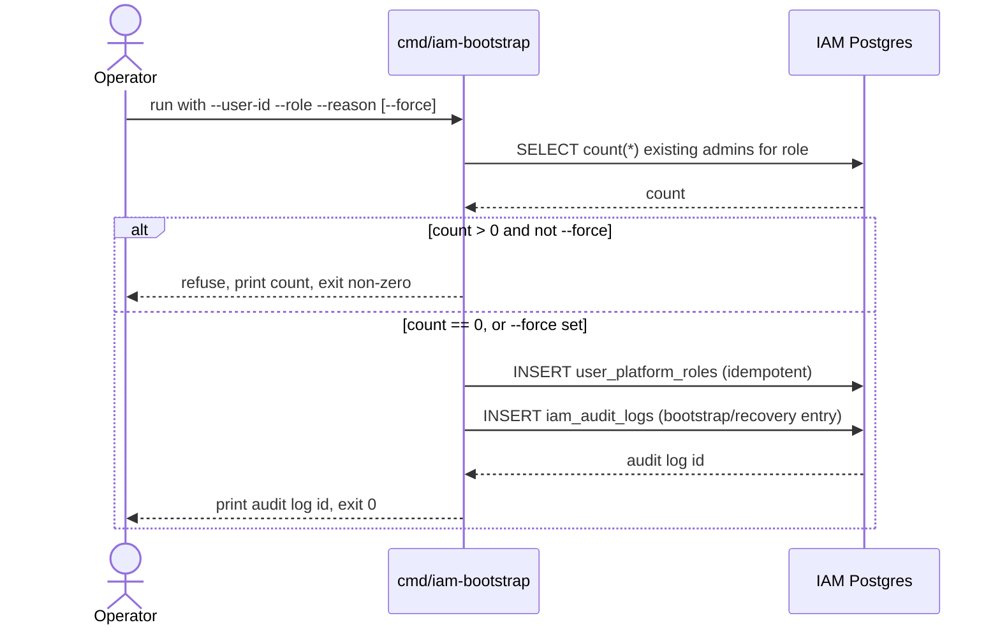

# PZEP-0002: Platform Admin Bootstrap And Recovery

## Status
Draft

## Date
2026-07-12

## Related Commit
(none yet — nothing implemented)

## Requirement Sources
- Business: `docs/00-project-vision/02-actors-and-business-flows.md` ("1A. System Admin / Platform Operator" — "system admin access is a separate platform-level grant and must be modeled independently")
- Feature: `docs/03-architecture-detail-design/11-iam-platform.md` ("Security And Operations" — "Require explicit bootstrap/recovery procedures for the first system admin")
- Use Cases: bootstrap the first `platform_owner` on a fresh deployment; break-glass recovery when every existing platform admin is locked out or unreachable
- Functional Requirements: [SRS-IAM-004](../01-srs/iam/SRS-IAM-004-platform-admin-bootstrap-and-recovery.md)
- Non-functional Requirements: [SRS-NFR-002](../01-srs/podzone-srs.md) Fail Closed Authorization, [SRS-NFR-004](../01-srs/podzone-srs.md) Auditability
- Acceptance Criteria: see below
- UI Specs: none — this is an operator CLI, not a product surface

## Summary

A standalone, network-unreachable CLI tool (`cmd/iam-bootstrap`) that grants
a platform-level role (`platform_owner` or `platform_admin`) to a target
user directly against the IAM database. It is the only supported way to
create the first platform admin, and doubles as the break-glass recovery
path if every existing platform admin becomes unreachable.

## Problem

`AddPlatformRole` — the only code path today that grants a platform role —
requires the caller to already hold `platform:manage_roles`
(`internal/iam/controller/grpchandler/role_methods.go:59`). No migration or
seed assigns a platform role to any user. There is therefore no way to
create the first platform admin except an unaudited, ad-hoc SQL insert
against production or dev data — exactly the kind of manual DB edit
`docs/06-recovery/recovery-plan.md` and the twelve-factor rules
(`docs/00-governance/twelve-factor.md`) call out as something the system
must not require operators to do.

## Goals

- Grant a platform role to a user with no existing platform admin present (bootstrap).
- Grant a platform role to a user when existing platform admins are locked out (break-glass recovery), with a stronger confirmation step than bootstrap.
- Record every grant in `iam_audit_logs`, indistinguishable in queryability from a normal `AddPlatformRole` audit entry except for its actor marker.
- Be safe to run against a live database without a service restart or deploy.

## Non-Goals

- No network-reachable endpoint of any kind (HTTP, gRPC, GraphQL) — this is intentionally outside SRS-IAM-001's normal authorization path, not an extension of it.
- No revoke/rotate flow here — `RemovePlatformRole` (already implemented, requires `platform:manage_roles`) covers revocation once at least one admin exists.
- No UI. Operators run this from a trusted shell with database network access, the same trust level already required to run `goose` migrations.
- No self-service "become admin" flow of any kind — every grant is an explicit operator action against a named target user.

## Proposed Solution

New binary `cmd/iam-bootstrap`, following the existing minimal fx-wiring
pattern used by `cmd/iam-worker` (`pdconfig.Module`, `pdlog.Module`,
`pdsql.ModuleFor("iam")`, no HTTP/gRPC server started). It runs once and
exits — never deployed as a long-running service, never given a Docker
Compose service entry with an exposed port.

```
go run ./cmd/iam-bootstrap \
  --user-id 4 \
  --role platform_owner \
  --reason "initial platform admin for staging"
```

Flags:
- `--user-id` (required) — target `auth` user ID. The tool does not create
  users; the account must already exist via normal sign-up/sign-in.
- `--role` (required) — `platform_owner` or `platform_admin` only; any
  other value is rejected before touching the database.
- `--reason` (required) — free text, stored verbatim in the audit payload.
  Forces the operator to state why, at grant time, not reconstructed later.
- `--force` (required only when at least one `user_platform_roles` row
  already exists for the target role) — without it, the tool refuses to
  run and prints the existing admin count. This is what separates the fast
  bootstrap path (no admins yet, `--force` not needed) from break-glass
  recovery (admins exist but are unreachable, `--force` required and
  logged as such in the audit payload).

Behavior:
1. Validate flags.
2. `SELECT COUNT(*) FROM user_platform_roles urp JOIN iam_roles r ON r.id = urp.role_id WHERE r.name = $role`. If count > 0 and `--force` not set, exit non-zero with the count and a message pointing at this doc.
3. `INSERT INTO user_platform_roles (user_id, role_id, status) VALUES ($user_id, (SELECT id FROM iam_roles WHERE name = $role), 'active') ON CONFLICT (user_id, role_id) DO NOTHING` — idempotent, matches the existing migration idiom.
4. Insert one `iam_audit_logs` row: `actor_user_id = 0` (sentinel — no real user is the actor; 0 is safe because the column is a plain `BIGINT` with no FK, same as every other "no real user" case in this schema), `action = 'platform.bootstrap.role_granted'`, `resource_type = 'platform_role_membership'`, `resource_id = '{role}:{user_id}'`, `payload_json` containing `{"reason": ..., "force": bool, "existing_admin_count": N}`.
5. Print the audit log row ID and exit 0.

## Affected Components
- Frontend: none
- Gateway: none — this tool never goes through APISIX
- Backend: new `cmd/iam-bootstrap` binary; reuses existing `internal/iam` repository code for the two writes (no new domain logic beyond the CLI's own validation)
- Worker: none
- Database: writes to existing `user_platform_roles` and `iam_audit_logs` tables — no schema change
- External Integration: none

## Runtime Flow



## API Contract Changes
- None — no gRPC/HTTP/GraphQL surface added or changed.

## DB Contract Changes
- None — writes through existing tables and columns only, no migration needed.

## Event Contract Changes
- None.

## Permission Changes
- None to the permission model itself. This tool operates outside
  `CheckPermission`/`CheckPlatformPermission` entirely, by design (see
  Non-Goals) — its "authorization" is possession of IAM database
  credentials, the same trust boundary `goose` migrations already run
  under.

## Error Codes
- Non-zero exit with a human-readable message for: invalid `--role` value,
  target `user_id` not found in `auth`, existing admins present without
  `--force`. No structured error codes — this is a CLI, not an API.

## Data Ownership
- Owner component: `internal/iam` (existing tables, existing ownership — no new owner)
- Read/write owner: `cmd/iam-bootstrap` writes directly via the same repository layer `internal/iam` already uses, not a separate data path
- Projection/read-model owner: N/A

## Security Considerations
- Authentication: none — database credentials are the trust boundary, not a login
- Authorization: intentionally bypasses `SRS-IAM-001`'s normal check — see Non-Goals for why this is correct here, not an oversight
- Tenant/workspace/store isolation: N/A — platform-scope only, never touches tenant-scoped tables
- Sensitive data: `--reason` is operator-supplied free text stored in `iam_audit_logs.payload_json` — same existing rule applies (`services/iam/db-design.md`: do not put secrets in audit payloads); the tool does not enforce this beyond documenting it

## Observability
- Logs: the tool prints its own outcome to stdout (twelve-factor: logs are stdout, not a file — consistent even for a one-shot CLI)
- Metrics: none — one-shot tool, not a running service
- Traces: none
- Alerts: recommend (not required by this PZEP) that ops wire a query/dashboard over `iam_audit_logs WHERE action = 'platform.bootstrap.role_granted'` so every bootstrap/recovery event is visible without needing to know to look for it

## Alternatives Considered

### Option A: Migration with an env-var-driven target user ID
Pros:
- No new binary; reuses the existing `goose` migration runner already part of deploy.

Cons:
- Migrations run once per environment lifecycle and are meant to describe
  schema, not ad-hoc operational grants; using one for break-glass recovery
  (which must be repeatable, on demand, without a deploy) is a misuse of
  the tool.
- No natural place to require `--reason`/`--force` or print a refusal —
  migrations either apply or don't, they don't have an interactive
  confirmation step.

### Option B: Standalone CLI (this proposal)
Pros:
- Matches existing project convention (`cmd/iam-worker` as a separate
  minimal binary) exactly.
- Naturally supports both bootstrap and recovery with the same tool and a
  clear guardrail (`--force`) distinguishing them.
- Runs on demand without a deploy — actually usable for a real break-glass
  incident.

Cons:
- One more binary to build/document/keep in sync with `internal/iam`
  changes (e.g. if `iam_roles`/`user_platform_roles` schema changes, this
  tool's raw queries must be updated too — mitigated by reusing the
  existing repository layer, per Proposed Solution, instead of writing raw
  SQL a second time).

### Option C: Temporary HTTP endpoint gated by a one-time setup token
Pros:
- Friendlier UX — an operator could bootstrap from a browser instead of a shell with DB access.

Cons:
- Adds a network-reachable code path for the single most sensitive
  operation in the system, contradicting the explicit "must not be
  reachable through the public HTTP/gRPC API surface" requirement in
  SRS-IAM-004. Rejected on that basis alone.

## Test Plan
- Unit: role validation (`--role` restricted to the two valid values), idempotency of the `user_platform_roles` insert (running twice does not error or duplicate), refusal path when admins exist and `--force` is absent.
- Integration: run against a real Postgres test database — verify the audit log row's `payload_json` contains `reason`, `force`, and `existing_admin_count`.
- E2E: not applicable — no user-facing flow.
- Manual QA: run once against local Docker dev's `iam` database with no existing platform admin, confirm `AddPlatformRole` from the Settings UI subsequently works using the bootstrapped account.

## Agent Implementation Plan
- TASK-0001: Scaffold `cmd/iam-bootstrap/main.go` following `cmd/iam-worker`'s fx wiring pattern (no HTTP/gRPC server).
- TASK-0002: Implement flag parsing and validation (`--user-id`, `--role`, `--reason`, `--force`).
- TASK-0003: Implement the existing-admin-count check and refusal path.
- TASK-0004: Implement the `user_platform_roles` insert and `iam_audit_logs` insert, reusing `internal/iam`'s existing repository interfaces (do not hand-write new SQL if an existing repository method covers it).
- TASK-0005: Unit + integration tests per Test Plan.
- TASK-0006: Document the tool's usage in `docs/03-architecture-detail-design/services/iam/README.md` (Agent Rules or a new "Operations" section) and cross-link from `11-iam-platform.md`'s "Security And Operations" list, marking that requirement fulfilled.

## Acceptance Criteria Mapping

| AC | Task | Test |
|---|---|---|
| AC-1: Running the tool with no existing platform admin for the target role grants it without `--force` | TASK-0002, TASK-0004 | Integration: empty `user_platform_roles` for role, run, assert row exists |
| AC-2: Running the tool when an admin already exists refuses without `--force` and exits non-zero | TASK-0003 | Unit: mock count > 0, assert refusal and exit code |
| AC-3: Running the tool with `--force` when an admin already exists succeeds and logs `force: true` | TASK-0003, TASK-0004 | Integration: seed one admin, run with `--force`, assert audit payload |
| AC-4: Every successful grant produces exactly one `iam_audit_logs` row with the documented shape | TASK-0004 | Integration: assert row count and payload fields after run |
| AC-5: Running the tool twice with identical flags does not error or duplicate the role grant | TASK-0004 | Unit/Integration: run twice, assert single `user_platform_roles` row |
| AC-6: The tool has no HTTP/gRPC listener and is not present in any Docker Compose service definition with an exposed port | TASK-0001 | Manual: `grep` `deployments/docker/services.yml` for the binary name, confirm absent |

## Open Questions
- Should `--user-id` also accept `--email` and resolve it via `auth`'s
  `users` table, or stay ID-only to avoid `iam-bootstrap` needing a second
  database connection? Leaning ID-only (simpler, one DB connection) —
  confirm before TASK-0002.
- Should this PZEP also cover a `platform:manage_roles`-holder losing
  access to their own MFA/session (a "locked out of my own account" case
  distinct from "no admin exists")? Out of scope as written — that's an
  `auth` session-recovery problem, not an IAM role-grant problem; flag
  separately if it turns out to be the same incident class operators
  actually hit.
