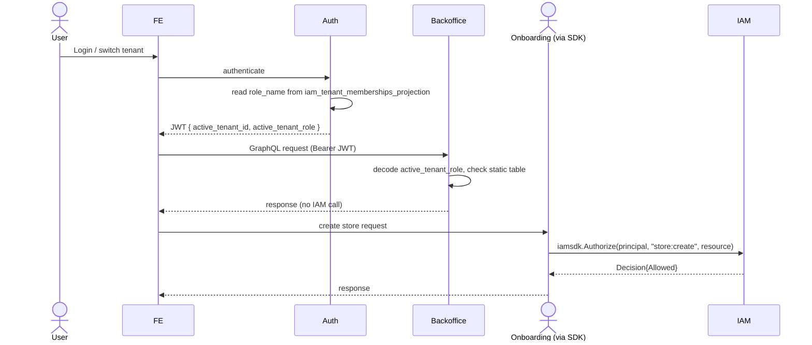

# PZEP-0003: Backoffice/IAM decoupling and IAM SDK Phase 1

## Status
Draft

## Date
2026-07-12

## Related Commit
(none yet — nothing implemented)

## Requirement Sources
- Business: user directive 2026-07-12 — extract IAM into an open-source, SDK-integrable authorization platform; Backoffice's own permission needs are simple role-gated read/update, not dynamic policy.
- Feature: `docs/03-architecture-detail-design/11-iam-platform.md` (existing target architecture, Phases 0-6 — this PZEP executes Phase 0 (done, see Problem) and Phase 1, and sets up Phase 4/5 to be lower-risk)
- Use Cases: (1) a Backoffice request is authorized without a network call to IAM; (2) onboarding and partner call IAM through a stable SDK instead of raw gRPC; (3) IAM's Podzone-specific coupling shrinks enough that open-source extraction (a later PZEP) is realistic.
- Functional Requirements: [SRS-IAM-005](../01-srs/iam/SRS-IAM-005-decision-api-scoped-to-dynamic-policy-consumers.md), [ADR-0004](../08-adr/ADR-0004-backoffice-static-rbac-not-iam-decision-api.md) (the boundary decision this PZEP implements)
- Non-functional Requirements: [SRS-IAM-001](../01-srs/iam/SRS-IAM-001-centralized-authorization.md) (still applies to onboarding/partner/IAM's own console — this PZEP narrows its scope, doesn't repeal it), [SRS-NFR-002](../01-srs/podzone-srs.md) Fail Closed Authorization
- Acceptance Criteria: see below
- UI Specs: none — backend/contract change only, no FE behavior change

## Summary

Two related changes, done together because the second only makes sense
once the first removes Backoffice's resource-dependent decision calls
from the picture:

1. **Backoffice stops calling IAM's decision API.** Auth embeds the
   caller's tenant role in the JWT; Backoffice checks a static, compiled-in
   role→action table locally.
2. **IAM's remaining real callers (onboarding, partner, IAM's own admin
   console) get a stable Go SDK** (`Authorize(ctx, principal, action,
   resource, context) -> Decision`) replacing direct `IAMQueryServiceClient`
   gRPC calls scattered across each service's own `iamclient` package.

## Problem

A live inventory (2026-07-12) of every cross-service call into IAM's
decision API found 6 call sites total: onboarding (4), backoffice (1),
partner (1), using ~21 distinct permission strings. Backoffice's single
call site (`tenant_middleware.go`'s `InterceptField`, wrapping every
GraphQL resolver) is the only one whose resource identifier
(`podzone:tenant/{tenantId}/store/{storeId}`) is resolved from
request-time GraphQL context, not a static route — this is precisely the
case `11-iam-platform.md`'s own "Enforcement Placement" table says
requires a service-handler PEP and explicitly forbids gateway-only
enforcement for. As long as Backoffice's per-request, per-resolver calls
stay routed through IAM's dynamic policy engine, IAM's action catalog
stays permanently coupled to Backoffice's GraphQL schema (`store:*`,
`store_config:*` hardcoded into IAM's own migrations), which
`11-iam-platform.md`'s "Product Independence Invariants" explicitly rules
out for a reusable IAM.

Backoffice's actual permission model, read from real seed data
(`internal/iam/migrations/sql/0002_create_iam_core.sql`), is four roles
with a strictly nested, static permission set (`tenant_viewer` ⊂
`tenant_editor` ⊂ `tenant_admin` ⊂ `tenant_owner`) — no per-store ACL, no
explicit deny, no boundary, no organization SCP is used by Backoffice
today. Routing this through IAM's dynamic engine pays a network round
trip per GraphQL resolver call to answer a question that never changes
mid-session and never varies per resource instance.

Separately, `onboarding`/`partner`/`iam` (admin console) duplicate IAM
client wiring (each owns its own thin gRPC client wrapper —
`internal/onboarding/infrastructure/iamclient/`,
`internal/partner/controller/grpchandler/authz.go`) with no shared SDK,
which is exactly the duplication `11-iam-platform.md`'s "Current
Readiness And Gaps" already calls out.

## Goals

- Backoffice serves every request without IAM being reachable (no runtime
  dependency).
- Auth's JWT carries enough information (`active_tenant_role`) for
  Backoffice to authorize locally.
- A single Go SDK package exists under `sdk/go` (per `11-iam-platform.md`'s
  target repository shape) exposing a stable `Authorize` call.
- onboarding and partner's 5 remaining call sites are migrated to the SDK,
  replacing their individual hand-rolled `iamclient` gRPC wrappers.
- IAM's decision API contract (`CheckPermission`/`CheckPlatformPermission`)
  is unchanged at the wire level — the SDK wraps the existing RPCs, it
  does not require a new IAM release before Backoffice's change ships.

## Non-Goals

- Gateway adapters (Envoy ext_authz, APISIX forward-auth) — that's
  `11-iam-platform.md` Phase 4, a separate future PZEP once the SDK
  (Phase 1, this PZEP) is stable.
- Open-source repository extraction, versioned public `v2` API, opaque
  principal references — Phase 2/3/5, separate future work.
- Any change to IAM's own admin console (organizations/policies/platform
  roles) or its permission model — untouched by this PZEP.
- Per-store ACLs for Backoffice — explicitly not built; `11-iam-platform.md`
  and ADR-0004 both note this as a deliberate simplification, not an
  oversight. Revisit only if a real requirement appears.
- Faster-than-JWT-refresh permission propagation for Backoffice — accepted
  tradeoff per ADR-0004, not solved here.
- Changing `store:approve`/`AuthorizeStoreApproval` in onboarding — stays
  on the IAM decision path, migrates to the SDK like the rest of
  onboarding's calls, but its authorization behavior doesn't change.

## Proposed Solution

### Part 1 — Backoffice decoupling (implements ADR-0004)

**Auth (JWT claim):**
`internal/auth`'s session/token-issuance code (login, `AssumeRole`/tenant
switch, refresh) reads `role_name` from its own
`iam_tenant_memberships_projection` for the active tenant and adds it to
the JWT as `active_tenant_role`, alongside the existing `active_tenant_id`.
No new read from IAM — this projection is already populated via IAM's
outbox → auth's `iamprojection` event handler.

**Backoffice (static table):**
```go
// internal/backoffice/domain/authz/roletable.go (illustrative)
var rolePermissions = map[string][]string{
    "tenant_viewer": {"tenant:read", "store:read", "store_config:read"},
    "tenant_editor": {"tenant:read", "store:read", "store:create", "store:update", "store_config:read", "store_config:update"},
    "tenant_admin":  {"tenant:read", "store:read", "store:create", "store:update", "store:activate", "store:deactivate", "store_config:read", "store_config:update"},
    "tenant_owner":  {"tenant:read", "tenant:manage_members", "store:read", "store:create", "store:update", "store:activate", "store:deactivate", "store_config:read", "store_config:update"},
}
```
Seeded verbatim from `internal/iam/migrations/sql/0002_create_iam_core.sql`
— a code comment must point back at that migration so a future reader
knows where the numbers came from and that they don't auto-sync.

`tenant_middleware.go`'s `InterceptField` reads `active_tenant_role` from
the already-validated JWT claims (added in `identityFromAuthorization`),
looks it up in `rolePermissions`, and checks membership — no `ctx`-borne
gRPC call, no `TenantAuthorizer.RequirePermission` port, no IAM client
construction in `internal/backoffice`'s fx wiring at all.

### Part 2 — IAM Go SDK (Phase 1 of `11-iam-platform.md`)

New package `sdk/go` (per the target repository shape already documented):

```go
package iamsdk

type Decision struct {
    Allowed    bool
    ReasonCode string
    DecisionID string
}

type Client interface {
    Authorize(ctx context.Context, principal, action, resource string, requestCtx map[string]string) (Decision, error)
}
```

Thin wrapper over the existing `IAMQueryServiceClient.CheckPermission`/
`CheckPlatformPermission` RPCs — no new IAM-side endpoint, no wire
contract change. `onboarding`'s `AccessAuthorizer` and `partner`'s
`authz.go` are rewritten to depend on `iamsdk.Client` instead of
constructing their own `pbiamv1.IAMQueryServiceClient` and duplicating
connection/retry/timeout logic.

## Affected Components
- Frontend: none
- Gateway: none (Phase 4, not this PZEP)
- Backend: `internal/auth` (JWT claim), `internal/backoffice` (remove IAM
  dependency, add static table), `internal/onboarding` (migrate to SDK),
  `internal/partner` (migrate to SDK), new `sdk/go` package
- Worker: none
- Database: none — no schema change on either side
- External Integration: none

## Runtime Flow



## API Contract Changes
- JWT claim addition: `active_tenant_role` (string). Additive, existing
  claims unchanged — old tokens without this claim must fail closed in
  Backoffice's new middleware (missing claim = deny), not crash.
- No IAM gRPC contract change — `CheckPermission`/`CheckPlatformPermission`
  request/response shapes are untouched; the SDK wraps them as-is.

## DB Contract Changes
- None.

## Event Contract Changes
- None — reuses the existing `iam_tenant_memberships_projection` sync path.

## Permission Changes
- Backoffice's 9 `store:*`/`store_config:*`/`tenant:*` actions move from
  IAM-evaluated to Backoffice-local-evaluated. The actual grants per role
  are unchanged (seeded verbatim from the same migration data) — this is
  an enforcement-location change, not a permission-model change.
- IAM's own copy of these permission rows (migration `0002`) is left in
  place — IAM's admin console still shows/manages them for
  organization/platform administration purposes, they're just no longer
  consulted by Backoffice at request time. Docs must state the two are no
  longer connected (see ADR-0004 Consequences).

## Error Codes
- Backoffice: missing/invalid `active_tenant_role` claim → same
  `PermissionMappingError`/deny path already used today for an unmapped
  GraphQL field — fail closed, not a new error shape.
- SDK: `Authorize` returns `(Decision{}, error)` on transport failure;
  callers must fail closed on error (matches
  [SRS-NFR-002](../01-srs/podzone-srs.md)), same as today's direct RPC
  calls.

## Data Ownership
- Owner component: `internal/backoffice` now owns its own permission
  model (the static table) instead of consuming IAM's.
- Read/write owner: `internal/auth` owns `active_tenant_role` claim
  minting, sourced from its own existing projection (no new ownership).
- Projection/read-model owner: unchanged — `iam_tenant_memberships_projection`
  stays auth-owned, IAM-sourced via outbox.

## Security Considerations
- Authentication: unchanged.
- Authorization: Backoffice's authorization boundary moves from
  network-enforced (IAM) to token-embedded-claim-enforced (JWT). The JWT
  is already signed/verified (`backofficeJWTClaims` + HS256 verification
  in `tenant_middleware.go`) — adding one more claim to an already-trusted,
  already-verified token does not weaken the trust boundary.
- Tenant/workspace/store isolation: `active_tenant_id` (existing claim)
  remains the tenant boundary; `active_tenant_role` only decides what
  actions are permitted within that already-enforced tenant scope. No
  change to tenant isolation.
- Sensitive data: none added to the JWT beyond a role name string —
  not a secret, already implied by tenant membership which is not
  confidential to the token's own holder.
- Staleness: explicitly accepted per ADR-0004 — a downgraded/revoked
  member keeps old permissions until token refresh/expiry. Document the
  JWT's access-token TTL as the effective upper bound on this window
  (check `internal/auth/config` for the current value when implementing).

## Observability
- Logs: no new logging requirement beyond existing deny-path logging in
  Backoffice's GraphQL error handling.
- Metrics: recommend (not required by this PZEP) a counter for
  Backoffice's local-deny rate, to catch a role-table/migration drift
  early if one ever occurs.
- Traces: none.
- Alerts: none required.

## Alternatives Considered

See ADR-0004's Alternatives Considered — that ADR covers the Backoffice
decoupling decision itself; this PZEP's own alternative is scope-related:

### Alternative: Ship Part 1 and Part 2 as separate PZEPs
Pros: smaller individual reviews, Part 1 could ship without waiting on SDK design.
Cons: the user explicitly requested one combined document this session; Part 2's Phase 4 (gateway) tractability argument only makes sense with Part 1's resource-dependency removal cited directly, so keeping them in one doc keeps that reasoning visible. Chosen: single PZEP as requested, but Part 1 and Part 2's task lists remain independently executable (Part 1 has zero dependency on Part 2's SDK existing).

## Test Plan
- Unit: `rolePermissions` table lookup for each of the 4 roles against
  each of the 9 actions (36 cases, matches/doesn't match per the seeded
  migration data exactly); missing-claim deny path; SDK `Authorize`
  success/error/deny cases with a mocked `IAMQueryServiceClient`.
- Integration: auth issues a JWT with `active_tenant_role` set correctly
  for a real seeded membership; Backoffice GraphQL request succeeds/fails
  per role without any IAM container running (proves the dependency is
  actually gone).
- E2E: not applicable this pass — no FE change.
- Manual QA: in Docker dev, stop the `iam`/`iam-worker` containers, confirm
  Backoffice GraphQL still serves authorized requests; confirm onboarding
  requests still correctly deny when IAM is down (fail-closed, expected,
  not a regression).

## Agent Implementation Plan
- TASK-0001: Add `active_tenant_role` claim to auth's JWT issuance (login, tenant switch, refresh) sourced from `iam_tenant_memberships_projection`.
- TASK-0002: Add Backoffice's static `rolePermissions` table + local check, wired into `tenant_middleware.go`'s `InterceptField`, replacing the `RequirePermission`/IAM gRPC call.
- TASK-0003: Remove IAM client construction from `internal/backoffice`'s fx wiring; delete the now-unused `TenantAuthorizer` IAM-backed implementation (keep the port interface if other code depends on its shape, confirm before deleting).
- TASK-0004: Unit + integration tests per Test Plan for Part 1.
- TASK-0005: Scaffold `sdk/go` package (`iamsdk.Client`, `Authorize` method) wrapping existing `CheckPermission`/`CheckPlatformPermission` RPCs.
- TASK-0006: Migrate `internal/onboarding`'s `AccessAuthorizer` (4 call sites) to use `iamsdk.Client`.
- TASK-0007: Migrate `internal/partner`'s `authz.go` (1 call site) to use `iamsdk.Client`.
- TASK-0008: Unit + integration tests per Test Plan for Part 2.
- TASK-0009: Update `docs/03-architecture-detail-design/11-iam-platform.md`'s "Current Readiness And Gaps" to reflect Phase 1 done and Backoffice's removal from the decision-API caller list; update `services/backoffice/README.md` and `services/iam/README.md` Dependencies sections.

Part 1 (TASK-0001 through 0004) has no dependency on Part 2 and can ship
first; Part 2 (TASK-0005 through 0008) has no dependency on Part 1 either
— they can be done in either order or in parallel.

## Acceptance Criteria Mapping

| AC | Task | Test |
|---|---|---|
| AC-1: Backoffice serves an authorized GraphQL request with IAM containers stopped | TASK-0002, TASK-0003 | Manual QA (Docker dev, IAM stopped) |
| AC-2: JWT issued at login/switch/refresh carries the correct `active_tenant_role` for the caller's real membership | TASK-0001 | Integration test |
| AC-3: All 4 roles × 9 actions match the seeded migration data exactly | TASK-0002 | Unit test (36 cases) |
| AC-4: A JWT without `active_tenant_role` (e.g. old token) is denied, not crashed | TASK-0002 | Unit test |
| AC-5: onboarding's 4 call sites and partner's 1 call site compile and behave identically through `iamsdk.Client` (no behavior change, only the call path changes) | TASK-0006, TASK-0007 | Integration test (existing onboarding/partner test suites still pass) |
| AC-6: `go test ./internal/backoffice/... ./internal/onboarding/... ./internal/partner/... ./sdk/...` and lint all pass | all | `go test`, `golangci-lint` |

## Open Questions
- Exact JWT claim name (`active_tenant_role` proposed) and its
  interaction with `AssumeRole`'s already-existing `assumed_role_*` claims
  (`internal/auth/migrations/authsql`) — does an assumed role need its own
  role-name claim distinct from `active_tenant_role`? Needs a look at
  `entity.GetAssumedRole(ctx)` usage before TASK-0001 to avoid a naming
  collision with the assumed-role path.
- Should `sdk/go`'s `Authorize` also expose a `BatchCheck`-equivalent now
  (per `11-iam-platform.md`'s Decision API spec), or is single-`Authorize`
  sufficient for onboarding/partner's actual call patterns (none of the 5
  call sites currently batch)? Leaning toward single-call only for Phase 1,
  add batch when a real caller needs it — confirm before TASK-0005.
- Where does `sdk/go` live relative to `go.mod` — same module (`github.com/tuannm99/podzone/sdk/go`) for now, matching the "not yet extracted" state, with the understanding it moves to its own module at Phase 5. Confirm this doesn't conflict with the target repository shape's implication of eventual separation before TASK-0005.
