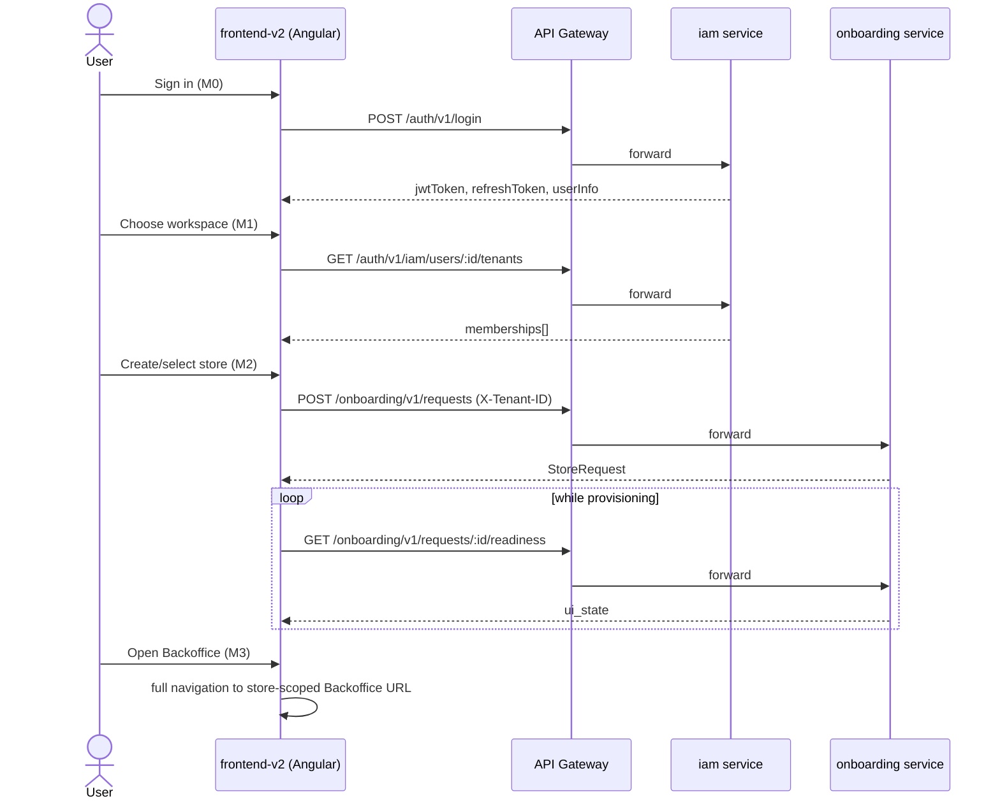

# PZEP-0008: Angular onboarding backbone integration (frontend-v2)

## Status
Approved

## Date
2026-07-14

## Related Commit
<leave blank until M0 lands>

## Requirement Sources
- Business: `docs/00-project-vision/README.md`
- Feature: Recovery backbone flow, `docs/06-recovery/recovery-plan.md` lines 28-49
- Use Cases: choose workspace, request/select store, open store-scoped Backoffice
- Functional Requirements: `docs/01-srs/onboarding/SRS-ONB-001-workspace-and-store-entry.md`,
  `SRS-ONB-002-store-provisioning-workflow.md`, `SRS-ONB-003-placement-source-of-truth.md`
- Non-functional Requirements: `docs/00-governance/twelve-factor.md`, `agent/ANGULAR_STYLE_GUIDE.md`
- Acceptance Criteria: see mapping table below
- UI Specs: none new — reuses the design system ported in PZEP-0007

## Summary
Port the onboarding backbone (sign in → choose workspace → request/select store →
placement resolves → open store-scoped Backoffice) into `frontend-v2` (Angular),
integrated against the real, already-implemented onboarding/IAM backend contracts.
`frontend-v2` currently has no auth/HTTP infrastructure at all, so this PZEP starts
with that prerequisite (M0) before porting the three onboarding screens (M1-M3).

## Problem
`frontend-v2`'s onboarding feature area is a placeholder (`admin-home-page` scaffold
from PZEP-0006, no service, no API calls). The app also has zero `core/` layer:
no `provideHttpClient()`, no token/tenant storage, no auth interceptor, no login
route, no `environments/` config. The recovery backbone (CLAUDE.md "Current Recovery
Target") cannot be exercised end-to-end on Angular until this exists.

## Goals
- Stand up `frontend-v2/src/app/core/{http,storage,auth}` following
  `agent/ANGULAR_STYLE_GUIDE.md`'s `core/` boundary, ported from the equivalent
  SolidJS modules (`frontend/packages/shared/services/{http,tokenStorage,tenantStorage,auth}.ts`).
- Add a minimal `/login` route so the backbone is testable standalone via `ng serve`
  without depending on the host-mount federation work (separate, higher-risk track).
- Port the workspace chooser (M1), store chooser + create-first-store + readiness
  (M2), and store-scoped Backoffice handoff (M3) using the real onboarding/IAM
  endpoints already wired in the SolidJS app.

## Non-Goals
- Approval queue / admin approve-reject UI (`SRS-ONB-004` — blocked on a
  cross-tenant `ListStoreRequests` query that does not exist yet; explicitly
  deferred there).
- Admin-provisioning / infra-manager screens (connections, pipeline, resources).
- Mounting `frontend-v2` as a real federated route inside the SolidJS host —
  tracked separately under PZEP-0004 Phase 2+; this PZEP only requires
  `frontend-v2` to run standalone (`ng serve`) against the real backend.
- Porting the Backoffice app itself — M3's handoff is a full-navigation link to
  the existing SolidJS-served store-scoped Backoffice, not a ported page.
- New backend endpoints, DTOs, or DB schema changes — this is FE-only,
  integrating against contracts that already exist and are documented in
  `docs/03-architecture-detail-design/services/onboarding/api-design.md`.

## Proposed Solution

Four milestones, each independently gate-reviewed before the next starts.

**M0 — Core infra.** `core/http`: `HttpClient` (`provideHttpClient()` added to
`app.config.ts`) plus a functional interceptor attaching `Authorization: Bearer`
and retrying once on 401 via refresh-token exchange (port of `http.ts`'s axios
interceptor pair). `core/storage`: `TokenStorageService`/`TenantStorageService`
wrapping `localStorage` (port of `tokenStorage.ts`/`tenantStorage.ts`).
`core/auth`: `AuthService` (`providedIn: 'root'`) exposing a current-user signal,
`login()`, `ensureActiveTenant()`/`switchTenant()`, matching the SolidJS
`useAuthContext()`/`ensureActiveTenant` contract. `src/environments/` with
`apiBaseUrl` (gateway) and `onboardingApiUrl`, mirroring `baseurl.ts`'s
`GW_API_URL`/`ONBOARDING_API_URL` defaults. One `/login` route: email/password
form using Signal Forms, calling `POST /auth/v1/login`.

**M1 — Workspace chooser.** `features/onboarding/workspace/` feature area, one
`OnboardingWorkspaceService` (route-scoped, not `root`) using `resource()` over
`listUserTenants(userId)`. Route component renders the active-membership list,
selecting a workspace calls `ensureActiveTenant`/switch and persists via
`TenantStorageService`.

**M2 — Store chooser + create + readiness.** Extend the feature area with a
`OnboardingStoreService` wiring `createStoreRequest`, `listStoreRequests`,
`getStoreReadiness`, `retryStoreRequest` (same DTOs as
`frontend/packages/shared/services/onboarding.ts`, ported verbatim as
`frontend-v2`'s own service module). UI renders `ui_state` (`pending | provisioning
| blocked | failed | ready`) per store request, with a polling `resource()` (or
`setInterval` + `reload()`, matching Solid's 10s poll) while any request is in an
active-provisioning status.

**M3 — Handoff.** When a store's `ui_state === 'ready'`, an "Open Backoffice"
action sets the active store id (`TenantStorageService`) and performs a full
navigation (plain `<a href>`, not `routerLink` — this crosses to a different,
still-SolidJS-served app, so a full document load is correct here, not a bug)
to the store-scoped Backoffice URL.

## Affected Components
- Frontend: `frontend-v2/src/app/core/**` (new), `frontend-v2/src/app/features/onboarding/**` (replaces scaffold), `frontend-v2/src/environments/**` (new), `frontend-v2/src/app/app.config.ts`
- Gateway: none (calls existing APISIX-fronted routes)
- Backend: none — integrates against existing `internal/onboarding` and `internal/iam` contracts, no changes
- Worker: none
- Database: none
- External Integration: none

## Runtime Flow

## API Contract Changes
- None. Consumes existing endpoints documented in
  `docs/03-architecture-detail-design/services/onboarding/api-design.md` and
  `internal/iam`'s tenant endpoints. No new fields, no new error codes.

## DB Contract Changes
- None.

## Event Contract Changes
- None.

## Permission Changes
- None. `RequireUser` auth middleware already gates the onboarding API;
  `store:approve` (used by the out-of-scope approval queue) is not touched.

## Error Codes
- None new. Services return `{ success, data, message }` per
  `agent/ANGULAR_STYLE_GUIDE.md`'s "Expected transport failures stay in feature
  state" rule — a `success: false` response is handled in feature error state,
  not thrown.

## Data Ownership
- Owner component: `internal/onboarding` (store requests), `internal/iam` (tenants/memberships) — unchanged, FE-only PZEP.
- Read/write owner: unchanged.
- Projection/read-model owner: unchanged (`ui_state` is server-computed via `ToUIState()`, FE only renders it).

## Security Considerations
- Authentication: JWT bearer token, stored in `localStorage` via
  `TokenStorageService`, attached by the `core/http` interceptor. Same storage
  mechanism as `frontend/` — no new risk introduced, but noted as an existing
  XSS-exposure tradeoff already accepted by the SolidJS app.
- Authorization: enforced server-side (`RequireUser` middleware, tenant-scoped
  queries by `workspace_id`/tenant ID). FE never makes an authorization
  decision — it only renders what the backend returns.
- Tenant/workspace/store isolation: every onboarding call sends `X-Tenant-ID`
  derived from the selected workspace; `frontend-v2` must never let a request
  fire without a resolved tenant ID (mirrors Solid's `ensureActiveTenant` guard
  before any tenant-scoped call).
- Sensitive data: JWT/refresh token in `localStorage`, same as existing app.

## Observability
- Logs: none new (browser-side only; relies on existing backend request logging).
- Metrics: none new.
- Traces: none new.
- Alerts: none new.

## Alternatives Considered

### Option A — M0 core infra + minimal standalone login (chosen)
Pros:
- Unlocks real end-to-end testing (`ng serve` on its own port, real JWT, real
  API calls) without waiting on the host-federation mount, which is a separate
  higher-risk track (PZEP-0004 Phase 2+).
- Small, reviewable surface — matches the "chậm mà chắc" incremental pace
  requested.

Cons:
- A throwaway-feeling `/login` route that will likely be replaced once the host
  actually mounts `frontend-v2` and can hand off an existing session instead.

### Option B — Manual JWT seeding for testing, skip login route
Pros:
- Less code to port right now.

Cons:
- Not a real integration test of the backbone (CLAUDE.md's recovery target
  starts at "sign in"); every gate review would require a manual localStorage
  edit, which is fragile and easy to get subtly wrong (wrong storage key,
  stale token format).
- Rejected — user asked to build `core/` properly, not shortcut it.

## Test Plan
- Unit: none required at this stage per `agent/ANGULAR_STYLE_GUIDE.md` ("Frontend unit tests are optional, same policy as `frontend/`").
- Integration: none (no backend changes).
- E2E: none automated yet.
- Manual QA: `ng build`, `ng serve` against real backend in Docker dev, click through login → workspace chooser → create store → poll readiness → open Backoffice, per milestone as each lands.

## Agent Implementation Plan
- TASK-0001: M0 — `core/storage` (TokenStorageService, TenantStorageService)
- TASK-0002: M0 — `core/http` (provideHttpClient, auth interceptor, refresh-on-401)
- TASK-0003: M0 — `core/auth` (AuthService) + `src/environments/`
- TASK-0004: M0 — `/login` route
- TASK-0005: M1 — workspace chooser feature + service
- TASK-0006: M2 — store chooser/create/readiness feature + service
- TASK-0007: M3 — Backoffice handoff action

## Acceptance Criteria Mapping

| AC | Task | Test |
|---|---|---|
| AC-1: user can log in against real backend from `frontend-v2` standalone | TASK-0001..0004 | Manual QA |
| AC-2: authenticated requests carry Bearer token, 401 triggers one refresh-retry | TASK-0002 | Manual QA |
| AC-3: workspace list reflects real IAM memberships | TASK-0005 | Manual QA |
| AC-4: store request create/list/readiness reflect real onboarding backend state | TASK-0006 | Manual QA |
| AC-5: ready store opens store-scoped Backoffice via full navigation | TASK-0007 | Manual QA |

## Open Questions
- Whether `frontend-v2`'s `/login` route survives once host-mount federation
  (PZEP-0004 Phase 2+) lands, or gets replaced by a session handoff from the
  host — deferred until that PZEP.
- Whether `core/auth`'s token storage should move off `localStorage` (e.g.
  httpOnly cookie) — out of scope here, matches existing `frontend/` behavior,
  flagged for a future security-hardening PZEP if desired.
