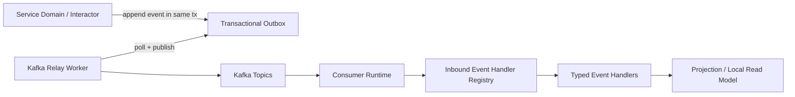
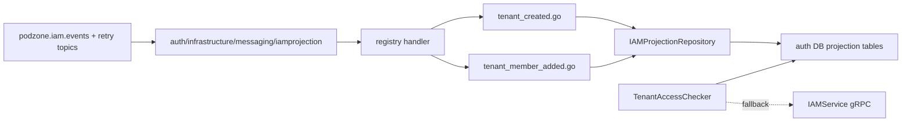

# Async Messaging

## Messaging Runtime



## Package Ownership

- `pkg/pdkafka`
  - Kafka infra wiring
  - Sarama config, producer/admin/consumer factory
  - topic bootstrap on startup
- `pkg/messaging`
  - envelope contract
  - retry / DLT strategy
  - observer hooks
  - idempotency middleware
  - outbox / inbox abstractions
- `internal/<service>/controller/eventhandler/...`
  - inbound event handler that maps a consumed event into application behavior
- `internal/<service>/infrastructure/messaging/...`
  - worker, subscriber runtime, consumer wiring, inbox store selection

## Clean Architecture Notes

- Event handlers are inbound adapters, so they live under `controller/eventhandler`.
- Consumer workers and Kafka runtime wiring live under `infrastructure/messaging`.
- Business rules stay in `domain` / `interactor`.
- Projections are persistence adapters and read-model maintenance, not domain source of truth.

## Consumer Architecture Rules

- Default runtime shape is `1 worker binary = 1 consumer runtime`.
- Do not introduce a multi-consumer supervisor until one binary truly owns multiple independent consumers.
- Keep API runtimes and worker runtimes in separate binaries when Kafka workloads are real:
  - `cmd/<service>` for gRPC/HTTP/API
  - `cmd/<service>-worker` for Kafka projections, outbox relays, or sagas
- If a worker binary later owns multiple consumers, each consumer should run in its own goroutine under a supervisor.

## Handler Dispatch Rules

- Do not grow one `switch envelope.Type` as event surface expands.
- Use `pkg/messaging.Registry` with `TypedHandler` implementations.
- Each event should live in its own file inside the service-owned inbound adapter package.
- `handler.go` should only assemble the registry.

Recommended shape:

```text
internal/<service>/controller/eventhandler/<consumer>/
  handler.go
  <event_one>.go
  <event_two>.go
```

## Concurrency Rules

- Keep message handling sequential inside a partition claim by default.
- Do not add goroutine-per-message processing unless offset commit and ordering semantics are redesigned explicitly.
- Safe concurrency points are:
  - Kafka partitions
  - separate consumer groups
  - separate consumers under a worker supervisor
- Unsafe default to avoid:
  - fire-and-forget goroutines inside `Handle(...)`
  - early offset marking while background work still runs

## When To Add A Multi-Consumer Worker

Introduce a supervisor only when at least one of these becomes true:

- one worker binary owns multiple unrelated consumers
- projection, audit, saga, or redrive flows need independent restart behavior
- lag, retry, or DLT behavior diverges per consumer
- one runtime needs multiple consumer groups for one service

Until then, prefer:

- one worker runtime
- one consumer
- one registry
- many typed handlers behind that registry

## Current Auth IAM Projection



## Runtime Toggles

Messaging runtime behavior is optional and config-driven:

- `messaging.<service>.consumers.<consumer_name>`
  - enable/disable consumer runtime
  - retry attempts / base delay
  - observability logging
  - idempotency and inbox table
- `messaging.kafka.<service>.topics`
  - enable/disable topic bootstrap
  - main / retry / DLT topic expansion

If config is missing, package defaults apply.
