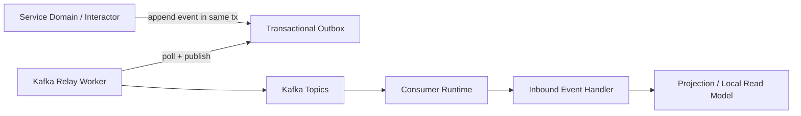
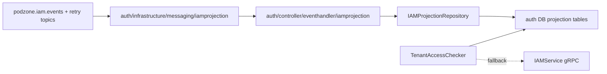

# Async Messaging

## Messaging Runtime

## Package Ownership

- `pkg/pdkafka`
  - Kafka infra wiring
  - Sarama config, producer/admin/consumer factory
  - topic bootstrap on startup
- `pkg/messaging`
  - envelope contract
  - retry / DLT strategy
  - observer hooks
  - idempotency middleware
  - outbox / inbox abstractions
- `internal/<service>/controller/eventhandler/...`
  - inbound event handler that maps a consumed event into application behavior
- `internal/<service>/infrastructure/messaging/...`
  - worker, subscriber runtime, consumer wiring, inbox store selection

## Clean Architecture Notes

- Event handlers are inbound adapters, so they live under `controller/eventhandler`.
- Consumer workers and Kafka runtime wiring live under `infrastructure/messaging`.
- Business rules stay in `domain` / `interactor`.
- Projections are persistence adapters and read-model maintenance, not domain source of truth.

## Current Auth IAM Projection

## Runtime Toggles

Messaging runtime behavior is optional and config-driven:

- `messaging.<service>.consumers.<consumer_name>`
  - enable/disable consumer runtime
  - retry attempts / base delay
  - observability logging
  - idempotency and inbox table
- `messaging.kafka.<service>.topics`
  - enable/disable topic bootstrap
  - main / retry / DLT topic expansion

If config is missing, package defaults apply.
