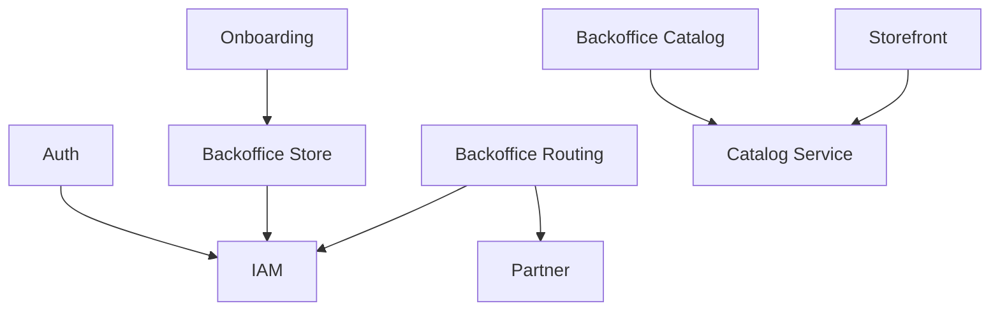
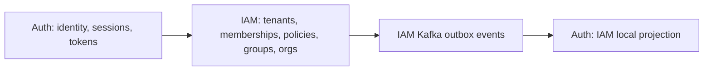
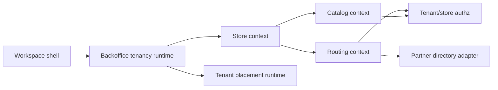
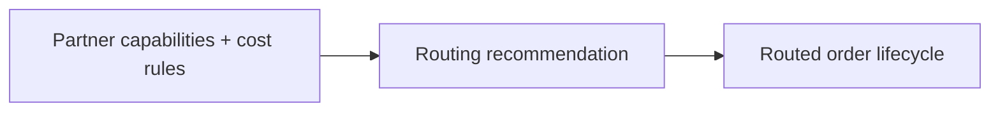

# Bounded Contexts

## Context Landscape

## Auth and IAM Boundary

## Backoffice Boundary

## Partner and Routing Boundary

## Notes

- `Auth` and `IAM` are now separate contexts with gRPC and Kafka integration points.
- `Backoffice` is still one deployable service, but internally split into `store`, `catalog`, and `routing`.
- `Backoffice` also needs a tenancy runtime layer that separates:
  - edge/runtime tenant routing
  - application placement resolution
  - store-scoped business execution
- `Partner` influences routing decisions through capability and cost metadata.
- `Onboarding` owns connection/placement publication and is distinct from operator workflow surfaces.
