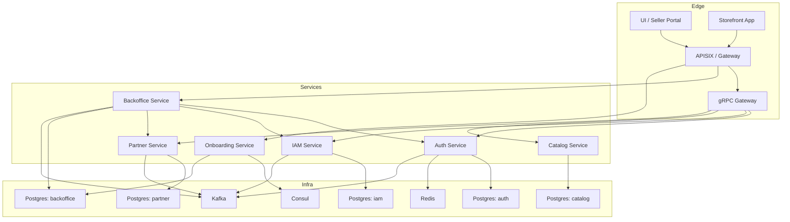

# C2: Container View

## Boundaries

- `auth` and `iam` are separated by API and database ownership.
- `auth` uses `IAMService` over `gRPC` for synchronous authorization-sensitive operations.
- `iam` publishes domain events through Kafka outbox.
- `auth` consumes a subset of IAM events into a local projection.
- `grpcgateway` remains the HTTP translation layer for gRPC services.
- `backoffice` is GraphQL-first and talks to service APIs plus its own database.
