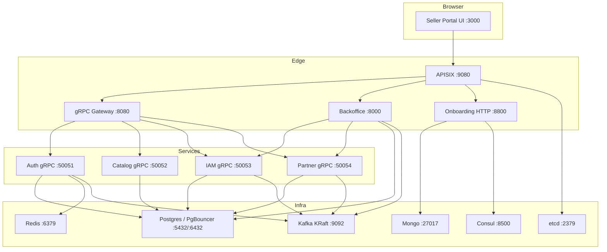
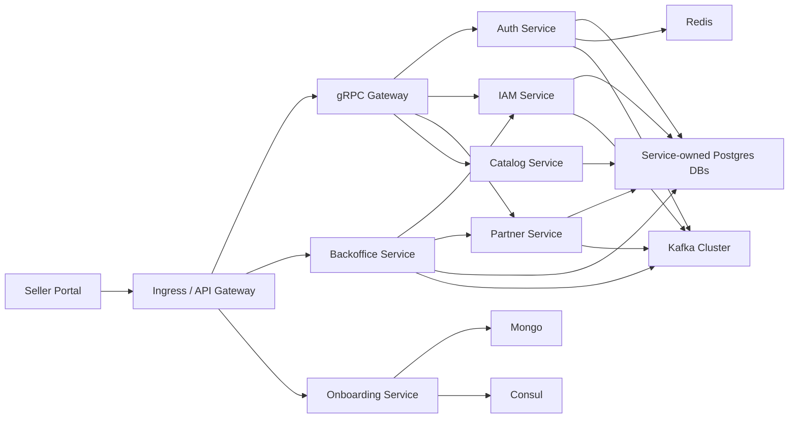

# Deployment

## Local Docker Runtime

## Production-Target Runtime Shape

## Notes

- Local runtime mirrors the target service split with simplified single-node infrastructure.
- `APISIX` fronts both GraphQL and HTTP/gRPC-gateway surfaces.
- Kafka is the single async backbone target for service integration.
