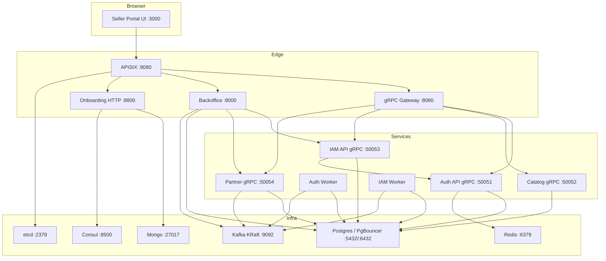
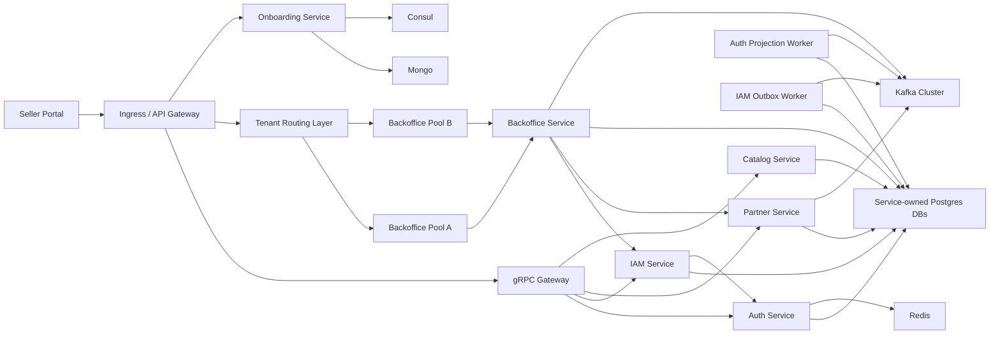
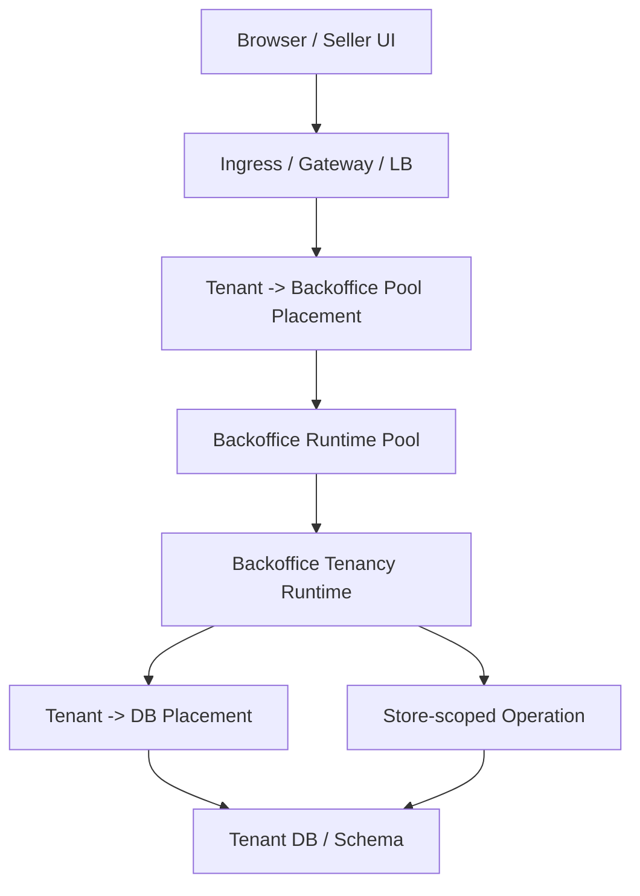

# Deployment

## Local Docker Runtime

## Production-Target Runtime Shape

## Backoffice Tenant Routing Model

## Notes

- Local runtime mirrors the target service split with simplified single-node infrastructure.
- `APISIX` fronts both GraphQL and HTTP/gRPC-gateway surfaces.
- Local Docker now includes a one-shot `apisix-init` seed step for routes, services, shared plugins, and a JWT edge probe route.
- Kafka is the single async backbone target for service integration.
- Production follow-up should move APISIX bootstrap into:
  - Kubernetes Job / Helm hook
  - Terraform-managed Admin API resources
  - environment-specific route/plugin manifests
- `auth` and `iam` now run separate API and worker binaries in local Docker.
- Projection and outbox workers no longer share the gRPC server runtime by default.
- `Backoffice` should be treated as stateless API capacity inside tenant-assigned runtime pools.
- Tenant-to-runtime-pool routing belongs to edge/runtime placement, not to business handlers.
- Tenant-to-database placement belongs to `pdtenantdb` and application runtime placement resolution.

## Kubernetes Direction

- Each service keeps its own Deployment and DB binding.
- `auth-api`, `auth-worker`, `iam-api`, and `iam-worker` should be modeled as separate Deployments or ECS services.
- Shared code can still live in one repo and one bounded context, but runtime scaling is now independent.
- `backoffice` should support sharded runtime pools where:
  - ingress routes tenant traffic into the correct pool
  - multiple pods can exist within one pool
  - pod count can scale independently from tenant placement metadata
- tenant placement metadata should remain externalized so scale-in and rescheduling do not require application rebinding.

## Terraform / AWS Future

- Keep service runtime bootstrap declarative enough to migrate later into:
  - MSK topics and ACLs
  - RDS per-service databases
  - ECS/EKS service modules
  - APISIX or alternative gateway Admin API seed resources
- The current Docker seed scripts should be treated as the local equivalent of future infra bootstrap modules, not as the final production mechanism.
