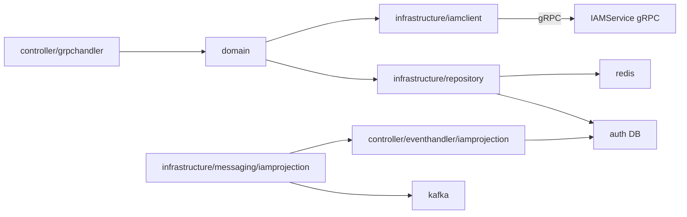
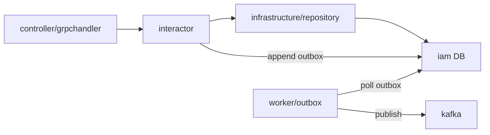
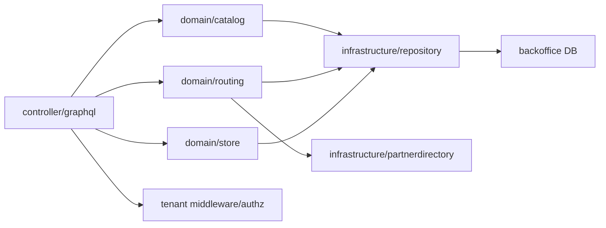
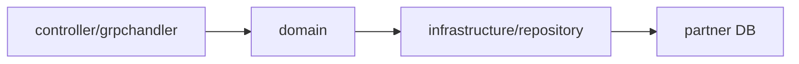
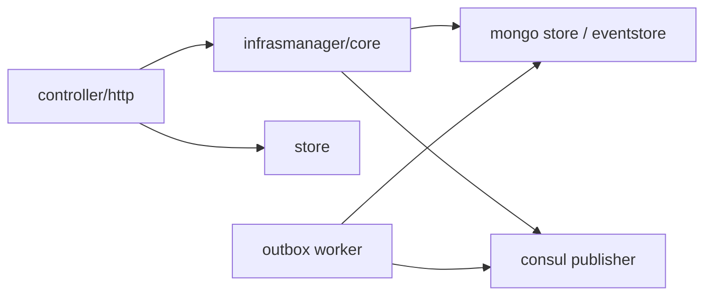
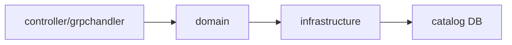
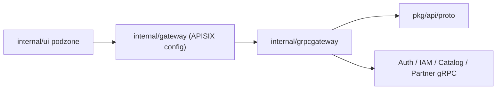
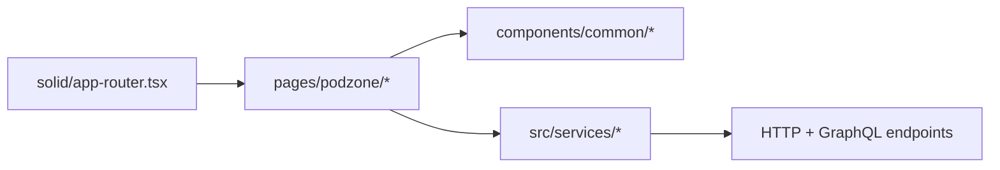

# C3: Module View

## Auth Service

### Main modules

- `domain`: login, register, refresh token, switch tenant, session policy, assume-role session state
- `infrastructure/iamclient`: synchronous calls to `IAMService`
- `controller/eventhandler/iamprojection`: inbound Kafka event handler for IAM-derived projection updates
- `infrastructure/messaging/iamprojection`: consumer runtime, inbox/idempotency wiring, and worker lifecycle

## IAM Service

### Main modules

- `entity`: authorization core types, policy statements, trust policies, memberships
- `inputport`: IAM usecase contracts
- `outputport`: repository and outbox contracts
- `interactor`: policy lifecycle, authz evaluation, groups, tenants, org/SCP, assume-role

## Backoffice Service

### Main modules

- `catalog`: product setup draft/candidate flow
- `routing`: routed orders, recommendation, shipment, settlement, audit feed
- `store`: tenant store metadata and store-owned operations

## Partner Service

### Main modules

- `domain`: partner profile, capabilities, cost rules, operational settings
- `controller/grpchandler`: gRPC transport surface for partner management
- `infrastructure/repository`: SQL persistence

## Onboarding Service

### Main modules

- `infrasmanager/core`: connection lifecycle and outbox/event storage
- `store`: onboarding-facing store CRUD
- `core/worker`: outbox publisher to Consul

## Catalog Service

### Main modules

- current repo shape keeps `catalog` lighter than `backoffice/catalog`
- it mainly exposes gRPC APIs and persistence for catalog-facing workflows

## Gateway and gRPC Gateway

### Main modules

- `internal/gateway`: APISIX runtime config
- `deployments/docker/apisix-init`: local seed for APISIX services, routes, and sample JWT edge plugin
- `internal/grpcgateway`: service registration and HTTP translation
- `pkg/api/proto`: generated contracts shared by transport layers

## Seller Portal UI

### Main modules

- `solid/app-router.tsx`: auth/admin/tenant route ownership
- `pages/podzone/*`: page-level application flows
- `services/*`: API adapters for Auth, IAM, Partner, GraphQL Backoffice
