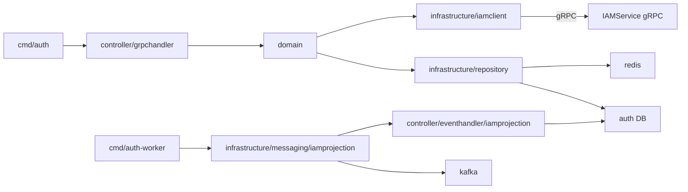
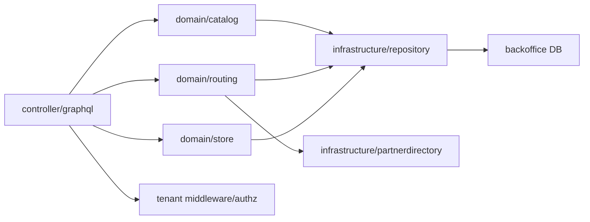
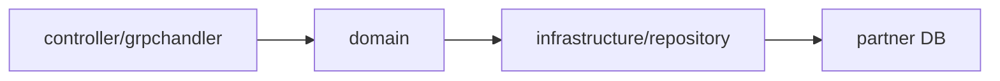
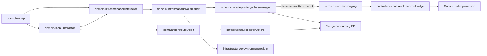
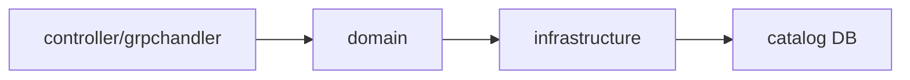
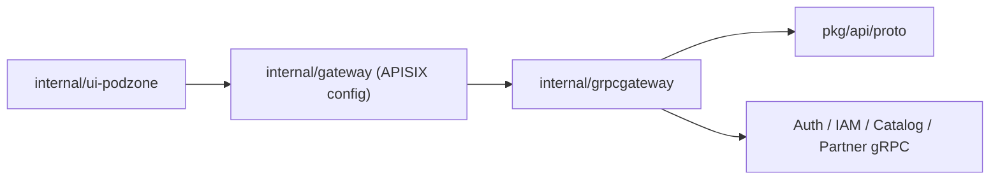
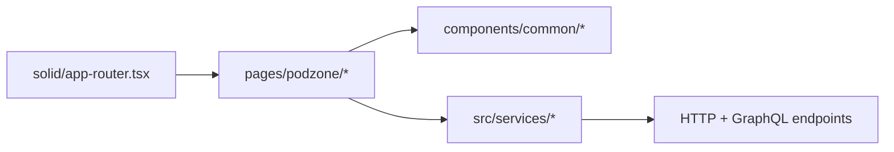

# C3: Module View

## Auth Service

### Main modules

- `domain`: login, register, refresh token, switch tenant, session policy, assume-role session state
- `infrastructure/iamclient`: synchronous calls to `IAMService`
- `controller/eventhandler/iamprojection`: inbound Kafka event handler for IAM-derived projection updates
- `infrastructure/messaging/iamprojection`: consumer runtime, inbox/idempotency wiring, and worker lifecycle
- `cmd/auth`: Auth API runtime
- `cmd/auth-worker`: projection-only runtime

## IAM Service

```mermaid
flowchart LR
    IAMServer["controller/grpchandler"]
    IAMCommandHandler["controller/grpchandler command handler"]
    IAMQueryHandler["controller/grpchandler query handler"]
    IAMCommand["domain/inputport command usecases"]
    IAMQuery["domain/inputport query usecases"]
    IAMInteractor["domain/interactor"]
    IAMWriteRepo["infrastructure/repository write model"]
    IAMReadRepo["infrastructure/repository read/evaluation model"]
    EventRelay["outbox CDC / fallback relay"]
    IAMAPI["cmd/iam"]
    IAMWorker["cmd/iam-worker"]
    IAMDB["iam DB"]
    Kafka["kafka"]

    IAMAPI --> IAMServer
    IAMServer --> IAMCommandHandler
    IAMServer --> IAMQueryHandler
    IAMCommandHandler --> IAMCommand
    IAMCommandHandler --> IAMQuery
    IAMQueryHandler --> IAMQuery
    IAMCommand --> IAMInteractor
    IAMQuery --> IAMInteractor
    IAMInteractor --> IAMWriteRepo
    IAMInteractor --> IAMReadRepo
    IAMWriteRepo --> IAMDB
    IAMReadRepo --> IAMDB
    IAMWorker --> EventRelay
    IAMInteractor -->|"append outbox"| IAMDB
    IAMDB -->|"CDC preferred; bounded polling fallback"| EventRelay
    EventRelay -->|"publish"| Kafka
```

### Main modules

- `entity`: authorization core types, policy statements, trust policies, memberships
- `inputport`: IAM command and query usecase contracts; `IAMUsecase` remains a compatibility facade during migration
- `outputport`: command repository, query repository, and outbox contracts
- `controller/grpchandler`: gRPC facade delegates to separate command and query handlers while preserving the public IAM service contract
- `api/proto/iam/v1/iam_service.proto`: exposes `IAMCommandService` and `IAMQueryService` for CQRS gRPC clients; `IAMService` remains the REST/gateway compatibility contract
- IAM currently runs as one API binary, but the module exposes separate command/query server registrations so it can become `cmd/iam-command` and `cmd/iam-query` later without changing proto contracts
- Fx wiring mirrors that boundary: `internal/iam.CommandModule` and `internal/iam.QueryModule` wire domain dependencies separately, while `internal/iam/server.Module` keeps the current all-in-one `cmd/iam` runtime
- `interactor`: command handling, policy lifecycle, authz evaluation, groups, tenants, org/SCP, assume-role
- command side owns tenant, policy, group, membership, org, and boundary mutations
- query side owns policy reads, membership reads, permission checks, simulations, and read-model access
- `cmd/iam`: IAM API runtime
- `cmd/iam-worker`: transactional event publisher runtime; polling relay is fallback until CDC is wired

## Backoffice Service

### Main modules

- `store`: store aggregate, store-scoped access, and workspace-facing store metadata
- `catalog`: product setup draft/candidate flow inside the active store context
- `routing`: routed order aggregate, recommendation, shipment, settlement, and audit feed
- Backoffice DDD boundary: GraphQL maps transport DTOs to context usecases; repositories stay behind each context output port.
- Cross-context calls should use domain ports or external adapters, not direct repository imports.

## Partner Service

### Main modules

- `domain`: partner profile, capabilities, cost rules, operational settings
- `controller/grpchandler`: gRPC transport surface for partner management
- `infrastructure/repository`: SQL persistence

## Onboarding Service

### Main modules

- `domain/infrasmanager`: placement allocation, connection publication, and infrastructure manager usecases
- `domain/store`: store request lifecycle, approval state, and provisioning orchestration
- `infrastructure/repository`: Mongo-backed repositories for store requests, connection events, and placement allocations
- `infrastructure/provisioning/provider`: runtime-specific placement provider for local Docker, Kubernetes, and future Terraform/cloud
- `controller/eventhandler/consulbridge`: router projection publisher; Consul is rebuilt from onboarding allocation state
- `infrastructure/messaging`: CDC/fallback publisher and background worker wiring

Local Docker and Kubernetes schema-mode placement use the `podzone_tenants` Postgres database for tenant schemas.
The `postgres` database remains the admin/default connection database and must not host service-owned public tables.

## Catalog Service

### Main modules

- current repo shape keeps `catalog` lighter than `backoffice/catalog`
- it mainly exposes gRPC APIs and persistence for catalog-facing workflows

## Gateway and gRPC Gateway

### Main modules

- `internal/gateway`: APISIX runtime config
- `deployments/docker/apisix-init`: local seed for APISIX services, routes, and sample JWT edge plugin
- `internal/grpcgateway`: service registration and HTTP translation
- `pkg/api/proto`: generated contracts shared by transport layers

## Seller Portal UI

### Main modules

- `solid/app-router.tsx`: auth/admin/tenant route ownership
- `pages/podzone/*`: page-level application flows
- `services/*`: API adapters for Auth, IAM, Partner, GraphQL Backoffice
