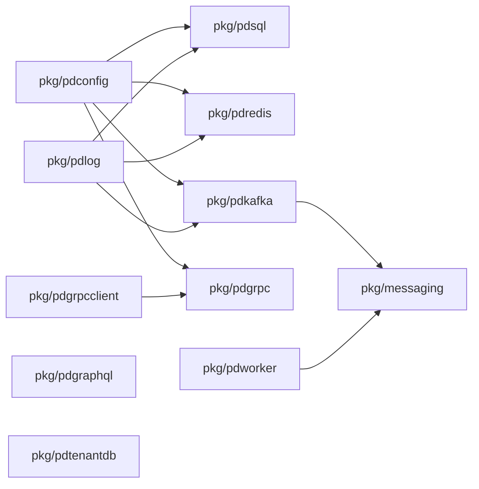
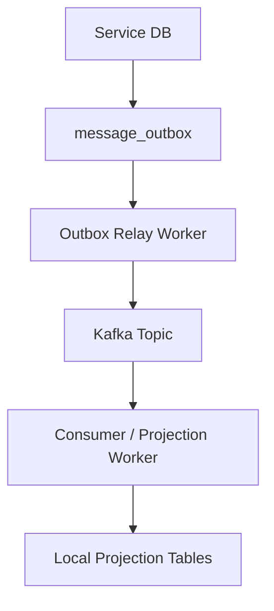

# Shared Runtime and Platform Modules

## Runtime Foundation

## Package Intent

- `pkg/pdconfig`: Koanf-backed configuration bootstrap
- `pkg/pdlog`: logging abstraction and Fx module
- `pkg/pdsql`: named SQL connection modules per service
- `pkg/pdredis`: named Redis connection modules
- `pkg/pdkafka`: Kafka client/admin/consumer-group wiring with Sarama
- `pkg/messaging`: envelope, outbox, publisher/consumer contracts, Kafka adapters
- `pkg/pdgrpc` and `pkg/pdgrpcclient`: gRPC server/client lifecycle
- `pkg/pdgraphql`: GraphQL runtime wiring
- `pkg/pdtenantdb`: tenant placement and multi-tenant DB resolution
- `pkg/pdworker`: long-running worker lifecycle abstraction

## Data and Event Backbone

This is the preferred asynchronous integration pattern for the current codebase:

- write business state and outbox in the same service-owned database
- relay publishes Kafka events
- downstream services materialize local read models when needed
