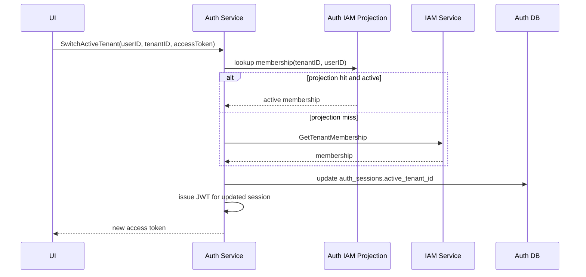
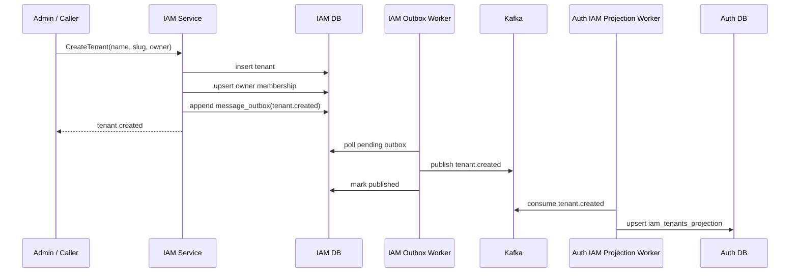
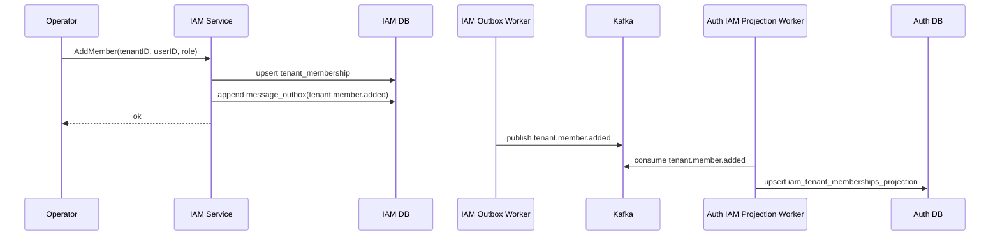
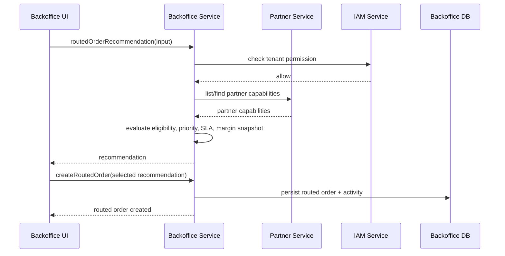
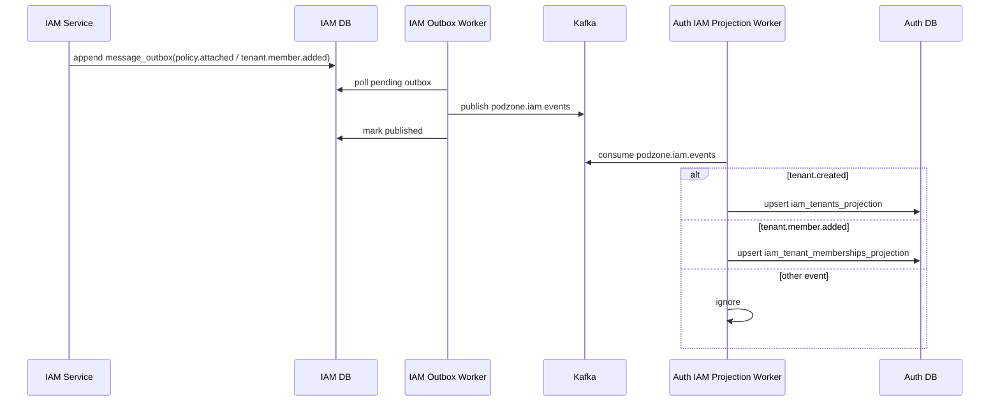
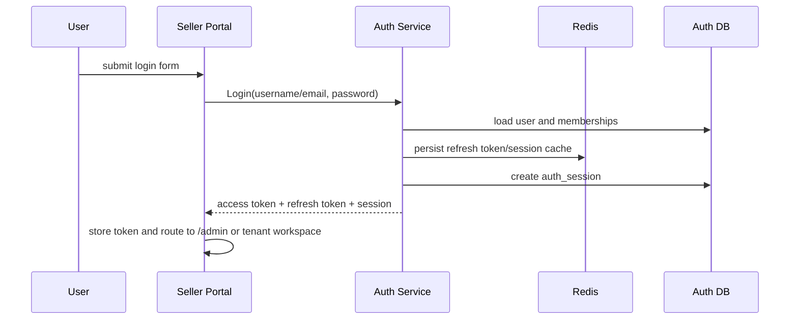
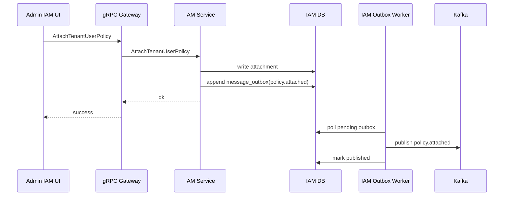
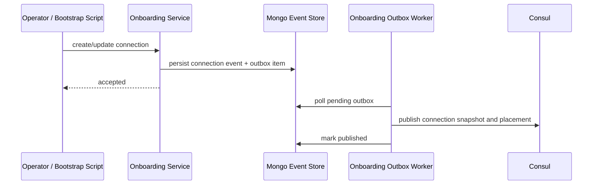

# C4: Detail Design Sequences

## 1. Switch Active Tenant

## 2. Create Tenant with Outbox

## 3. Add Tenant Member

## 4. Create Routed Order Recommendation

## 5. IAM Event Projected into Auth

## 6. Login and Tenant Workspace Bootstrap

## 7. Admin IAM Policy Attachment

## 8. Onboarding Connection Publish to Consul

