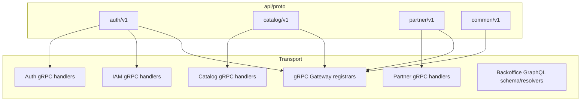
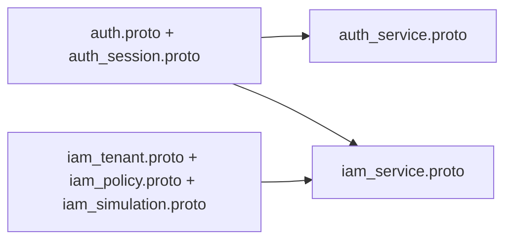
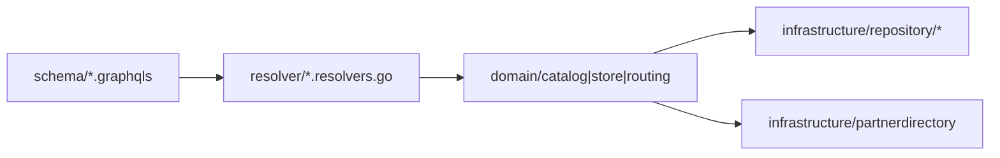
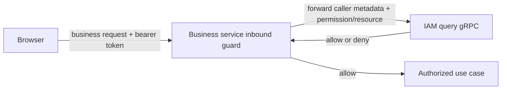

# Transport and Contracts

## API Surface Ownership

## Auth and IAM Proto Split

## Backoffice Transport Split

## Authorization Boundary

## Notes

- `AuthService` owns identity, session, and token lifecycle.
- `IAMService` owns authorization, tenant, membership, policy, boundary, simulation, and assume-role decisioning.
- Frontends do not call permission-check endpoints to gate workflows. Backoffice
  and onboarding enforce access at their inbound boundaries through IAM query
  gRPC; IAM-owned endpoints enforce policy internally.
- `Backoffice` is GraphQL-owned and maps into context-local domain packages.
- `grpcgateway` is only a transport adapter, not business logic.
